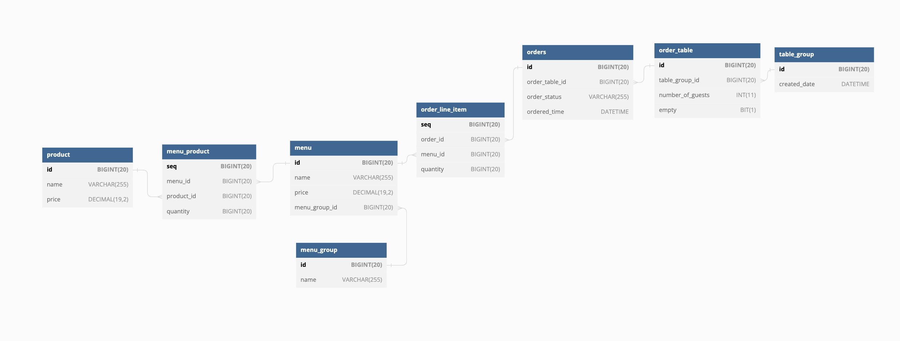

# 키친포스

## 요구 사항

### 상품(product) - _메뉴를 관리하는 기준이 되는 데이터_

| METHOD | URI           | 설명       |
|--------|---------------|----------|
| POST   | /api/products | 상품 생성 요청 |
| GET    | /api/products | 상품 목록 조회 |

```sqlh2
CREATE TABLE product
(
    id    BIGINT(20) NOT NULL AUTO_INCREMENT,
    name  VARCHAR(255)   NOT NULL,
    price DECIMAL(19, 2) NOT NULL,
    PRIMARY KEY (id)
);
```

- 상품은 이름과 가격은 필수 값 이다.

- 상품을 등록할 수 있다.
  - 상품을 등록할때는 상품의 이름과 가격이 필요한다.
  - 상품의 가격은 0 이상이어야 한다.
  - 상품이 저장된다.
- 상품 목록을 조회할 수 있다.

### 메뉴 그룹(menu group) - _메뉴 묶음, 분류_

| METHOD | URI              | 설명          |
|--------|------------------|-------------|
| POST   | /api/menu-groups | 메뉴 그룹 생성 요청 |
| GET    | /api/menu-groups | 메뉴 그룹 목록 조회 |
```sqlh2
CREATE TABLE menu_group (
    id BIGINT(20) NOT NULL AUTO_INCREMENT,
    name VARCHAR(255) NOT NULL,
    PRIMARY KEY (id)
);
```
- 메뉴 그룹의 이름은 필수 값인다.
- 메뉴 그릅을 등록할 수 있다.
  - 메뉴 그룹을 등록할때에는 메뉴 그룹의 이름이 필요하다.
  - 메뉴 그룹이 저장된다.
- 메뉴 그룹 목록을 조회할 수 있다.


### 메뉴(menu) - _메뉴 그룹에 속하는 실제 주문 가능 단위_
| METHOD | URI        | 설명       |
|--------|------------|----------|
| POST   | /api/menus | 메뉴 생성 요청 |
| GET    | /api/menus | 메뉴 목록 조회 |
```sqlh2
CREATE TABLE menu (
    id BIGINT(20) NOT NULL AUTO_INCREMENT,
    name VARCHAR(255) NOT NULL,
    price DECIMAL(19, 2) NOT NULL,
    menu_group_id BIGINT(20) NOT NULL,
    PRIMARY KEY (id)
);
```
- 메뉴의 이름과 가격은 필수 값이다.
- 메뉴는 메뉴 그룹에 속해있어야 한다.
- 메뉴 등록 요청을 할 수 있다
  - 메뉴 등록을 요청할때에는 메뉴 이름, 가격, 메뉴 그룹, 메뉴 상품이 필요하다.
    - 메뉴 상품은 상품과 수량으로 구성되어 있다.
  - 메뉴의 가격은 0 이상이어야 한다.
  - 메뉴는 반드시 메뉴그룹에 속해 있어야 한다.
  - 메뉴의 가격은 메뉴 상품에 속한 각 상품의 가격 * 수량을 모두 더한 값보다 크면 안된다.
  - 메뉴가 저장된다.
  - 메뉴 상품이 저장된다.
- 메뉴 목록을 조회할 수 있다.
  - 메뉴 조회시 메뉴에 속한 모든 상품도 조회된다.

### 주문(order) - _매장에서 발생하는 주문_
| METHOD | URI                                | 설명       |
|--------|------------------------------------|----------|
| POST   | /api/orders                        | 주문 생성 요청 |
| GET    | /api/orders                        | 주문 목록 조회 |
| PUT    | /api/orders/{orderId}/order-status | 주문 상태 변경 |
```sqlh2
CREATE TABLE orders (
    id BIGINT(20) NOT NULL AUTO_INCREMENT,
    order_table_id BIGINT(20) NOT NULL,
    order_status VARCHAR(255) NOT NULL,
    ordered_time DATETIME NOT NULL,
    PRIMARY KEY (id)
);
```
- 주문의 주문 상태와 주문 시간은 필수 값이다.
- 주문은 주문 테이블에 속해 있어야 한다.
- 주문을 생성할 수 있다.
  - 주문을 생성 요청시에는 주문 항목이 필요하다.
    - 주문 항목은 메뉴와 수량 목록이다.
  - 등록된 메뉴만 주문할 수 있다.
  - 줌문 생성 요청시 주문 테이블이 필요한다.
  - 테이블이 비어 있는 상태로는 주문을 생성할 수 없다.
  - 주문을 생성하면 최초의 주문 상태는 요리중이다.
  - 주문시간을 현재시간(`now()`)으로 설정된다.
  - 주문이 저장된다.
  - 주문항목이 저장된다.
- 주문 목록을 조회할 수 있다.
- 각 주문의 상태를 변경할 수 있다.
  - 주문의 상태 변경 요청시 주문의 상태가 필요하다.
    - 주문 상태는 `요리중`, `식사`, `완료` 세가지 상태가 존재한다.
  - 등록되지 않은 주문은 상태를 변경할 수 없다.
  - 완료 상태의 주문은 상태를 변경할 수 없다.
  - 요청한 상태로 주문의 상태가 변경 저장된다.

  
### 주문 테이블(order table) - _매장에서 주문이 발생하는 영역_
| METHOD | URI                                         | 설명                    |
|--------|---------------------------------------------|-----------------------|
| POST   | /api/tables                                 | 주문 테이블 생성 요청          |
| GET    | /api/tables                                 | 주문 테이블 목록 조회 요청       |
| PUT    | /api/tables/{orderTableId}/empty            | 주문 테이블 상태 변경 요청       |
| PUT    | /api/tables/{orderTableId}/number-of-guests | 주문 테이블 방문한 손님 수 변경 요청 |

```sqlh2
CREATE TABLE order_table (
    id BIGINT(20) NOT NULL AUTO_INCREMENT,
    table_group_id BIGINT(20),
    number_of_guests INT(11) NOT NULL,
    empty BIT(1) NOT NULL,
    PRIMARY KEY (id)
);
```
- 주문 테이블의 방문한 손님 수와 빈 테이블 상태는 필수 값이다.
- 주문 테이블 생성 요청할 수 있다.
  - 테이블 생성 요청시 방문한 손님 수와 빈테이블 상태가 필요하다.
  - 주문 테이블 생성 시 단체지정은 불가한다.
- 주문 테이블 목록 조회 요청할 수 잇다.
- 주문 테이블에 빈 테이블 상태를 변경할 수 있다.
  - 테이블의 상태 값을 변경 요청한다.
  - 등록된 주문테이블만 변경이 가능하다.
  - 단체 지정된 주문 테이블은 빈 테이블이 될 수 없다.
  - 주문 테이블에 속한 주문의 상태가 완료일때만 변경 가능하다.
  - 주문 테이블의 상태가 변경 저장된다.
- 주문 테이블의 방문한 손님 수를 변경할 수 잇다.
  - 테이블의 손님 수 변경을 요청한다.
  - 변경 요청한 손님 수는 0명 이상이어야 한다.
  - 등록된 주문 테이블에 대해서만 손님 수 변경이 가능하다.
  - 주문 테이블이 빈 상태이면 이원수를 변경할 수 없다.
  - 요청한 손님 수로 수정 저장된다.

### 단체 지정(table group) - _통합 계산을 위해 개별 주문 테이블을 그룹화하는 기능_
| METHOD | URI                              | 설명               |
|--------|----------------------------------|------------------|
| POST   | /api/table-groups                | 단체 지정을 생성할 수 있다. |
| DELETE | /api/table-groups/{tableGroupId} | 단체 지정을 해제할 수 있다. |
```sqlh2
CREATE TABLE table_group (
    id BIGINT(20) NOT NULL AUTO_INCREMENT,
    created_date DATETIME NOT NULL,
    PRIMARY KEY (id)
);
```
- 단체 지정 생성 요청할 수 있다.
  - 단체 지정 생성 요청시 주문 테이블 목록이 요청된다.
  - 주문 테이블은 2개 이상이어야 한다.
  - 등록되지 않은 주문 테이블은 단체지정으로 요청할 수 없다.
  - 주문 테이블들이 빈 테이블이어야 한다.
  - 단체 지정된 주문테이블은 단체 지정할 수 없다.
  - 단체 지정시 생성 날짜가 설정된다.
  - 단체 지정이 저장된다.
  - 요청된 주문 테이블의 테이블 그룹이 지정되고 테이블이 비어있지 않은 상태가 된다.
- 단체 지정 삭제 요청할 수 있다.
  - 테이블 그룹 아이디로 주문 테이블을 조회한다.
  - 조회된 주문 테이블의 상태가 완료 상태가 아니면 에러가 발생한다.
  - 주문 테이블의 단체 지정이 해제된다.

## 용어 사전

| 한글명      | 영문명              | 설명                            |
|----------|------------------|-------------------------------|
| 상품       | product          | 메뉴를 관리하는 기준이 되는 데이터           |
| 메뉴 그룹    | menu group       | 메뉴 묶음, 분류                     |
| 메뉴       | menu             | 메뉴 그룹에 속하는 실제 주문 가능 단위        |
| 메뉴 상품    | menu product     | 메뉴에 속하는 수량이 있는 상품             |
| 금액       | amount           | 가격 * 수량                       |
| 주문 테이블   | order table      | 매장에서 주문이 발생하는 영역              |
| 빈 테이블    | empty table      | 주문을 등록할 수 없는 주문 테이블           |
| 주문       | order            | 매장에서 발생하는 주문                  |
| 주문 상태    | order status     | 주문은 조리 ➜ 식사 ➜ 계산 완료 순서로 진행된다. |
| 방문한 손님 수 | number of guests | 필수 사항은 아니며 주문은 0명으로 등록할 수 있다. |
| 단체 지정    | table group      | 통합 계산을 위해 개별 주문 테이블을 그룹화하는 기능 |
| 주문 항목    | order line item  | 주문에 속하는 수량이 있는 메뉴             |
| 매장 식사    | eat in           | 포장하지 않고 매장에서 식사하는 것           |

## ERD

---

# 🚀 1단계 - 테스트를 통한 코드 보호

### 요구사항

1. 요구사항 정리
    - [x] `kitchenpos` 패키지의 코드를 보고 키친포스의 요구 사항을 `README.md`에 작성한다.
2. 테스트 코드 작성
    - [x] 정리한 키친포스의 요구 사항을 토대로 테스트 코드를 작성한다.
    - [x] 모든 Business Object에 대한 테스트 코드를 작성한다.
    - [x] 인수 테스트 코드 작성은 권장하지만 필수는 아니다.

### 힌트

```text
### 상품

* 상품을 등록할 수 있다.
* 상품의 가격이 올바르지 않으면 등록할 수 없다.
    * 상품의 가격은 0 원 이상이어야 한다.
* 상품의 목록을 조회할 수 있다.
```
---
# 🚀 2단계 - 서비스 리팩터링
### 요구 사항
- [ ] 단위 테스트하기 어려운 코드와 단위 테스트 가능한 코드를 분리
  - [ ] 단위 테스트 가능한 코드에 대해 단위 테스트를 구현
- [x] Spring Data JPA 사용 시 spring.jpa.hibernate.ddl-auto=validate 옵션 설정
- [ ] 필요하면 데이터베이스 스키마 변경 및 마이그레이션

### 힌트
#### 테스트하기 쉬운 부분과 어려운 부분을 분리
- 모델에 비즈니스 로직을 최대한 모으면 순수히 해당 언어의 클래스 문법으로만 작성되고, 그 어떤 프레임워크나 외부 종속 없이도 테스트 가능한 객체가 된다. 
- 이런 객체는 테스트하기 매우 용이해서 더 많은 테스트 코드를 작성하게 하는 순기능이 있다.

#### 한 번에 완벽한 설계를 하겠다는 욕심을 버려라.
- 초기에는 도메인에 대한 이해도가 낮아 설계 품질이 낮다. 
- 반복적인 설계와 구현을 통해 도메인에 대한 이해도를 높인다. 
- 도메인에 대한 이해도가 높아야 추상화 수준도 높아진다.

#### 모델에 setter 메서드 넣지 않기
- 모델에 getter, setter 메서드를 무조건 추가하는 것은 좋지 않은 버릇이다. 
- 특히 setter 메서드는 도메인의 핵심 개념이나 의도를 코드에서 사라지게 한다. 
- setter 메서드의 또 다른 문제는 도메인 객체를 생성할 때 완전한 상태가 아닐 수도 있다는 것이다. 
- 도메인 객체가 불완전한 상태로 사용되는 것을 막으려면 생성 시점에 필요한 것을 전달해 주어야 한다.

#### 리팩토링 진행 방향
- JDBCTemplate -> JPA
- 비즈니스 로직 -> 도메인 영역으로
- DTO 활용
- 도메인별 패키지 분리
  - 상품 / 메뉴 / 주문
- 의존성이 적은 영역부터 리팩토링 시작
  - product 
  - menuGroup -> menuProduct -> menu 

```
changeShippingInfo() vs setShippingInfo()
completePayment() vs setOrderState()
```
