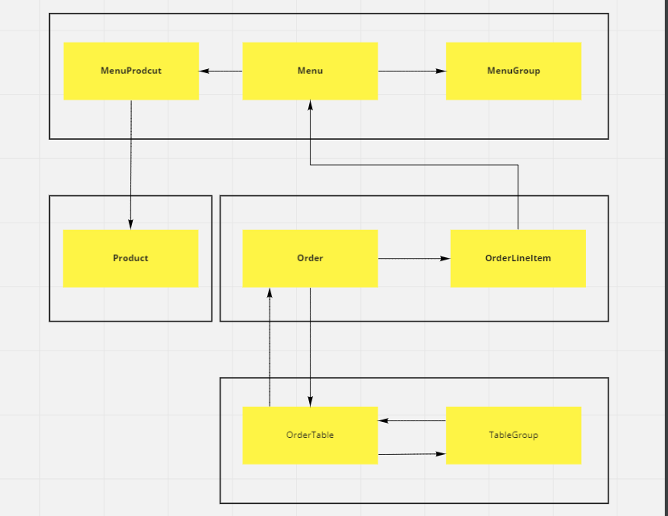
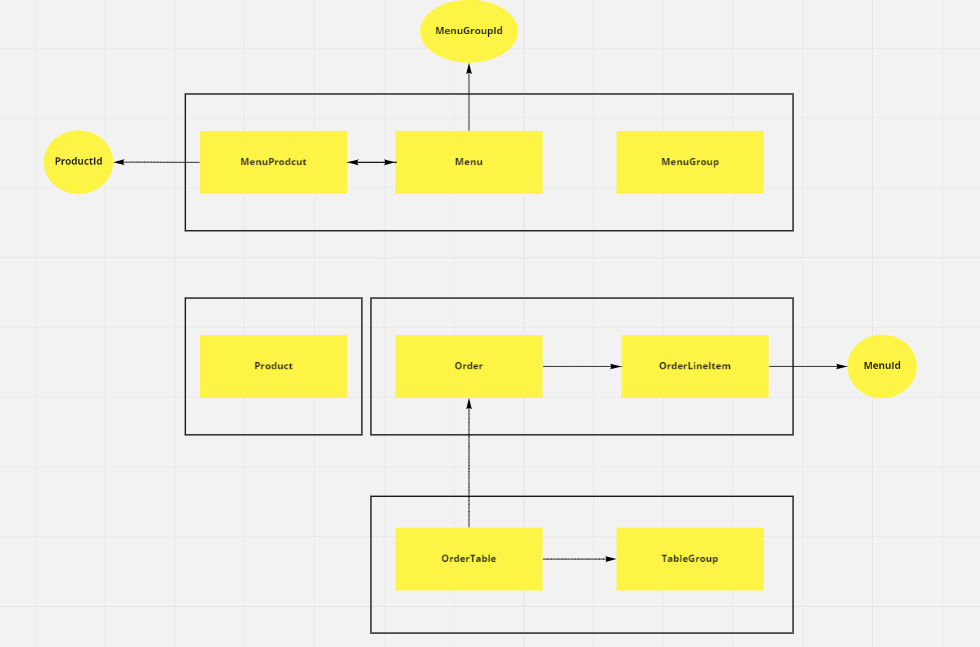

# 키친포스

## 요구 사항

## 용어 사전

| 한글명 | 영문명 | 설명 |
| --- | --- | --- |
| 상품 | product | 메뉴를 관리하는 기준이 되는 데이터 |
| 메뉴 그룹 | menu group | 메뉴 묶음, 분류 |
| 메뉴 | menu | 메뉴 그룹에 속하는 실제 주문 가능 단위 |
| 메뉴 상품 | menu product | 메뉴에 속하는 수량이 있는 상품 |
| 금액 | amount | 가격 * 수량 |
| 주문 테이블 | order table | 매장에서 주문이 발생하는 영역 |
| 빈 테이블 | empty table | 주문을 등록할 수 없는 주문 테이블 |
| 테이블 상태| orderTableStatus| 테이블의 상태를 표시 USE(주문테이블), EMPTY(빈테이블)
| 주문 | order | 매장에서 발생하는 주문 |
| 주문 상태 | order status | 주문은 조리 ➜ 식사 ➜ 계산 완 료 순서로 진행된다. |
| 방문한 손님 수 | number of guests | 필수 사항은 아니며 주문은 0명으로 등록할 수 있다. |
| 단체 지정 | table group | 통합 계산을 위해 개별 주문 테이블을 그룹화하는 기능 |
| 주문 항목 | order line item | 주문에 속하는 수량이 있는 메뉴 |
| 매장 식사 | eat in | 포장하지 않고 매장에서 식사하는 것 |

|비지니스명|비지니스|관련된도메인|메뉴위치|
|:---:|:---:|:---:|:---:|
|상품|ProductService|상품생성,조회|[상품](#상품)|
|메뉴그룹|MenuGroupService|메뉴그룹생성,조회|[메뉴그룹](#메뉴그룹)|
|메뉴|MenuService|메뉴생성, 조회|[메뉴](#메뉴)|
|주문|OrderService|주문생성, 주문조회, 주문상태변경|[주문](#주문)|
|주문테이블|TableService|테이블생성, 빈 테이블로 변경, 방문한 손님 수|[주문테이블](#주문테이블)|
|단체지정|TableGroupService|단체지정생성, 단체지정취소|[단체지정](#단체지정)|


# 상품
 - 키친포스 운영자는 상품(`이름,가격`)을 등록할 수 있다. 
  - 가격은 반드시 필수이다. 
  - 상품의 가격은 0보다 작을 수 없다.
 - 여러개의 상품을 조회할 수 있다.


# 메뉴그룹
 - 키친포스 운영자는 메뉴를 `메뉴그룹`할 수 있다.
 - 그룹된 메뉴를 조회할 수 있다.
 
# 메뉴
 - 메뉴를 생성할 수 있다.
   - 메뉴의 가격이 올바르지 않으면 메뉴를 생성할 수 없다.
     - 0원 이상
   - 메뉴의 `메뉴그룹`이 존재하지 않는다면 생성할 수 없다. 
   - `상품`의 총 금액이 올바르지 않다면 생성할 수 없다 
     - 0원 이상
 - 메뉴를 조회할 수 있다.


# 주문
 - `주문 테이블`에서 주문을 진행한다.
   - `빈테이블`에서는 주문할 수 없다.
 - 최소 `하나 이상`의 음식을 주문해야한다.
 - 주문은 키친포스에서 `판매하고 있는 상품`이어야한다.
 - 주문시 주문 `조리상태`가 된다.
 - 전체 주문을 조회할 수 있다.
 - 주문의 상태를 변경할 수 있다. 
   - 이미 `완료` 상태인 주문은 상태를 변경할 수 없다
   - 주문의 상태는 `조리`,`식사`로 변경 가능하다.


# 주문테이블
 - `주문테이블`을 생성할 수 있다.
 - `주문테이블` 전체 조회 할 수 있다.
 - `주문 테이블`을 `빈 테이블`로 변경할 수 있다
   - `요리중`, `식사 중`이면 `빈테이블`로 변경 할 수 없다.
 - `주문테이블`에 `손님 수`를 등록한다.
   - 테이블이 `빈테이블`이면 손님수를 등록할 수 없다. 
   

# 단체지정
 - `주문테이블`을 `단체지정` 할수 있다.
   - `주문테이블`을 단체지정한 취소후 다시 `단체지정`해야한다.
 - `단체지정`을 취소할 수 있다.
   - 해당 테이블의 상태가 `조리`,`식사` 중이라면 취소할수 없다.


# 인수테스트 
```integrationperformancetest
   Feature 상품 관리
   
      Scenario 상품을 생성한다.
          When 상품을 생성 요청
          Then 상품 생성됨
          
       Scenario 전체 상품을 조회한다.
          given 상품이 생성 요청
          When 전체 상품 조회
          Then 전체 상품 조회됨
       
   Feature 메뉴그룹 관리  
   
      Scenario `메뉴그룹` 생성한다.
          When `메뉴그룹` 생성 요청
          Then 메뉴그룹 생성됨
          
       Scenario `메뉴그룹`을 조회한다.
          given 메뉴그룹 생성 요청
          When  메뉴그룹 전체조회 
          Then  메뉴그룹 조회됨
       
   Feature 메뉴 관리
   
      Scenario `메뉴`를 생성한다.
          When 메뉴 생성을 요청
          Then 메뉴 생성됨
          
       Scenario `메뉴`을 조회한다.
          given 메뉴 생성 요청
          When  메뉴 전체조회 
          Then  메뉴 조회됨
       
   Feature 주문을 할 수 있다 
   
      Scenario `주문`을 생성한다.
          When 주문 생성 요청
          Then 주문 생성됨
          
       Scenario 전체 `주문`을 조회한다.
          given 주문 생성 요청
          When  주문 전체조회 요청 
          Then  주문 조회됨
   
   
   Feature `주문테이블` 관리
   
      Scenario `주문테이블`을 생성한다.
          When 주문테이블 생성 요청
          Then 주문테이블 생성됨
      
      Scenario `주문테이블`을 `빈테이블` 변경한다.
         given 주문테이블 생성 요청
          When 주문테이블 변경 요청
          Then 주문테이블 변경 됨
          
      Scenario `주문테이블`에 `손님 수` 변경한다..
         given 주문테이블 생성
          When 주문테이블 손님 수 변경 요청
          Then 주문테이블 손님 수 변경됨
          
   Feature `단체지정` 관리
   
      Secnario `주문테이블` 단체지정 생성
         given 주문테이블 생성
         given 주문테이블 생성
          when 단체지정 생성을 요청 
          then 단체지정 생성됨
          
      Secnario `단체지정`을 취소할 수 있다.
         given 주문테이블 생성요청
         given 주문테이블 생성요청
         given 단체지정 요청
          when 단체지정 취소 요청
          then 단체지정 취소됨 
```
## 기능정의성

## 주문 

- [x] 주문 생성
   - 예외
      - [x] 메뉴에 등록된 상품 숫자와 주문하는 숫자는 동일해야한다.
      - [x] 주문테이블은 빈값일 수 없다.
- [x] 주문 상태 수정
  - 파라미터
    - [x] `주문상태` true , false
  - 예외
    - [x] 계산완료된 경우에는 상태를 변경할 수 없다.
- [x] 주문 전체 조회 


## 메뉴 그룹 
- [x] 메뉴 그룹생성 
  - 파라미터 
    - [x] `메뉴이름`
  - 예외
    - [x] 메뉴 이름은 반드시 필수입니다.
- [x] 메뉴 전체 조회

## 메뉴 
- [x] 메뉴 생성
  - 파라미터 
    - [x] 이름, 금액, 메뉴그룹, 메뉴에 등록할 상품
    - [x] 상품 Id , 상품 수량
  - 예외 
    - 메뉴에 등록하는 금액은 상품에 등록된 금액보다 클 수 없다.
      - 2000 상품이 두 개인경우 4000원 으로 메뉴를 등록 해야한다.
    - 메뉴 이름은 반드시 필수 입니다.
- [x] 메뉴 전체 조회

## 주문테이블
- [x] 주문 생성
  - 파라미터 
    - [x] 주문생성 `손님수`, `빈 테이블여부`
    - [x] 주문테이블 상태변경 `빈 테이블여부`
    - [x] 손님 수
  - 예외 
    - [x] 손님의 수는 0보다 작을 수 없습니다.
    - [x] 빈 테이블 여부는 빈 값일 수 없습니다.
    - [x] 빈테이블로 변경시 `요리`,`식사`중이면 변경할 수 없다.

## 단체지정 
- [x] 단체지정
  - 파라미터
    - 주문테이블(다건)
  - 예외
    - [x] 단체지정시 최소 2건 이상이어야한다.
    - [x] 주문 테이블이 빈값일 수 없다.
    - [x] 단체지정하는 테이블의 수가 저장되어 있는 수와 같지 않다면 예외 
      - 단체지정하는 테이블은 이미 등록되어있는 테이블이어야한다.
- [x] 단체 취소 
  - 예외
    - 주문테이블 상태가 `요리중`, `식사 중`인경우 그룹 취소할수 없다.

## 상품 
- [x] 상품 생성
  - [x] 파라미터 
    - `이름, 가격`
  - 예외 
    - [x] 이름과 가격은 필수 값입니다. 
  
- [x] 금액 
  - [x] 더하기, 곱하기 
  - 예외
    - [x] 0보다 작을 수 없습니다.

----

## Step3 의존성 리팩터링

### 개선 전 


### 개선 후

