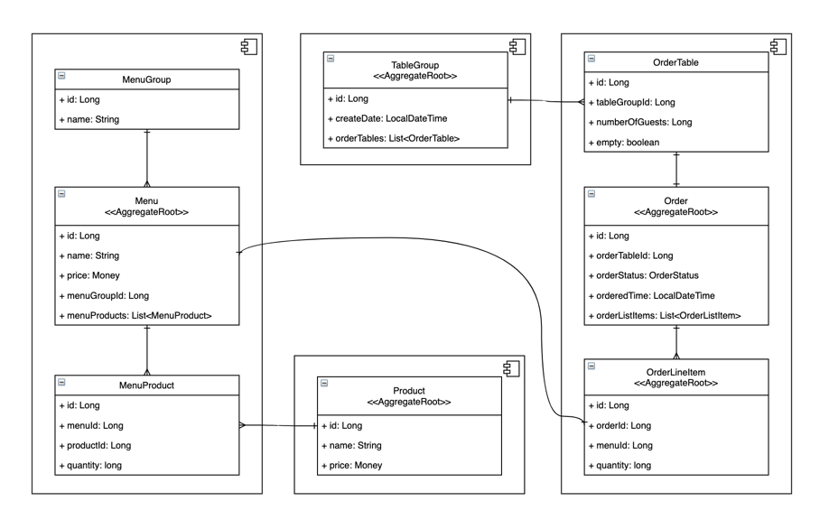

# 키친포스

<!-- %3CmxGraphModel%3E%3Croot%3E%3CmxCell%20id%3D%220%22%2F%3E%3CmxCell%20id%3D%221%22%20parent%3D%220%22%2F%3E%3CmxCell%20id%3D%222%22%20value%3D%22%22%20style%3D%22html%3D1%3BdropTarget%3D0%3B%22%20vertex%3D%221%22%20parent%3D%221%22%3E%3CmxGeometry%20x%3D%22410%22%20y%3D%2240%22%20width%3D%22300%22%20height%3D%22600%22%20as%3D%22geometry%22%2F%3E%3C%2FmxCell%3E%3CmxCell%20id%3D%223%22%20value%3D%22%22%20style%3D%22shape%3Dmodule%3BjettyWidth%3D8%3BjettyHeight%3D4%3B%22%20vertex%3D%221%22%20parent%3D%222%22%3E%3CmxGeometry%20x%3D%221%22%20width%3D%2220%22%20height%3D%2220%22%20relative%3D%221%22%20as%3D%22geometry%22%3E%3CmxPoint%20x%3D%22-27%22%20y%3D%227%22%20as%3D%22offset%22%2F%3E%3C%2FmxGeometry%3E%3C%2FmxCell%3E%3CmxCell%20id%3D%224%22%20value%3D%22%22%20style%3D%22html%3D1%3BdropTarget%3D0%3B%22%20vertex%3D%221%22%20parent%3D%221%22%3E%3CmxGeometry%20x%3D%2270%22%20y%3D%2240%22%20width%3D%22300%22%20height%3D%22171%22%20as%3D%22geometry%22%2F%3E%3C%2FmxCell%3E%3CmxCell%20id%3D%225%22%20value%3D%22%22%20style%3D%22shape%3Dmodule%3BjettyWidth%3D8%3BjettyHeight%3D4%3B%22%20vertex%3D%221%22%20parent%3D%224%22%3E%3CmxGeometry%20x%3D%221%22%20width%3D%2220%22%20height%3D%2220%22%20relative%3D%221%22%20as%3D%22geometry%22%3E%3CmxPoint%20x%3D%22-27%22%20y%3D%227%22%20as%3D%22offset%22%2F%3E%3C%2FmxGeometry%3E%3C%2FmxCell%3E%3CmxCell%20id%3D%226%22%20value%3D%22%22%20style%3D%22html%3D1%3BdropTarget%3D0%3B%22%20vertex%3D%221%22%20parent%3D%221%22%3E%3CmxGeometry%20x%3D%2262%22%20y%3D%22460%22%20width%3D%22300%22%20height%3D%22180%22%20as%3D%22geometry%22%2F%3E%3C%2FmxCell%3E%3CmxCell%20id%3D%227%22%20value%3D%22%22%20style%3D%22shape%3Dmodule%3BjettyWidth%3D8%3BjettyHeight%3D4%3B%22%20vertex%3D%221%22%20parent%3D%226%22%3E%3CmxGeometry%20x%3D%221%22%20width%3D%2220%22%20height%3D%2220%22%20relative%3D%221%22%20as%3D%22geometry%22%3E%3CmxPoint%20x%3D%22-27%22%20y%3D%227%22%20as%3D%22offset%22%2F%3E%3C%2FmxGeometry%3E%3C%2FmxCell%3E%3CmxCell%20id%3D%228%22%20value%3D%22%22%20style%3D%22html%3D1%3BdropTarget%3D0%3B%22%20vertex%3D%221%22%20parent%3D%221%22%3E%3CmxGeometry%20x%3D%22-280%22%20y%3D%2240%22%20width%3D%22300%22%20height%3D%22600%22%20as%3D%22geometry%22%2F%3E%3C%2FmxCell%3E%3CmxCell%20id%3D%229%22%20value%3D%22%22%20style%3D%22shape%3Dmodule%3BjettyWidth%3D8%3BjettyHeight%3D4%3B%22%20vertex%3D%221%22%20parent%3D%228%22%3E%3CmxGeometry%20x%3D%221%22%20width%3D%2220%22%20height%3D%2220%22%20relative%3D%221%22%20as%3D%22geometry%22%3E%3CmxPoint%20x%3D%22-27%22%20y%3D%227%22%20as%3D%22offset%22%2F%3E%3C%2FmxGeometry%3E%3C%2FmxCell%3E%3CmxCell%20id%3D%2210%22%20value%3D%22Order%26%2310%3B%26lt%3B%26lt%3BAggregateRoot%26gt%3B%26gt%3B%22%20style%3D%22swimlane%3BfontStyle%3D0%3BchildLayout%3DstackLayout%3Bhorizontal%3D1%3BstartSize%3D50%3BfillColor%3Dnone%3BhorizontalStack%3D0%3BresizeParent%3D1%3BresizeParentMax%3D0%3BresizeLast%3D0%3Bcollapsible%3D1%3BmarginBottom%3D0%3B%22%20vertex%3D%221%22%20parent%3D%221%22%3E%3CmxGeometry%20x%3D%22440%22%20y%3D%22240%22%20width%3D%22240%22%20height%3D%22180%22%20as%3D%22geometry%22%2F%3E%3C%2FmxCell%3E%3CmxCell%20id%3D%2211%22%20value%3D%22%2B%20id%3A%20Long%22%20style%3D%22text%3BstrokeColor%3Dnone%3BfillColor%3Dnone%3Balign%3Dleft%3BverticalAlign%3Dtop%3BspacingLeft%3D4%3BspacingRight%3D4%3Boverflow%3Dhidden%3Brotatable%3D0%3Bpoints%3D%5B%5B0%2C0.5%5D%2C%5B1%2C0.5%5D%5D%3BportConstraint%3Deastwest%3B%22%20vertex%3D%221%22%20parent%3D%2210%22%3E%3CmxGeometry%20y%3D%2250%22%20width%3D%22240%22%20height%3D%2226%22%20as%3D%22geometry%22%2F%3E%3C%2FmxCell%3E%3CmxCell%20id%3D%2212%22%20value%3D%22%2B%20orderTableId%3A%20Long%22%20style%3D%22text%3BstrokeColor%3Dnone%3BfillColor%3Dnone%3Balign%3Dleft%3BverticalAlign%3Dtop%3BspacingLeft%3D4%3BspacingRight%3D4%3Boverflow%3Dhidden%3Brotatable%3D0%3Bpoints%3D%5B%5B0%2C0.5%5D%2C%5B1%2C0.5%5D%5D%3BportConstraint%3Deastwest%3B%22%20vertex%3D%221%22%20parent%3D%2210%22%3E%3CmxGeometry%20y%3D%2276%22%20width%3D%22240%22%20height%3D%2226%22%20as%3D%22geometry%22%2F%3E%3C%2FmxCell%3E%3CmxCell%20id%3D%2213%22%20value%3D%22%2B%20orderStatus%3A%20OrderStatus%22%20style%3D%22text%3BstrokeColor%3Dnone%3BfillColor%3Dnone%3Balign%3Dleft%3BverticalAlign%3Dtop%3BspacingLeft%3D4%3BspacingRight%3D4%3Boverflow%3Dhidden%3Brotatable%3D0%3Bpoints%3D%5B%5B0%2C0.5%5D%2C%5B1%2C0.5%5D%5D%3BportConstraint%3Deastwest%3B%22%20vertex%3D%221%22%20parent%3D%2210%22%3E%3CmxGeometry%20y%3D%22102%22%20width%3D%22240%22%20height%3D%2226%22%20as%3D%22geometry%22%2F%3E%3C%2FmxCell%3E%3CmxCell%20id%3D%2214%22%20value%3D%22%2B%20orderedTime%3A%20LocalDateTime%22%20style%3D%22text%3BstrokeColor%3Dnone%3BfillColor%3Dnone%3Balign%3Dleft%3BverticalAlign%3Dtop%3BspacingLeft%3D4%3BspacingRight%3D4%3Boverflow%3Dhidden%3Brotatable%3D0%3Bpoints%3D%5B%5B0%2C0.5%5D%2C%5B1%2C0.5%5D%5D%3BportConstraint%3Deastwest%3B%22%20vertex%3D%221%22%20parent%3D%2210%22%3E%3CmxGeometry%20y%3D%22128%22%20width%3D%22240%22%20height%3D%2226%22%20as%3D%22geometry%22%2F%3E%3C%2FmxCell%3E%3CmxCell%20id%3D%2215%22%20value%3D%22%2B%20orderListItems%3A%20List%26lt%3BOrderListItem%26gt%3B%22%20style%3D%22text%3BstrokeColor%3Dnone%3BfillColor%3Dnone%3Balign%3Dleft%3BverticalAlign%3Dtop%3BspacingLeft%3D4%3BspacingRight%3D4%3Boverflow%3Dhidden%3Brotatable%3D0%3Bpoints%3D%5B%5B0%2C0.5%5D%2C%5B1%2C0.5%5D%5D%3BportConstraint%3Deastwest%3B%22%20vertex%3D%221%22%20parent%3D%2210%22%3E%3CmxGeometry%20y%3D%22154%22%20width%3D%22240%22%20height%3D%2226%22%20as%3D%22geometry%22%2F%3E%3C%2FmxCell%3E%3CmxCell%20id%3D%2216%22%20style%3D%22edgeStyle%3DorthogonalEdgeStyle%3Bcurved%3D1%3Brounded%3D0%3BorthogonalLoop%3D1%3BjettySize%3Dauto%3Bhtml%3D1%3BstartArrow%3DERmany%3BstartFill%3D0%3BendArrow%3DERone%3BendFill%3D0%3B%22%20edge%3D%221%22%20source%3D%2217%22%20target%3D%2210%22%20parent%3D%221%22%3E%3CmxGeometry%20relative%3D%221%22%20as%3D%22geometry%22%2F%3E%3C%2FmxCell%3E%3CmxCell%20id%3D%2217%22%20value%3D%22OrderLineItem%26%2310%3B%26lt%3B%26lt%3BAggregateRoot%26gt%3B%26gt%3B%22%20style%3D%22swimlane%3BfontStyle%3D0%3BchildLayout%3DstackLayout%3Bhorizontal%3D1%3BstartSize%3D47%3BfillColor%3Dnone%3BhorizontalStack%3D0%3BresizeParent%3D1%3BresizeParentMax%3D0%3BresizeLast%3D0%3Bcollapsible%3D1%3BmarginBottom%3D0%3B%22%20vertex%3D%221%22%20parent%3D%221%22%3E%3CmxGeometry%20x%3D%22440%22%20y%3D%22464.5%22%20width%3D%22240%22%20height%3D%22151%22%20as%3D%22geometry%22%2F%3E%3C%2FmxCell%3E%3CmxCell%20id%3D%2218%22%20value%3D%22%2B%20id%3A%20Long%22%20style%3D%22text%3BstrokeColor%3Dnone%3BfillColor%3Dnone%3Balign%3Dleft%3BverticalAlign%3Dtop%3BspacingLeft%3D4%3BspacingRight%3D4%3Boverflow%3Dhidden%3Brotatable%3D0%3Bpoints%3D%5B%5B0%2C0.5%5D%2C%5B1%2C0.5%5D%5D%3BportConstraint%3Deastwest%3B%22%20vertex%3D%221%22%20parent%3D%2217%22%3E%3CmxGeometry%20y%3D%2247%22%20width%3D%22240%22%20height%3D%2226%22%20as%3D%22geometry%22%2F%3E%3C%2FmxCell%3E%3CmxCell%20id%3D%2219%22%20value%3D%22%2B%20orderId%3A%20Long%22%20style%3D%22text%3BstrokeColor%3Dnone%3BfillColor%3Dnone%3Balign%3Dleft%3BverticalAlign%3Dtop%3BspacingLeft%3D4%3BspacingRight%3D4%3Boverflow%3Dhidden%3Brotatable%3D0%3Bpoints%3D%5B%5B0%2C0.5%5D%2C%5B1%2C0.5%5D%5D%3BportConstraint%3Deastwest%3B%22%20vertex%3D%221%22%20parent%3D%2217%22%3E%3CmxGeometry%20y%3D%2273%22%20width%3D%22240%22%20height%3D%2226%22%20as%3D%22geometry%22%2F%3E%3C%2FmxCell%3E%3CmxCell%20id%3D%2220%22%20value%3D%22%2B%20menuId%3A%20Long%22%20style%3D%22text%3BstrokeColor%3Dnone%3BfillColor%3Dnone%3Balign%3Dleft%3BverticalAlign%3Dtop%3BspacingLeft%3D4%3BspacingRight%3D4%3Boverflow%3Dhidden%3Brotatable%3D0%3Bpoints%3D%5B%5B0%2C0.5%5D%2C%5B1%2C0.5%5D%5D%3BportConstraint%3Deastwest%3B%22%20vertex%3D%221%22%20parent%3D%2217%22%3E%3CmxGeometry%20y%3D%2299%22%20width%3D%22240%22%20height%3D%2226%22%20as%3D%22geometry%22%2F%3E%3C%2FmxCell%3E%3CmxCell%20id%3D%2221%22%20value%3D%22%2B%20quantity%3A%20long%22%20style%3D%22text%3BstrokeColor%3Dnone%3BfillColor%3Dnone%3Balign%3Dleft%3BverticalAlign%3Dtop%3BspacingLeft%3D4%3BspacingRight%3D4%3Boverflow%3Dhidden%3Brotatable%3D0%3Bpoints%3D%5B%5B0%2C0.5%5D%2C%5B1%2C0.5%5D%5D%3BportConstraint%3Deastwest%3B%22%20vertex%3D%221%22%20parent%3D%2217%22%3E%3CmxGeometry%20y%3D%22125%22%20width%3D%22240%22%20height%3D%2226%22%20as%3D%22geometry%22%2F%3E%3C%2FmxCell%3E%3CmxCell%20id%3D%2222%22%20style%3D%22edgeStyle%3DorthogonalEdgeStyle%3Bcurved%3D1%3Brounded%3D0%3BorthogonalLoop%3D1%3BjettySize%3Dauto%3Bhtml%3D1%3BstartArrow%3DERone%3BstartFill%3D0%3BendArrow%3DERone%3BendFill%3D0%3BentryX%3D0%3BentryY%3D0.5%3BentryDx%3D0%3BentryDy%3D0%3BexitX%3D1%3BexitY%3D0.5%3BexitDx%3D0%3BexitDy%3D0%3B%22%20edge%3D%221%22%20source%3D%2225%22%20target%3D%2219%22%20parent%3D%221%22%3E%3CmxGeometry%20relative%3D%221%22%20as%3D%22geometry%22%3E%3CArray%20as%3D%22points%22%3E%3CmxPoint%20x%3D%22384%22%20y%3D%22306%22%2F%3E%3CmxPoint%20x%3D%22384%22%20y%3D%22539%22%2F%3E%3C%2FArray%3E%3C%2FmxGeometry%3E%3C%2FmxCell%3E%3CmxCell%20id%3D%2223%22%20value%3D%22Menu%26%2310%3B%26lt%3B%26lt%3BAggregateRoot%26gt%3B%26gt%3B%22%20style%3D%22swimlane%3BfontStyle%3D0%3BchildLayout%3DstackLayout%3Bhorizontal%3D1%3BstartSize%3D50%3BfillColor%3Dnone%3BhorizontalStack%3D0%3BresizeParent%3D1%3BresizeParentMax%3D0%3BresizeLast%3D0%3Bcollapsible%3D1%3BmarginBottom%3D0%3B%22%20vertex%3D%221%22%20parent%3D%221%22%3E%3CmxGeometry%20x%3D%22-250%22%20y%3D%22240%22%20width%3D%22240%22%20height%3D%22180%22%20as%3D%22geometry%22%2F%3E%3C%2FmxCell%3E%3CmxCell%20id%3D%2224%22%20value%3D%22%2B%20id%3A%20Long%22%20style%3D%22text%3BstrokeColor%3Dnone%3BfillColor%3Dnone%3Balign%3Dleft%3BverticalAlign%3Dtop%3BspacingLeft%3D4%3BspacingRight%3D4%3Boverflow%3Dhidden%3Brotatable%3D0%3Bpoints%3D%5B%5B0%2C0.5%5D%2C%5B1%2C0.5%5D%5D%3BportConstraint%3Deastwest%3B%22%20vertex%3D%221%22%20parent%3D%2223%22%3E%3CmxGeometry%20y%3D%2250%22%20width%3D%22240%22%20height%3D%2226%22%20as%3D%22geometry%22%2F%3E%3C%2FmxCell%3E%3CmxCell%20id%3D%2225%22%20value%3D%22%2B%20name%3A%20String%22%20style%3D%22text%3BstrokeColor%3Dnone%3BfillColor%3Dnone%3Balign%3Dleft%3BverticalAlign%3Dtop%3BspacingLeft%3D4%3BspacingRight%3D4%3Boverflow%3Dhidden%3Brotatable%3D0%3Bpoints%3D%5B%5B0%2C0.5%5D%2C%5B1%2C0.5%5D%5D%3BportConstraint%3Deastwest%3B%22%20vertex%3D%221%22%20parent%3D%2223%22%3E%3CmxGeometry%20y%3D%2276%22%20width%3D%22240%22%20height%3D%2226%22%20as%3D%22geometry%22%2F%3E%3C%2FmxCell%3E%3CmxCell%20id%3D%2226%22%20value%3D%22%2B%20price%3A%20Money%22%20style%3D%22text%3BstrokeColor%3Dnone%3BfillColor%3Dnone%3Balign%3Dleft%3BverticalAlign%3Dtop%3BspacingLeft%3D4%3BspacingRight%3D4%3Boverflow%3Dhidden%3Brotatable%3D0%3Bpoints%3D%5B%5B0%2C0.5%5D%2C%5B1%2C0.5%5D%5D%3BportConstraint%3Deastwest%3B%22%20vertex%3D%221%22%20parent%3D%2223%22%3E%3CmxGeometry%20y%3D%22102%22%20width%3D%22240%22%20height%3D%2226%22%20as%3D%22geometry%22%2F%3E%3C%2FmxCell%3E%3CmxCell%20id%3D%2227%22%20value%3D%22%2B%20menuGroupId%3A%20Long%22%20style%3D%22text%3BstrokeColor%3Dnone%3BfillColor%3Dnone%3Balign%3Dleft%3BverticalAlign%3Dtop%3BspacingLeft%3D4%3BspacingRight%3D4%3Boverflow%3Dhidden%3Brotatable%3D0%3Bpoints%3D%5B%5B0%2C0.5%5D%2C%5B1%2C0.5%5D%5D%3BportConstraint%3Deastwest%3B%22%20vertex%3D%221%22%20parent%3D%2223%22%3E%3CmxGeometry%20y%3D%22128%22%20width%3D%22240%22%20height%3D%2226%22%20as%3D%22geometry%22%2F%3E%3C%2FmxCell%3E%3CmxCell%20id%3D%2228%22%20value%3D%22%2B%20menuProducts%3A%20List%26lt%3BMenuProduct%26gt%3B%22%20style%3D%22text%3BstrokeColor%3Dnone%3BfillColor%3Dnone%3Balign%3Dleft%3BverticalAlign%3Dtop%3BspacingLeft%3D4%3BspacingRight%3D4%3Boverflow%3Dhidden%3Brotatable%3D0%3Bpoints%3D%5B%5B0%2C0.5%5D%2C%5B1%2C0.5%5D%5D%3BportConstraint%3Deastwest%3B%22%20vertex%3D%221%22%20parent%3D%2223%22%3E%3CmxGeometry%20y%3D%22154%22%20width%3D%22240%22%20height%3D%2226%22%20as%3D%22geometry%22%2F%3E%3C%2FmxCell%3E%3CmxCell%20id%3D%2229%22%20style%3D%22edgeStyle%3DorthogonalEdgeStyle%3Bcurved%3D1%3Brounded%3D0%3BorthogonalLoop%3D1%3BjettySize%3Dauto%3Bhtml%3D1%3BstartArrow%3DERone%3BstartFill%3D0%3BendArrow%3DERmany%3BendFill%3D0%3B%22%20edge%3D%221%22%20source%3D%2230%22%20target%3D%2223%22%20parent%3D%221%22%3E%3CmxGeometry%20relative%3D%221%22%20as%3D%22geometry%22%2F%3E%3C%2FmxCell%3E%3CmxCell%20id%3D%2230%22%20value%3D%22MenuGroup%22%20style%3D%22swimlane%3BfontStyle%3D0%3BchildLayout%3DstackLayout%3Bhorizontal%3D1%3BstartSize%3D26%3BfillColor%3Dnone%3BhorizontalStack%3D0%3BresizeParent%3D1%3BresizeParentMax%3D0%3BresizeLast%3D0%3Bcollapsible%3D1%3BmarginBottom%3D0%3B%22%20vertex%3D%221%22%20parent%3D%221%22%3E%3CmxGeometry%20x%3D%22-250%22%20y%3D%2286.5%22%20width%3D%22240%22%20height%3D%2278%22%20as%3D%22geometry%22%2F%3E%3C%2FmxCell%3E%3CmxCell%20id%3D%2231%22%20value%3D%22%2B%20id%3A%20Long%22%20style%3D%22text%3BstrokeColor%3Dnone%3BfillColor%3Dnone%3Balign%3Dleft%3BverticalAlign%3Dtop%3BspacingLeft%3D4%3BspacingRight%3D4%3Boverflow%3Dhidden%3Brotatable%3D0%3Bpoints%3D%5B%5B0%2C0.5%5D%2C%5B1%2C0.5%5D%5D%3BportConstraint%3Deastwest%3B%22%20vertex%3D%221%22%20parent%3D%2230%22%3E%3CmxGeometry%20y%3D%2226%22%20width%3D%22240%22%20height%3D%2226%22%20as%3D%22geometry%22%2F%3E%3C%2FmxCell%3E%3CmxCell%20id%3D%2232%22%20value%3D%22%2B%20name%3A%20String%22%20style%3D%22text%3BstrokeColor%3Dnone%3BfillColor%3Dnone%3Balign%3Dleft%3BverticalAlign%3Dtop%3BspacingLeft%3D4%3BspacingRight%3D4%3Boverflow%3Dhidden%3Brotatable%3D0%3Bpoints%3D%5B%5B0%2C0.5%5D%2C%5B1%2C0.5%5D%5D%3BportConstraint%3Deastwest%3B%22%20vertex%3D%221%22%20parent%3D%2230%22%3E%3CmxGeometry%20y%3D%2252%22%20width%3D%22240%22%20height%3D%2226%22%20as%3D%22geometry%22%2F%3E%3C%2FmxCell%3E%3CmxCell%20id%3D%2233%22%20style%3D%22edgeStyle%3DorthogonalEdgeStyle%3Bcurved%3D1%3Brounded%3D0%3BorthogonalLoop%3D1%3BjettySize%3Dauto%3Bhtml%3D1%3BstartArrow%3DERmany%3BstartFill%3D0%3BendArrow%3DERone%3BendFill%3D0%3B%22%20edge%3D%221%22%20source%3D%2235%22%20target%3D%2223%22%20parent%3D%221%22%3E%3CmxGeometry%20relative%3D%221%22%20as%3D%22geometry%22%2F%3E%3C%2FmxCell%3E%3CmxCell%20id%3D%2234%22%20style%3D%22edgeStyle%3DorthogonalEdgeStyle%3Bcurved%3D1%3Brounded%3D0%3BorthogonalLoop%3D1%3BjettySize%3Dauto%3Bhtml%3D1%3BstartArrow%3DERmany%3BstartFill%3D0%3BendArrow%3DERone%3BendFill%3D0%3B%22%20edge%3D%221%22%20source%3D%2235%22%20target%3D%2251%22%20parent%3D%221%22%3E%3CmxGeometry%20relative%3D%221%22%20as%3D%22geometry%22%2F%3E%3C%2FmxCell%3E%3CmxCell%20id%3D%2235%22%20value%3D%22MenuProduct%22%20style%3D%22swimlane%3BfontStyle%3D0%3BchildLayout%3DstackLayout%3Bhorizontal%3D1%3BstartSize%3D26%3BfillColor%3Dnone%3BhorizontalStack%3D0%3BresizeParent%3D1%3BresizeParentMax%3D0%3BresizeLast%3D0%3Bcollapsible%3D1%3BmarginBottom%3D0%3B%22%20vertex%3D%221%22%20parent%3D%221%22%3E%3CmxGeometry%20x%3D%22-250%22%20y%3D%22485.5%22%20width%3D%22240%22%20height%3D%22130%22%20as%3D%22geometry%22%2F%3E%3C%2FmxCell%3E%3CmxCell%20id%3D%2236%22%20value%3D%22%2B%20id%3A%20Long%22%20style%3D%22text%3BstrokeColor%3Dnone%3BfillColor%3Dnone%3Balign%3Dleft%3BverticalAlign%3Dtop%3BspacingLeft%3D4%3BspacingRight%3D4%3Boverflow%3Dhidden%3Brotatable%3D0%3Bpoints%3D%5B%5B0%2C0.5%5D%2C%5B1%2C0.5%5D%5D%3BportConstraint%3Deastwest%3B%22%20vertex%3D%221%22%20parent%3D%2235%22%3E%3CmxGeometry%20y%3D%2226%22%20width%3D%22240%22%20height%3D%2226%22%20as%3D%22geometry%22%2F%3E%3C%2FmxCell%3E%3CmxCell%20id%3D%2237%22%20value%3D%22%2B%20menuId%3A%20Long%22%20style%3D%22text%3BstrokeColor%3Dnone%3BfillColor%3Dnone%3Balign%3Dleft%3BverticalAlign%3Dtop%3BspacingLeft%3D4%3BspacingRight%3D4%3Boverflow%3Dhidden%3Brotatable%3D0%3Bpoints%3D%5B%5B0%2C0.5%5D%2C%5B1%2C0.5%5D%5D%3BportConstraint%3Deastwest%3B%22%20vertex%3D%221%22%20parent%3D%2235%22%3E%3CmxGeometry%20y%3D%2252%22%20width%3D%22240%22%20height%3D%2226%22%20as%3D%22geometry%22%2F%3E%3C%2FmxCell%3E%3CmxCell%20id%3D%2238%22%20value%3D%22%2B%20productId%3A%20Long%22%20style%3D%22text%3BstrokeColor%3Dnone%3BfillColor%3Dnone%3Balign%3Dleft%3BverticalAlign%3Dtop%3BspacingLeft%3D4%3BspacingRight%3D4%3Boverflow%3Dhidden%3Brotatable%3D0%3Bpoints%3D%5B%5B0%2C0.5%5D%2C%5B1%2C0.5%5D%5D%3BportConstraint%3Deastwest%3B%22%20vertex%3D%221%22%20parent%3D%2235%22%3E%3CmxGeometry%20y%3D%2278%22%20width%3D%22240%22%20height%3D%2226%22%20as%3D%22geometry%22%2F%3E%3C%2FmxCell%3E%3CmxCell%20id%3D%2239%22%20value%3D%22%2B%20quantity%3A%20long%22%20style%3D%22text%3BstrokeColor%3Dnone%3BfillColor%3Dnone%3Balign%3Dleft%3BverticalAlign%3Dtop%3BspacingLeft%3D4%3BspacingRight%3D4%3Boverflow%3Dhidden%3Brotatable%3D0%3Bpoints%3D%5B%5B0%2C0.5%5D%2C%5B1%2C0.5%5D%5D%3BportConstraint%3Deastwest%3B%22%20vertex%3D%221%22%20parent%3D%2235%22%3E%3CmxGeometry%20y%3D%22104%22%20width%3D%22240%22%20height%3D%2226%22%20as%3D%22geometry%22%2F%3E%3C%2FmxCell%3E%3CmxCell%20id%3D%2240%22%20style%3D%22edgeStyle%3DorthogonalEdgeStyle%3Brounded%3D0%3BorthogonalLoop%3D1%3BjettySize%3Dauto%3Bhtml%3D1%3BendArrow%3DERone%3BendFill%3D0%3BstartArrow%3DERone%3BstartFill%3D0%3B%22%20edge%3D%221%22%20source%3D%2241%22%20target%3D%2210%22%20parent%3D%221%22%3E%3CmxGeometry%20relative%3D%221%22%20as%3D%22geometry%22%2F%3E%3C%2FmxCell%3E%3CmxCell%20id%3D%2241%22%20value%3D%22OrderTable%22%20style%3D%22swimlane%3BfontStyle%3D0%3BchildLayout%3DstackLayout%3Bhorizontal%3D1%3BstartSize%3D26%3BfillColor%3Dnone%3BhorizontalStack%3D0%3BresizeParent%3D1%3BresizeParentMax%3D0%3BresizeLast%3D0%3Bcollapsible%3D1%3BmarginBottom%3D0%3B%22%20vertex%3D%221%22%20parent%3D%221%22%3E%3CmxGeometry%20x%3D%22440%22%20y%3D%2264%22%20width%3D%22240%22%20height%3D%22130%22%20as%3D%22geometry%22%2F%3E%3C%2FmxCell%3E%3CmxCell%20id%3D%2242%22%20value%3D%22%2B%20id%3A%20Long%22%20style%3D%22text%3BstrokeColor%3Dnone%3BfillColor%3Dnone%3Balign%3Dleft%3BverticalAlign%3Dtop%3BspacingLeft%3D4%3BspacingRight%3D4%3Boverflow%3Dhidden%3Brotatable%3D0%3Bpoints%3D%5B%5B0%2C0.5%5D%2C%5B1%2C0.5%5D%5D%3BportConstraint%3Deastwest%3B%22%20vertex%3D%221%22%20parent%3D%2241%22%3E%3CmxGeometry%20y%3D%2226%22%20width%3D%22240%22%20height%3D%2226%22%20as%3D%22geometry%22%2F%3E%3C%2FmxCell%3E%3CmxCell%20id%3D%2243%22%20value%3D%22%2B%20tableGroupId%3A%20Long%22%20style%3D%22text%3BstrokeColor%3Dnone%3BfillColor%3Dnone%3Balign%3Dleft%3BverticalAlign%3Dtop%3BspacingLeft%3D4%3BspacingRight%3D4%3Boverflow%3Dhidden%3Brotatable%3D0%3Bpoints%3D%5B%5B0%2C0.5%5D%2C%5B1%2C0.5%5D%5D%3BportConstraint%3Deastwest%3B%22%20vertex%3D%221%22%20parent%3D%2241%22%3E%3CmxGeometry%20y%3D%2252%22%20width%3D%22240%22%20height%3D%2226%22%20as%3D%22geometry%22%2F%3E%3C%2FmxCell%3E%3CmxCell%20id%3D%2244%22%20value%3D%22%2B%20numberOfGuests%3A%20Long%22%20style%3D%22text%3BstrokeColor%3Dnone%3BfillColor%3Dnone%3Balign%3Dleft%3BverticalAlign%3Dtop%3BspacingLeft%3D4%3BspacingRight%3D4%3Boverflow%3Dhidden%3Brotatable%3D0%3Bpoints%3D%5B%5B0%2C0.5%5D%2C%5B1%2C0.5%5D%5D%3BportConstraint%3Deastwest%3B%22%20vertex%3D%221%22%20parent%3D%2241%22%3E%3CmxGeometry%20y%3D%2278%22%20width%3D%22240%22%20height%3D%2226%22%20as%3D%22geometry%22%2F%3E%3C%2FmxCell%3E%3CmxCell%20id%3D%2245%22%20value%3D%22%2B%20empty%3A%20boolean%22%20style%3D%22text%3BstrokeColor%3Dnone%3BfillColor%3Dnone%3Balign%3Dleft%3BverticalAlign%3Dtop%3BspacingLeft%3D4%3BspacingRight%3D4%3Boverflow%3Dhidden%3Brotatable%3D0%3Bpoints%3D%5B%5B0%2C0.5%5D%2C%5B1%2C0.5%5D%5D%3BportConstraint%3Deastwest%3B%22%20vertex%3D%221%22%20parent%3D%2241%22%3E%3CmxGeometry%20y%3D%22104%22%20width%3D%22240%22%20height%3D%2226%22%20as%3D%22geometry%22%2F%3E%3C%2FmxCell%3E%3CmxCell%20id%3D%2246%22%20style%3D%22rounded%3D0%3BorthogonalLoop%3D1%3BjettySize%3Dauto%3Bhtml%3D1%3BedgeStyle%3DorthogonalEdgeStyle%3Bcurved%3D1%3BendArrow%3DERmany%3BendFill%3D0%3BstartArrow%3DERone%3BstartFill%3D0%3B%22%20edge%3D%221%22%20source%3D%2247%22%20target%3D%2241%22%20parent%3D%221%22%3E%3CmxGeometry%20relative%3D%221%22%20as%3D%22geometry%22%2F%3E%3C%2FmxCell%3E%3CmxCell%20id%3D%2247%22%20value%3D%22TableGroup%26%2310%3B%26lt%3B%26lt%3BAggregateRoot%26gt%3B%26gt%3B%22%20style%3D%22swimlane%3BfontStyle%3D0%3BchildLayout%3DstackLayout%3Bhorizontal%3D1%3BstartSize%3D47%3BfillColor%3Dnone%3BhorizontalStack%3D0%3BresizeParent%3D1%3BresizeParentMax%3D0%3BresizeLast%3D0%3Bcollapsible%3D1%3BmarginBottom%3D0%3B%22%20vertex%3D%221%22%20parent%3D%221%22%3E%3CmxGeometry%20x%3D%22100%22%20y%3D%2264%22%20width%3D%22240%22%20height%3D%22125%22%20as%3D%22geometry%22%2F%3E%3C%2FmxCell%3E%3CmxCell%20id%3D%2248%22%20value%3D%22%2B%20id%3A%20Long%22%20style%3D%22text%3BstrokeColor%3Dnone%3BfillColor%3Dnone%3Balign%3Dleft%3BverticalAlign%3Dtop%3BspacingLeft%3D4%3BspacingRight%3D4%3Boverflow%3Dhidden%3Brotatable%3D0%3Bpoints%3D%5B%5B0%2C0.5%5D%2C%5B1%2C0.5%5D%5D%3BportConstraint%3Deastwest%3B%22%20vertex%3D%221%22%20parent%3D%2247%22%3E%3CmxGeometry%20y%3D%2247%22%20width%3D%22240%22%20height%3D%2226%22%20as%3D%22geometry%22%2F%3E%3C%2FmxCell%3E%3CmxCell%20id%3D%2249%22%20value%3D%22%2B%20createDate%3A%20LocalDateTime%22%20style%3D%22text%3BstrokeColor%3Dnone%3BfillColor%3Dnone%3Balign%3Dleft%3BverticalAlign%3Dtop%3BspacingLeft%3D4%3BspacingRight%3D4%3Boverflow%3Dhidden%3Brotatable%3D0%3Bpoints%3D%5B%5B0%2C0.5%5D%2C%5B1%2C0.5%5D%5D%3BportConstraint%3Deastwest%3B%22%20vertex%3D%221%22%20parent%3D%2247%22%3E%3CmxGeometry%20y%3D%2273%22%20width%3D%22240%22%20height%3D%2226%22%20as%3D%22geometry%22%2F%3E%3C%2FmxCell%3E%3CmxCell%20id%3D%2250%22%20value%3D%22%2B%20orderTables%3A%20List%26lt%3BOrderTable%26gt%3B%22%20style%3D%22text%3BstrokeColor%3Dnone%3BfillColor%3Dnone%3Balign%3Dleft%3BverticalAlign%3Dtop%3BspacingLeft%3D4%3BspacingRight%3D4%3Boverflow%3Dhidden%3Brotatable%3D0%3Bpoints%3D%5B%5B0%2C0.5%5D%2C%5B1%2C0.5%5D%5D%3BportConstraint%3Deastwest%3B%22%20vertex%3D%221%22%20parent%3D%2247%22%3E%3CmxGeometry%20y%3D%2299%22%20width%3D%22240%22%20height%3D%2226%22%20as%3D%22geometry%22%2F%3E%3C%2FmxCell%3E%3CmxCell%20id%3D%2251%22%20value%3D%22Product%26%2310%3B%26lt%3B%26lt%3BAggregateRoot%26gt%3B%26gt%3B%22%20style%3D%22swimlane%3BfontStyle%3D0%3BchildLayout%3DstackLayout%3Bhorizontal%3D1%3BstartSize%3D50%3BfillColor%3Dnone%3BhorizontalStack%3D0%3BresizeParent%3D1%3BresizeParentMax%3D0%3BresizeLast%3D0%3Bcollapsible%3D1%3BmarginBottom%3D0%3B%22%20vertex%3D%221%22%20parent%3D%221%22%3E%3CmxGeometry%20x%3D%2292%22%20y%3D%22487.5%22%20width%3D%22240%22%20height%3D%22128%22%20as%3D%22geometry%22%2F%3E%3C%2FmxCell%3E%3CmxCell%20id%3D%2252%22%20value%3D%22%2B%20id%3A%20Long%22%20style%3D%22text%3BstrokeColor%3Dnone%3BfillColor%3Dnone%3Balign%3Dleft%3BverticalAlign%3Dtop%3BspacingLeft%3D4%3BspacingRight%3D4%3Boverflow%3Dhidden%3Brotatable%3D0%3Bpoints%3D%5B%5B0%2C0.5%5D%2C%5B1%2C0.5%5D%5D%3BportConstraint%3Deastwest%3B%22%20vertex%3D%221%22%20parent%3D%2251%22%3E%3CmxGeometry%20y%3D%2250%22%20width%3D%22240%22%20height%3D%2226%22%20as%3D%22geometry%22%2F%3E%3C%2FmxCell%3E%3CmxCell%20id%3D%2253%22%20value%3D%22%2B%20name%3A%20String%22%20style%3D%22text%3BstrokeColor%3Dnone%3BfillColor%3Dnone%3Balign%3Dleft%3BverticalAlign%3Dtop%3BspacingLeft%3D4%3BspacingRight%3D4%3Boverflow%3Dhidden%3Brotatable%3D0%3Bpoints%3D%5B%5B0%2C0.5%5D%2C%5B1%2C0.5%5D%5D%3BportConstraint%3Deastwest%3B%22%20vertex%3D%221%22%20parent%3D%2251%22%3E%3CmxGeometry%20y%3D%2276%22%20width%3D%22240%22%20height%3D%2226%22%20as%3D%22geometry%22%2F%3E%3C%2FmxCell%3E%3CmxCell%20id%3D%2254%22%20value%3D%22%2B%20price%3A%20Money%22%20style%3D%22text%3BstrokeColor%3Dnone%3BfillColor%3Dnone%3Balign%3Dleft%3BverticalAlign%3Dtop%3BspacingLeft%3D4%3BspacingRight%3D4%3Boverflow%3Dhidden%3Brotatable%3D0%3Bpoints%3D%5B%5B0%2C0.5%5D%2C%5B1%2C0.5%5D%5D%3BportConstraint%3Deastwest%3B%22%20vertex%3D%221%22%20parent%3D%2251%22%3E%3CmxGeometry%20y%3D%22102%22%20width%3D%22240%22%20height%3D%2226%22%20as%3D%22geometry%22%2F%3E%3C%2FmxCell%3E%3C%2Froot%3E%3C%2FmxGraphModel%3E -->

## 요구 사항
- `Menu` (메뉴)
  - `메뉴` 등록
    - `메뉴` 가격이 0원 이하이거나 null이여선 안된다.
    - `메뉴`가 속한 `메뉴 그룹`이 존재해야 한다.
    - `메뉴`가 속한 `메뉴 그룹`의 총 합은 `메뉴` 가격보다 크거나 같아야 한다.
  - `메뉴` 전체 조회
- MenuGroup (메뉴 그룹)
  - `메뉴 그룹` 등록
  - `메뉴 그룹` 전체 조회
- `Order` (주문)
  - `주문` 생성
    - `주문`에는 최소 1개의 `주문 항목`이 있어야 한다.
    - `주문`에 중복되는 `주문 항목` 또는 등록되지 않은 `주문 항목`이 있어선 안된다.
    - `주문`에 `주문 테이블`이 공석이여야 한다.
  - `주문` 전체 조회
  - `주문` 상태 변경
    - `주문`의 상태가 COMPLETION 이면 변경이 안된다.
- `Product` (상품)
  - `상품` 생성
    - `상품`의 가격이 0원 초과여야 한다.
  - `상품` 전체 조회
- `TableGroup` (단체 지정)
  - `단체 지정` 생성
    - `단체 지정`에 중복되는 `주문 테이블` 또는 등록되지 않은 `주문 테이블`이 있어선 안된다.
    - `단체 지정`에 `주문 테이블`은 2개 이상이여야 한다.
    - `단체 지정`의 모든 `주문 테이블`은 공석이여야 한다.
  - `단체 지정` 해제
    - `단체 지정` 해제시 `주문 테이블`중 하나라도 COOKING, MEAL 상태인 경우에는 해재 불가.
- `OrderTable` (주문 테이블)
  - `주문 테이블` 생성
  - `주문 테이블` 전체 조회
  - `주문 테이블` 비우기 (empty = true)
    - `주문 테이블`이 COOKING, MEAL 상태일 경우에는 비우기 불가.
  - `주문 테이블` 테이블 인원 수 변경
    - `주문 테이블`에 변경 인원이 0명 초과
    - `주문 테이블`이 비어있는 경우 변경 불가.

## 용어 사전

| 한글명 | 영문명 | 설명 |
| --- | --- | --- |
| 상품 | product | 메뉴를 관리하는 기준이 되는 데이터 |
| 메뉴 그룹 | menu group | 메뉴 묶음, 분류 |
| 메뉴 | menu | 메뉴 그룹에 속하는 실제 주문 가능 단위 |
| 메뉴 상품 | menu product | 메뉴에 속하는 수량이 있는 상품 |
| 금액 | amount | 가격 * 수량 |
| 주문 테이블 | order table | 매장에서 주문이 발생하는 영역 |
| 빈 테이블 | empty table | 주문을 등록할 수 없는 주문 테이블 |
| 주문 | order | 매장에서 발생하는 주문 |
| 주문 상태 | order status | 주문은 조리 ➜ 식사 ➜ 계산 완료 순서로 진행된다. |
| 방문한 손님 수 | number of guests | 필수 사항은 아니며 주문은 0명으로 등록할 수 있다. |
| 단체 지정 | table group | 통합 계산을 위해 개별 주문 테이블을 그룹화하는 기능 |
| 주문 항목 | order line item | 주문에 속하는 수량이 있는 메뉴 |
| 매장 식사 | eat in | 포장하지 않고 매장에서 식사하는 것 |
