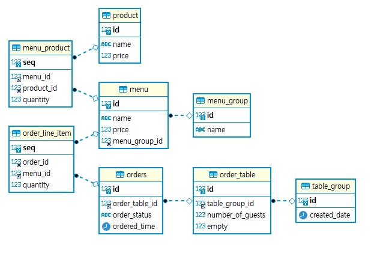

# 1단계 - 테스트를 통한 코드 보호

## 요구사항

1. 키친포스 요구사항 정리
2. 비지니스 오브젝트에 대한 테스트 코드 작성
   - Mock 을 통한 단위 테스트 코드 또는 통합 테스트 작성
3. (옵션) 인수 테스트 작성

## 기능 목록

- 상품 서비스 테스트
- 메뉴 그룹 서비스 테스트
- 메뉴 서비스 테스트
- 테이블 그룹 서비스 테스트
- 테이블 서비스 테스트
- 주문 서비스 테스트

----

# 키친포스

## 요구 사항

### 상품 product

- 상품을 등록한다
- 상품 가격이 올바르지 않으면 등록 안된다
  - 상품 가격이 0원 이상이어야 한다
- 상품 목록을 조회한다

### 메뉴 그룹 menu group

- 메뉴 그룹을 생성한다
- 메뉴 그룹 목록을 조회한다

### 메뉴 menu

- 메뉴를 등록한다
- 메뉴 등록 조건
  - 메뉴 가격이 0 이상이어야 한다
  - 메뉴 그룹 지정을 해야 한다
  - 메뉴의 상품이 모두 등록되어 있어야 한다
  - 메뉴 가격이 메뉴 재료 원가(메뉴 상품들과 각 수량 곱의 합)보다 비싸야 한다
- 메뉴 목록을 조회한다

### 단체 지정 table group

- 단체 지정을 생성한다
- 단체 지정 조건
  - 주문 테이블들의 수가 2 이상이어야 한다
  - 주문 테이블들이 모두 존재해야 한다
  - 테이블 인원이 0인 주문테이블이 하나라도 있으면 안된다
- 단체 지정을 해제한다
- 단체 지정 해제 조건
  - 조리 중이거나 식사 중인 주문 테이블은 해제가 안된다

### 주문 테이블 order, empty table

- 주문 테이블을 생성한다
- 주문 테이블 목록을 조회한다
- 주문 테이블을 빈 테이블로 변경한다
  - 테이블 그룹에 속해있지 않아야 한다
  - 조리 중이거나 식사 중인 테이블이면 안된다
- 주문 테이틀 손님수를 변경한다
  - 손님수가 0명 이상이어야 한다
  - 빈 테이블 상태가 아니어야 한다

## 주문 orders

- 주문을 생성한다
- 주문 생성 조건
  - 주문 항목이 1개 이상이어야 한다
  - 모든 주문 항목 메뉴가 존재해야 한다
  - 주문 테이블이 존재해야 한다
  - 주문 테이블이 빈 테이블 상태가 아니어야 한다
- 주문 목록을 조회한다
- 주문 상태를 변경한다
- 주문 상태 변경 조건
  - 주문 상태가 완료가 아니어야 한다
  
### ERD

- 

## 용어 사전

| 한글명 | 영문명 | 설명 |
| --- | --- | --- |
| 상품 | product | 메뉴를 관리하는 기준이 되는 데이터 |
| 메뉴 그룹 | menu group | 메뉴 묶음, 분류 |
| 메뉴 | menu | 메뉴 그룹에 속하는 실제 주문 가능 단위 |
| 메뉴 상품 | menu product | 메뉴에 속하는 수량이 있는 상품 |
| 금액 | amount | 가격 * 수량 |
| 주문 테이블 | order table | 매장에서 주문이 발생하는 영역 |
| 빈 테이블 | empty table | 주문을 등록할 수 없는 주문 테이블 |
| 주문 | order | 매장에서 발생하는 주문 |
| 주문 상태 | order status | 주문은 조리 ➜ 식사 ➜ 계산 완료 순서로 진행된다. |
| 방문한 손님 수 | number of guests | 필수 사항은 아니며 주문은 0명으로 등록할 수 있다. |
| 단체 지정 | table group | 통합 계산을 위해 개별 주문 테이블을 그룹화하는 기능 |
| 주문 항목 | order line item | 주문에 속하는 수량이 있는 메뉴 |
| 매장 식사 | eat in | 포장하지 않고 매장에서 식사하는 것 |
