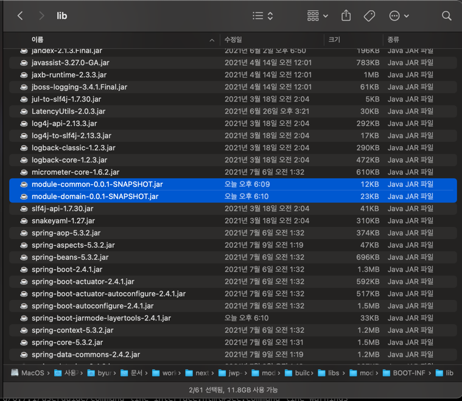

# 키친포스

## 요구 사항

### 요구사항 1

- [X] 기능 요구사항 정리

#### 기능 명세서

- 메뉴그룹 관리 기능
    + 메뉴그룹 목록을 조회할 수 있다.
    + 메뉴그룹을 등록할 수 있다.
        * 메뉴그룹의 이름은 필수값이다.
- 메뉴 관리 기능
    + 메뉴 목록을 조회할 수 있다.
    + 메뉴를 등록할 수 있다.
        * 메뉴의 이름, 가격, 메뉴그룹은 필수값이다.
        * 메뉴의 금액은 양의 정수만 가능하다.
        * 메뉴에는 등록된 상품만 포함할 수 있다.
        * 하나의 메뉴는 하나 이상의 메뉴상품을 가질 수 있다.
        * 하나의 메뉴 상품은 반드시 하나의 상품을 포함하고 있다.
- 주문 관리 기능
    + 주문 목록을 조회할 수 있다.
    + 주문을 등록할 수 있다.
        * 하나 이상의 주문 메뉴와 수량이 있어야 한다.
        * 등록된 메뉴만 주문 가능하다.
        * 주문 테이블이 존재해야 한다.
        * 최초 주문 등록 시 COOKING 상태를 가진다.
    + 주문을 수정할 수 있다.
        * 등록된 주문만 수정 가능하다.
        * 주문한 메뉴가 완료되면 수정이 불가능하다.
- 상품 관리 기능
    + 상품 목록을 조회할 수 있다.
    + 상품을 등록할 수 있다.
        * 상품의 가격와 이름은 필수값이다.
        * 상품의 가격은 0 이상의 금액이어야 한다.
- 단체지정 관리 기능
    + 통합 계산을 위해 개별 주문 테이블을 그룹화
    + 단체 지정 등록을 할 수 있다.
        * 주문 테이블이 2개 이상이어야 한다.
        * 등록 요청 테이블은 실제 등록된 주문 테이블만 가능한다.
        * 하나의 테이블은 하나의 단체 지정만 가능하다.(이미 단체 지정이 등록된 테이블은 추가 단체지정이 불가능)
        * 비어있는 테이블만 단체 지정이 가능하다.
    + 단체 지정 삭제를 할 수 있다.
        * 주문 테이블이 존재해야 하고, 해당 주문의 상태가 COOKING, MEAL 상태일 경우.
- 테이블 관리 기능
    + 테이블을 등록할 수 있다.
    + 테이블 목록을 조회할 수 있다.
    + 테이블을 비울 수 있다.
        * 대상 테이블은 주문 테이블로 등록되어 있어야 한다.
        * 대상 테이블은 단체지정된 테이블이 아니어야 한다.
        * 주문 테이블이 존재해야 하고, 해당 주문의 상태가 COOKING, MEAL 상태일 경우.
    + 테이블 인원을 수정할 수 있다.
        * 대상 테이블의 기존 인원은 0명 이상이어야 한다.
        * 대상 테이블은 주문 테이블에 등록되어 있어야 한다.

### 요구사항 2

- [X] 레거시 코드와 요구사항을 바당으로 테스트 코드 작성.

### 요구사항 3
- 이전 단계에서 객체 지향 설계를 의식하였다면 아래의 문제가 존재한다. 의존성 관점에서 설계를 검토해 본다.
    + 메뉴의 이름과 가격이 변경되면 주문 항목도 함께 변경된다. 메뉴 정보가 변경되더라도 주문 항목이 변경되지 않게 구현한다.
    + 클래스 간의 방향도 중요하고 패키지 간의 방향도 중요하다. 클래스 사이, 패키지 사이의 의존 관계는 단방향이 되도록 해야 한다.
    
#### 상세 리팩터링 요구사항 정리
- [X] 모든 도메인의 연관관계는 단방향으로 관리 - Aggregate을 벗어나는 영역의 객체 참조는 Id값 참조로 수정
- [X] 서비스 레이어에서의 다른 페키지 참조를 느슨하게 구현
    - [X] Spring Events 적용해보기
    - [X] Service 및 Repository 참조는 Interface 또는 Validator로 대신하기

### 요구사항 4
- Gradle의 멀티 모듈 개념을 적용해 자유롭게 서로 다른 프로젝트로 분리해 본다.
    - 컨텍스트 간의 독립된 모듈로 만들 수 있다.
    - 계층 간의 독립된 모듈로 만들 수 있다.

#### 상세 구현내용 정리
- [X] 아래 링크 내용을 토대로 계층간의 독립된 모듈로 구성
    - 멀티모듈 구성 - [멀티모듈 설계 이야기 with Spring, Gradle](https://techblog.woowahan.com/2637/)
    - 통합테스트 케이스 분리 및 빌드 - [Gradle Multi Project](https://kwonnam.pe.kr/wiki/gradle/multiproject)
    - 구성 내용
        + [X] 공통으로 사용되는 클래스 및 유틸성 기능들은 common으로 구성
        + [X] 도메인 및 도메인과 연결된 Repository 인터페이스를 domain으로 구성. common 모듈을 의존.
        + [X] 애플리케이션 실행에 필요한 클래스와 기능이 구현된 클래스를 app으로 구성. domain 모듈을 의존.
        + [X] 컨트롤러 단위에서 SpringBootTest를 이용한 통합테스트 케이스는 별도로 test-support로 구성.
            - app모듈의 불필요한 의존성을 제거하기 위해 해당 테스트 케이스는 별도로 분리.
- [X] 모듈 빌드를 진행 후 lib 참조 확인.
    - `./gradlew clean :module-app:build` 명령어로 app모듈 빌드 진행
    - 생성된 app의 jar 파일 내부에 module-domain, module-common이름의 jar 파일 포함된것 확인.
    

## 용어 사전

| 한글명 | 영문명 | 설명 |
| --- | --- | --- |
| 상품 | product | 메뉴를 관리하는 기준이 되는 데이터 |
| 메뉴 그룹 | menu group | 메뉴 묶음, 분류 |
| 메뉴 | menu | 메뉴 그룹에 속하는 실제 주문 가능 단위 |
| 메뉴 상품 | menu product | 메뉴에 속하는 수량이 있는 상품 |
| 금액 | amount | 가격 * 수량 |
| 주문 테이블 | order table | 매장에서 주문이 발생하는 영역 |
| 빈 테이블 | empty table | 주문을 등록할 수 없는 주문 테이블 |
| 주문 | order | 매장에서 발생하는 주문 |
| 주문 상태 | order status | 주문은 조리 ➜ 식사 ➜ 계산 완료 순서로 진행된다. |
| 방문한 손님 수 | number of guests | 필수 사항은 아니며 주문은 0명으로 등록할 수 있다. |
| 단체 지정 | table group | 통합 계산을 위해 개별 주문 테이블을 그룹화하는 기능 |
| 주문 항목 | order line item | 주문에 속하는 수량이 있는 메뉴 |
| 매장 식사 | eat in | 포장하지 않고 매장에서 식사하는 것 |
| 수량 | quantity | 메뉴나 주문의 수량 |
