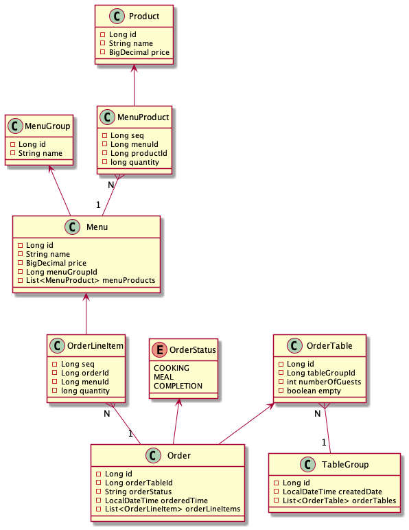
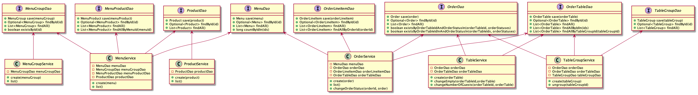
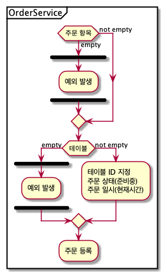
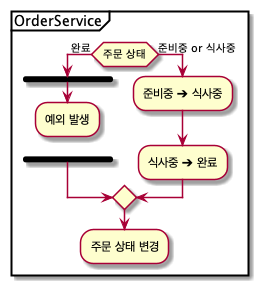
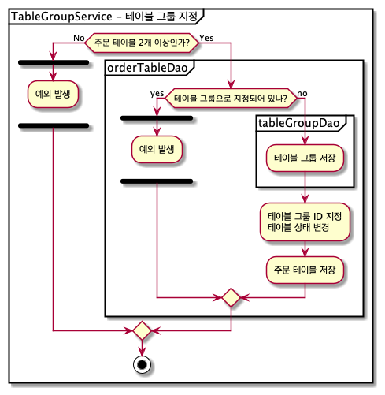
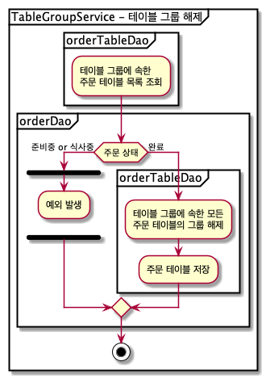

# 키친포스

## 요구 사항

- 메뉴 그룹
    - 메뉴 그룹을 등록한다.
        - 메뉴 그룹명을 입력 받아 메뉴 그룹을 등록한다.
    - 메뉴 그룹 목록을 조회한다.
- 메뉴
    - 메뉴를 등록한다.
        - 메뉴명, 가격, 메뉴 그룹 ID, 상품 ID, 상품 수량을 입력 받아 메뉴를 등록한다.
        - 메뉴에 속한 상품 가격의 합을 계산한다.
            - 상품 가격의 합은 (상품 가격 * 상품 수량) 이다.
        - 메뉴 가격이 상품 가격의 합 보다 작거나 같은 경우 메뉴를 등록할 수 있다.
        - (예외)
            - 메뉴의 가격이 null인 경우 예외가 발생한다.
            - 메뉴의 가격이 0원 미만인 경우 예외가 발생한다.
            - 메뉴 그룹에 속하지 않는 메뉴인 경우 예외가 발생한다.
            - 메뉴에 속한 상품이 존재하지 않는 경우 예외가 발생한다.
            - 메뉴의 가격이 상품 가격의 합보다 큰 경우 예외가 발생한다.
    - 메뉴 목록을 조회한다.
- 상품
    - 상품을 등록한다.
        - 상품명과 가격을 입력 받아 상품을 등록한다.
        - (예외)
            - 상품의 가격이 null인 경우 예외가 발생한다.
            - 상품의 가격이 0원 미만인 경우 예외가 발생한다.
    - 상품 목록을 조회한다.
- 주문
    - 주문을 등록한다.
        - 주문 테이블 ID와 주문 항목(메뉴 ID, 수량)을 입력 받아 주문을 등록한다.
        - 초기 주문 상태는 요리중이다.
        - 주문 날짜는 현재 시간이다.
        - (예외)
            - 주문 항목의 목록이 비어있는 경우 예외가 발생한다.
            - 주문 항목의 메뉴가 기존에 등록된 메뉴가 아닌 경우 예외가 발생한다.
            - 주문 테이블 번호에 해당하는 주문 테이블이 없는 경우 예외가 발생한다.
            - 주문 테이블이 빈 테이블인 경우 예외가 발생한다. (* 테이블 등록 후 주문 등록을 해야 한다.)
    - 주문 목록을 조회한다.
    - 주문 상태를 변경한다.
        - 주문 상태가 요리중이거나 식사중인 경우 주문 상태를 변경할 수 있다.
        - (예외)
            - 주문 번호를 조회할 수 없는 경우 예외가 발생한다.
            - 주문 상태가 계산 완료인 경우 예외가 발생한다.
- 테이블 그룹
    - 테이블 그룹을 등록한다.
        - 테이블 ID 목록을 입력 받아 테이블 그룹을 등록한다.
        - 테이블 그룹에 현재 시간을 지정한다.
        - 테이블 그룹에 속한 테이블 사용중인 상태로 변경한다.
        - (예외)
            - 주문 테이블 목록이 비어 있는 경우 예외가 발생한다.
            - 주문 테이블 목록이 2개 미만인 경우 예외가 발생한다.
            - 주문 테이블이 등록되어 있지 않은 경우 예외가 발생한다.
            - 주문 테이블이 빈 테이블인 경우 예외가 발생한다.
            - 다른 테이블 그룹에 등록되어 있는 주문 테이블인 경우 예외가 발생한다.
        - 테이블 그룹을 해제한다.
            - 테이블 그룹에 속한 모든 테이블의 그룹을 해제한다.
            - (예외) 테이블 그룹에 속한 모든 테이블의 주문 상태가 계산 완료가 아닌 경우 예외가 발생한다.
- 테이블
    - 손님 수와 테이블 사용 여부를 입력 받아 테이블을 등록한다.
    - 테이블 목록을 조회한다.
    - 테이블을 빈 테이블(사용 가능 상태)로 변경한다.
        - (예외)
            - 주문 테이블 번호에 해당하는 주문 테이블이 없는 경우 예외가 발생한다.
            - 테이블 그룹으로 등록되어 있는 경우 예외가 발생한다.
            - 테이블의 주문 상태가 완료가 아닌 경우 예외가 발생한다.
    - 테이블의 손님 수를 변경한다.
        - (예외)
            - 손님의 수가 0명 미만인 경우 예외가 발생한다.
            - 주문 테이블 번호에 해당하는 주문 테이블이 없는 경우 예외가 발생한다.
            - 주문 테이블이 빈 테이블인 경우 예외가 발생한다.

## 다이어그램

## 용어 사전

| 한글명 | 영문명 | 설명 |
| --- | --- | --- |
| 상품 | product | 메뉴를 관리하는 기준이 되는 데이터 |
| 메뉴 그룹 | menu group | 메뉴 묶음, 분류 |
| 메뉴 | menu | 메뉴 그룹에 속하는 실제 주문 가능 단위 |
| 메뉴 상품 | menu product | 메뉴에 속하는 수량이 있는 상품 |
| 금액 | amount | 가격 * 수량 |
| 주문 테이블 | order table | 매장에서 주문이 발생하는 영역 |
| 빈 테이블 | empty table | 주문을 등록할 수 없는 주문 테이블 |
| 주문 | order | 매장에서 발생하는 주문 |
| 주문 상태 | order status | 주문은 조리 ➜ 식사 ➜ 계산 완료 순서로 진행된다. |
| 방문한 손님 수 | number of guests | 필수 사항은 아니며 주문은 0명으로 등록할 수 있다. |
| 단체 지정 | table group | 통합 계산을 위해 개별 주문 테이블을 그룹화하는 기능 |
| 주문 항목 | order line item | 주문에 속하는 수량이 있는 메뉴 |
| 매장 식사 | eat in | 포장하지 않고 매장에서 식사하는 것 |
