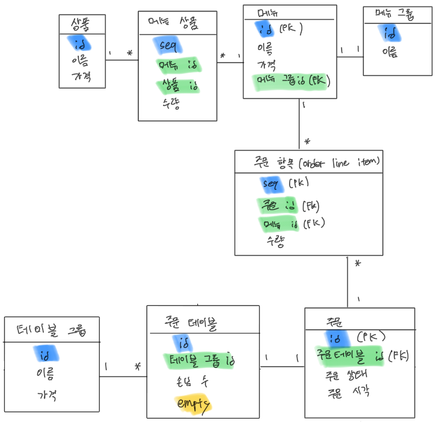
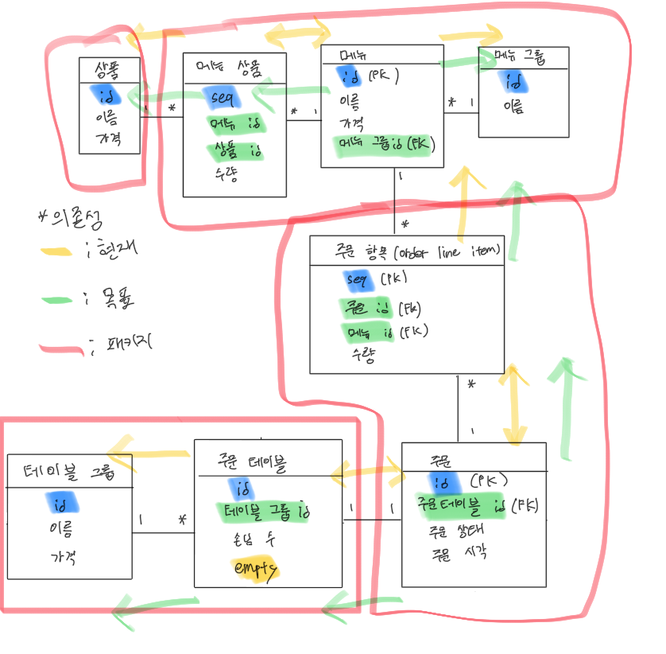

# 키친포스

## 요구 사항

### Product(상품)
- 상품은 **상품명**과 **가격**으로 구성된다.
- 상품을 생성 할 수 있다
  - 상품의 가격은 0 이상 이어야 한다.
- 상품 목록을 조회할 수 있다

### MenuGroup(메뉴 그룹)
- 메뉴 그룹은 **메뉴그룹명**으로 구성된다.
- 메뉴 그룹 생성 할 수 있다
- 메뉴 그룹 목록을 조회 할 수 있다.

### Menu(메뉴)
- 메뉴는 **메뉴명**, **메뉴가격**, **속한 메뉴그룹**, **구성 상품 리스트**로 구성된다.
- 메뉴를 생성 할 수 있다.
  - 메뉴의 가격은 0 이상 이어야 한다.
  - 메뉴의 가격은 메뉴의 구성 상품들의 가격 총합보다 작거나 같다.
  - 속한 메뉴그룹이 반드시 존재한다.
- 메뉴 목록을 조회 할 수 있다.

### OrderLineItem(주문항목)
- 주문 항목은 **주문**, **주문한 메뉴**, **주문한 메뉴의 수량** 으로 구성된다.

### OrderTable(주문 테이블)
- 주문 테이블은 **단체 주문 테이블**, **손님의 수**, **빈 테이블 여부** 로 구성된다.
- 주문 테이블을 생성 할 수 있다.
- 주문 테이블 목록을 조회 할 수 있다.
- 테이블의 비어있는 상태를 변경 할 수 있다.
  - 단체로 주문 테이블이 묶여 있으면 빈 테이블로 상태를 변경할 수 없다.
  - 주문 테이블의 주문 상태가 `식사중`이거나, `요리중`인 경우 상태를 변경할 수 없다.
- 주문 테이블의 손님의 수를 변경 할 수 있다.
  - 손님의 수는 0 이상 이어야 한다.
  - 변경할 주문 테이블이 존재해야 한다.
  - 주문 테이블이 빈 테이블이면 손님의 수를 변경할 수 없다.

### Order(주문)
- 주문은 **주문한 테이블**, **주문상태**, **주문시각**, **주문 항목 리스트**로 구성된다.
- 주문을 생성 할 수 있다.
  - 주문 항목은 반드시 존재해야 한다.
  - 주문 메뉴 하나당 주문 항목이 한개씩 존재해야 한다.
  - 주문을 요청한 테이블이 존재해야 한다.
  - 주문을 요청할 수 없는 테이블에서는 주문할 수 없다.
    - 빈 테이블인 경우
    - 유효하지 않은 주문테이블인 경우
- 주문 목록을 조회 할 수 있다.
- 주문 상태를 변경 할 수 있다.
  - 이미 완료되었거나, 주문이 생성되어 있지 않은 경우 상태를 변경할 수 없다

### TableGroup(단체)
- 단체는 **단체지정 시각**, **단체의 주문 테이블 리스트**로 구성된다.
- 단체로 지정 할 수 있다.
  - 단체로 지정할 주문 테이블이 존재해야 한다.
  - 단체로 지정할 주문 테이블은 2개 이상이어야 한다.
  - 단체로 지정할 주문 테이블이 빈 테이블이 아니거나  
  - 이미 다른 단체로 지정되어 있다면, 단체로 지정할 수 없다.

## 용어 사전

| 한글명      | 영문명              | 설명                            |
|----------|------------------|-------------------------------|
| 상품       | product          | 메뉴를 관리하는 기준이 되는 데이터           |
| 메뉴 그룹    | menu group       | 메뉴 묶음, 분류                     |
| 메뉴       | menu             | 메뉴 그룹에 속하는 실제 주문 가능 단위        |
| 메뉴 상품    | menu product     | 메뉴에 속하는 수량이 있는 상품             |
| 금액       | amount           | 가격 * 수량                       |
| 주문 테이블   | order table      | 매장에서 주문이 발생하는 영역              |
| 빈 테이블    | empty table      | 주문을 등록할 수 없는 주문 테이블           |
| 주문       | order            | 매장에서 발생하는 주문                  |
| 주문 상태    | order status     | 주문은 조리 ➜ 식사 ➜ 계산 완료 순서로 진행된다. |
| 방문한 손님 수 | number of guests | 필수 사항은 아니며 주문은 0명으로 등록할 수 있다. |
| 단체 지정    | table group      | 통합 계산을 위해 개별 주문 테이블을 그룹화하는 기능 |
| 주문 항목    | order line item  | 주문에 속하는 수량이 있는 메뉴             |
| 매장 식사    | eat in           | 포장하지 않고 매장에서 식사하는 것           |

## 1단계 - 테스트를 통한 코드 보호

### 기능 목록
- [x] 키친포스 시스템의 요구사항을 작성
  - [x] table create 문 분석 후 각 domain 간 관계를 찾아본다 (가능하면, ERD를 직접 그려볼 것)
  
  - [x] 각 도메인의 관계를 분석하여, `Bounded Context`를 설정 해 본다.
    - 메뉴
    - 주문
  - [x] 분석한 도메인 간의 관계를 말로 잘 풀어서 요구사항을 정리 해 본다.
- [x] 키친포스의 요구사항을 토대로 테스트 코드를 작성
  - [x] `@SpringBootTest`로 통합 테스트 코드 작성
    - [x] 메뉴 통합테스트
    - [x] 주문 통합테스트
  - [x] `@ExtendWith(MockitoExtension.class)` 를 이용해 단위 테스트 코드 작성
    - [x] `Product`
      - [x] create 단위 테스트 작성 
      - [x] list 단위 테스트 작성
    - [x] `MenuGroup`
      - [x] create 단위 테스트 작성
      - [x] list 단위 테스트 작성
    - [x] `Menu`
      - [x] create 단위 테스트 작성
      - [x] list 단위 테스트 작성
    - [x] `Table`
      - [x] create 단위 테스트 작성
      - [x] list 단위 테스트 작성
      - [x] changeEmpty 단위 테스트 작성
      - [x] changeNumberOfGuests 단위 테스트 작성
    - [x] `Order`
      - [x] create 단위 테스트 작성
      - [x] list 단위 테스트 작성
      - [x] changeOrderStatus 단위 테스트 작성
    - [x] `TableGroup`
      - [x] create 단위 테스트 작성
      - [x] ungroup 단위 테스트 작성
  - [x] 인수 테스트 코드 작성
    - [x] 메뉴 인수 테스트 작성
    - [x] 주문 인수 테스트 작성

### 1단계 피드백
- [x] 제약조건은 `~한다` 로, 가능한 행위는 `~할 수 있다`로 작성
- [x] 테스트용 리소스를 생성하는 역할은 `TestFixture`라는 명칭으로 주로 명명
- [x] 라이브러리 의존성은 더이상 추가하지 않는 것을 권장
- [x] 테스트코드의 setup 메서드 내에서 조건을 설정하는 것을 분리
  - 객체의 상태를 각각의 테스트 코드에서 변경하면 `테스트의 독립성`이 보장되지 않음

## 2단계 - 서비스 리팩터링

### 기능목록 작성
- [x] 각 도메인에 `Spring Data JPA Entity`로 수정할 것(+ dao 삭제, Repository 추가)
  - Product
    - [x] Product
      - [x] 인수 테스트
      - [x] 도메인 테스트
  - Menu
    - [x] MenuGroup
      - [x] 인수 테스트
      - [x] 도메인 테스트
    - [x] Menu
      - [x] 인수 테스트
      - [x] 도메인 테스트
    - [x] MenuProduct
      - [x] 인수 테스트
      - [x] 도메인 테스트
  - Order
    - [x] Order
      - [x] 인수 테스트
      - [x] 도메인 테스트
    - [x] OrderLineItem
      - [x] 인수 테스트
      - [x] 도메인 테스트
  - Table
    - [x] OrderTable
      - [x] 인수 테스트
      - [x] 도메인 테스트
    - [x] TableGroup
      - [x] 인수 테스트
      - [x] 도메인 테스트

### 요구사항
- 단위 테스트 하기 어려운 코드와 가능한 코드를 분리
  - 단위 테스트 구현
- Spring Data JPA 사용 시 ```spring.jpa.hibernate.ddl-auto=validate``` 옵션을 필수로 준다.(Flyway 적용)
- 데이터베이스 스키마 변경 및 마이그레이션 필요 시 참고
  - [DB도 형상관리 해보자](https://meetup.toast.com/posts/173)

### 프로그래밍 요구사항
- Lombok 없이 미션 진행
- 객체지향 생활 체조 원칙 준수

### 비즈니스 로직의 위치에 대한 고민
- TDD, OOP 를 적용하려면 핵심 비즈니스 로직을 도메인 객체가 담당하도록 구현하는 것
- 테스트하기 쉬운 코드로 변경하고, 지속적인 리팩터링

힌트 
- 모델에 비즈니스 로직을 최대한 모은다
  - 프레임워크나 외부 종속관계가 줄어들기 때문에 테스트하기가 매우 수월해진다
- 반복적인, 단계적인 설계
- 모델에 setter 를 무조건적으로 추가하지 않기
  - setter는 도메인의 핵심 개념이나 의도를 코드에서 사라지게 함
  - setter는 도메인 객체를 생성할 때 완전한 상태가 아닐 수도 있다는 것(생성할 때 완전한 상태로 만들 것)

### 2단계 피드백
- [x] API 스펙은 유지하면서 리펙터링 진행할 것 (API 스펙이 바뀐다는 것은 클라이언트 측에서 끔찍한 일)
- [x] 미사용 의존성 제거
- [x] `MenuRequest` 에서 validation 적용 필요(request 내에서 List 타입이 있는 경우 전수 조사 필요)
- [x] `Objects.isNull` 메서드 사용은 `Predicate` 이외에는 지양할 것 (가독성이 떨어짐, 차라리 `null == price`로 사용)
- [x] 전체적으로 쿼리 호출 횟수에 대한 피드백 반영 필요

----

## [우아한 객체지향](https://www.youtube.com/watch?v=dJ5C4qRqAgA&ab_channel=%EC%9A%B0%EC%95%84%ED%95%9CTech) 내용 정리

### 변경
설계에서는 변경이 가장 중요

### 의존성
어떤 B라는 클래스의 어떠한 것이라도 변경될 때(클래스명, 메소드명, 메소드 구현 등등),  
A도 변경될 **가능성**이 있을 때, A는 B에게 의존성이 있다 라고 표현

- **연관관계(Association)** : 객체 참조가 있는 경우
- **의존관계(Dependency)** : 협력하는 시점에 일시적으로 관계가 있는 경우(메소드의 리턴타입 등등)
- 상속관계(Inheritance) : 상속 ; 구현이 바뀌면 영향을 받는다
- 실체화관계(Realization) : Signature 가 변경된 경우, 실체화 관계가 있는 객채에서 변경이 필요하다

패키지 내의 임의의 클래스에 변경이 있어도 다른 패키지의 클래스에 의존이 있을 때, 패키지 간 의존관계가 있다

#### 객체간 양방향 의존성을 피하라
- 의존성이란 변경할 가능성이기 때문에, 양방향이면 하나가 바뀔 때 둘 다 바뀌어야할 가능성이 있다는 뜻

#### 다중성이 적은 방향을 선택하라
- 일대다(OneToMany) 보단 다대일(ManyToOne)로

#### 의존성이 필요없다면 제거하라

#### 패키지 사이의 의존성 사이클을 제거하라
How?
- 중간 객체를 생성
- 의존성 역전
- 새로운 패키지 추가

#### 때로는 절차지향이 객체지향보다 좋다
- Validator 클래스
- 도메인 서비스

----

## 3단계 - 의존성 리팩터링

### 의존성 확인하기


### 요구사항
- [x] 의존성 관점에서 설계를 검토
  - [x] 의존성 관점에서 ERD 를 `방향`을 고려하여 다시 그려보자.
  - [x] 패키지 사이의 의존관계 확인
- [x] 메뉴의 이름과 가격이 변경되면 주문 항목(OrderLineItem) 도 함께 변경되는 문제

### 기능 목록 작성
- [x] Menu 와 다른 패키지 / 객체 간 의존성 제거
  - [x] MenuProduct --> Menu 의존성 제거 (간접참조)
- [x] Order 와 다른 패키지 / 객체 간 의존성 제거
  - [x] OrderLineItem --> Order 의존성 제거 (간접참조)
  - [x] Order --> OrderTable 의존성 제거 (간접참조 + 의존성 역전 필요할 듯..)
- [x] Table 과 다른 패키지 / 객체 간 의존성 제거
  - [x] OrderTable --> TableGroup 의존성 제거 (간접참조)

- [x] Validator 도입
  - [x] OrderTableValidator
    - 빈테이블 변경
      - 단체로 주문 테이블이 묶여 있으면 빈 테이블로 상태를 변경할 수 없다.
      - 주문 테이블의 주문 상태가 `식사중`이거나, `요리중`인 경우 상태를 변경할 수 없다.
    - 인원수 변경
      - 손님의 수는 0 이상 이어야 한다.
      - 변경할 주문 테이블이 존재해야 한다.
      - 주문 테이블이 빈 테이블이면 손님의 수를 변경할 수 없다.
  - [x] TableGroupValidator
    - 단체로 지정할 주문 테이블이 존재해야 한다.
    - 단체로 지정할 주문 테이블은 2개 이상이어야 한다.
    - 단체로 지정할 주문 테이블이 빈 테이블이 아니거나
    - 이미 다른 단체로 지정되어 있다면, 단체로 지정할 수 없다.
  - [x] OrderValidator
    

### 힌트
- 함께 생성되고 함께 삭제되는 객체들을 함께 묶어라
- 불변식을 지켜야 하는 객체들을 함께 묶어라
- 가능하면 분리하라

연관 관계는 다양하게 구현할 수 있다.
- 직접참조 (참조를 통한 연관관계)
- 간접참조 (멤버로 다른 객체의 id만 가지고 있고, 레파지토리를 통해 탐색)

### 3단계 피드백
- [x] ```OrderTableValidator.isEmpty``` 의 메소드명을 적절하게 변경(validation 종류)  
- [x] ```OrderTableValidator.isOrderStatusNotCompletion``` 의 메소드명을 적절하게 변경(validation 종류)
- [x] ```OrderLineItem```에서 `Order` 로의 방향이 필요한가?
  - 시스템의 최초 진입은 `Order`에서 시작할 가능성이 높다.  
    따라서 `OrderLineItem` -> `Order` 의 방향은 사용하는 경우가 극히 드물 것으로 예상됨  
    객체의 양방향 의존성을 피하는 방향으로 구현해야 하므로, 이 의존성은 제거하는 편이 좋을 듯 합니다.

------

## 4단계 - 멀티 모듈 적용

### 멀티 모듈에 대한 간단한 내용 정리
#### 왜 나눠야 하는가?
이전 의존성 리펙터링을 잘 이해했다면 왜 나눠야 하는가에 대한 답은 생각보다 쉽게 할 수 있다.  
의존성이 높다는 것은 서로가 서로의 변화를 감지하고 대응해야하는 것이 많다는 것이다.  

이런 구조는 필연적으로 불필요한 작업을 야기시킨다.  
따라서, 좋은 설계 중에 하나의 방법으로서 가급적이면
- 의존성을 낮추고
- 이를 통해 결합도를 낮추고
- 각 모듈의 응집도는 높이는 것
이다.

이전 단계에서는 논리적인 설계에서부터 객체 간 / 패키지 간 의존성을 끊어내거나 낮췄다면,  
이번 단계에서는 멀티 모듈이라는 도구를 통해 물리적으로   
강력하게 의존성을 낮추는 것에 있다고 생각한다.

#### 멀티 모듈의 장점
- 각 모듈별로 분리하여 관리가 가능하다(선을 명확하게 긋는다 ; 바운디드 컨텍스트)
- 독립적인 모듈 간 상호 교환만 가능하다
- 정의된 인터페이스를 통해서만 모듈간 통신이 가능하다.
- 작업적인 측면에서도 모듈만 디버깅하거나 리빌드하는 등의 작업이 가능하기 때문에 유지보수성이 좋아진다.

#### 멀티 모듈의 단점
- 잘 모르고 사용하면 오히려 독이다. --> 멀티 모듈에 대한 이해, 학습등의 부수적인 비용이 추가된다.
- 모듈간 의존성이 아예 없는것이 아니다. 따라서, 모듈간 의존성에 대해 잘 관리해줘야 한다.

#### 멀티 모듈에서 MSA 까지
강의 내용 중에 `MonolithFirst` 에 대한 내용이 나온다.  
굉장히 생소한 단어지만 핵심은 '처음부터 MSA로 만들지 말라' 라는 것이다.  

왜냐하면, **MSA**로 나눠진 경계가 애매한 경우, 이를 되돌리기 위해선  
**다시 합치거나 수정 하는데에 나누는 것 보다 훨씬 큰 비용이 들기 때문**이다.

1. 따라서, `MonolithFirst` 로 개발을 시작해야 하고,  
충분한 시간이 흐르고 해당 시스템에 대한 이해도가 어느정도 수준을 넘었을 경우  
`멀티 모듈` 을 고려 해야 하는 지 **의심**해야 한다.

2. 점진적으로 발전하기 위해 Layered 별로 모듈을 나누는 것을 고려해보아야 한다.  
예를 들어, `외부 API`, `내부 API`, `Domain`, `Common`, `Batch` 로 나눌 수 있다.

3. 도메인은 비즈니스 로직 등 시스템의 가장 큰 책임과 역할을 담당하기 때문에,  
구조적으로 비중이 커질 수 밖에 없다. 이 때 충분한 **의심** 후에 도메인별로 멀티모듈을 나누는 것을 고려해보아야 한다.    
도메인 간 의존성에 따라 바운디드 컨텍스트를 명확하게 나눠야 한다.

4. 나누었던 `멀티 모듈`의 역할과 책임이 늘어나게 되면,  
이를 별도의 `Service`로 전환 할 수 있는 지 **의심**해 봐야 한다.  
만약 나누기로 결정했다면, 아래와 같은 것들을 고려해야 한다.

- 통신 방법에 대한 문제(Message Queue 이용?)
- 데이터 동기화에 대한 문제
- 로드 밸런싱에 대한 문제
- 분산 DB, 서버간 트랜잭션
등등..

----- 

### 4단계 요구사항
- Gradle 의 멀티 모듈 개념을 적용해 자유롭게 서로 다른 프로젝트로 분리해 본다.
  - 컨텍스트 간의 독립된 모듈로 만들 수 있다.
  - 계층 간의 독립된 모듈로 만들 수 있다.
- 데이터 주고 받는 관점에서 분리
  - 의존성 주입
  - HTTP 요청 / 응답
  - 이벤트 발행 / 구독


### 멀티모듈 목표 설정
의존성 리팩터링 시 각 도메인별로 적절하게 나누어 놓았기 때문에,  
이번 미션에서는 멀티 모듈의 단위를 각 `도메인 컨텍스트`로 설정하였습니다. 

#### Common
- 각 Domain 에서 사용될 가능성이 있는 POJO 클래스 (`Price`, `Quantity` 등등..)
- 필요하다면 공통으로 사용되는 Util 도 Common 모듈에 포함될 수 있다.
  - 단, 이 경우 특정 도메인에 의존성이 높은 Util 은 Common에 두어도 되는지 **의심**해야 한다.
- [x] 멀티 모듈 분리
- [x] 다른 도메인의 테스트 코드 정상 구동 확인

#### Product
- [ ] 멀티 모듈 분리
- [ ] 테스트 코드 정상 구동 확인

#### Menu
- [ ] 멀티 모듈 분리
- [ ] 테스트 코드 정상 구동 확인

#### Order
- [ ] 멀티 모듈 분리
- [ ] 테스트 코드 정상 구동 확인

#### Table
- [ ] 멀티 모듈 분리
- [ ] 테스트 코드 정상 구동 확인

--- 

### 참고 한 글
- https://jojoldu.tistory.com/123
- https://techblog.woowahan.com/2637/
- https://kwonnam.pe.kr/wiki/gradle/multiproject
