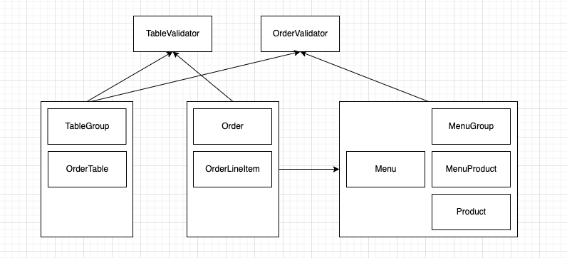

# 🍳 키친포스 

## 요구 사항

- [X] kitchenpos 패키지의 코드를 보고 키친포스의 요구 사항을 README.md에 작성한다.
- [X] 정리한 키친포스의 요구 사항을 토대로 테스트 코드를 작성한다.

### Product (상품)

```text
# 상품 생성
POST /api/products
```

- 상품을 등록할 수 있다.
  - 상품의 가격은 반드시 존재해야 한다.
  - 상품의 가격은 0 원 이상이어야 한다.

```text
# 상품 목록 조회
GET /api/products
```

- 상품의 목록을 조회할 수 있다.

### Menu (메뉴)

```text
# 메뉴 생성
POST /api/menus
```

- 메뉴를 등록할 수 있다.
  - 메뉴의 가격은 무조건 존재해야 한다.
  - 상품의 가격은 0 원 이상이어야 한다.
  - 메뉴 그룹 아이디가 존재하지 않으면 등록할 수 없다.
  - 메뉴 상품은 모두 등록된 상품이어야 한다.
  - 메뉴의 가격은 메뉴 상품들의 가격의 총 가격보다 클 수 없다.

```text
# 메뉴 목록 조회
GET /api/menus
```

- 메뉴를 조회할 수 있다.

### MenuGroup (메뉴 그룹)

```text
# 메뉴 그룹 생성
POST /api/menu-groups
```

- 메뉴 그룹을 생성할 수 있다.

```text
# 메뉴 그룹 목록 조회
GET /api/menu-groups
```

- 메뉴 그룹을 조회할 수 있다.

### Table (주문 테이블)

```text
# 주문 테이블 생성
POST /api/tables
```

- 주문 테이블을 생성할 수 있다.

```text
# 주문 테이블 목록 조회
GET /api/tables
```

- 주문 테이블 목록을 조회할 수 있다.

```text
# 주문 테이블이 비어있는지 여부 변경
PUT /api/tables/{orderTableId}/empty
```

- 주문 테이블이 비어있는지 여부를 변경할 수 있다.
  - 주문 테이블은 반드시 등록되어 있어야 한다.
  - 주문 테이블은 단체 지정이 되어 있지 않아야 한다.
  - 주문 테이블의 주문 상태는 조리 중이거나 식사 중이면 안된다.

```text
# 주문 테이블에 방문한 손님 수 변경
PUT /api/tables/{orderTableId]/number-of-guests
```

- 주문 테이블에 방문한 손님 수를 변경할 수 있다.
  - 주문 테이블의 방문한 손님 수가 0명 이상이어야 한다.
  - 주문 테이블은 등록되어 있어야 한다.
  - 주문 테이블은 빈 테이블이 아니어야 한다.

### TableGroup (단체 지정)

```text
# 단체 지정 등록
POST /api/table-groups
```

- 단체 지정을 등록한다.
  - 주문 테이블들이 2개 이상 있어야 한다.
  - 주문 테이블들은 모두 등록된 주문 테이블이어야 한다.
  - 주문 테이블들은 빈 테이블이어야 한다.
  - 이미 단체 지정된 주문 테이블은 단체 지정할 수 없다.

```text
# 단체 지정 삭제
DELETE /api/table-groups/{tableGroupId}
```

- 단체 지정을 삭제할 수 있다.
  - 단체 내 주문 테이블들의 상태는 조리 중이거나 식사중이면 안된다.

### Order (주문)

```text
# 주문 생성
POST /api/orders
```

- 주문을 생성할 수 있다.
  - 주문 항목은 최소 1개 이상 있어야 한다.
  - 주문 항목 속 메뉴들은 모두 등록된 메뉴여야 한다.
  - 주문 테이블은 등록된 테이블이어야 한다.
  - 주문 테이블이 빈 테이블이 아니어야 한다.

```text
# 주문 목록 조회
GET /api/orders
```

- 주문 목록을 조회할 수 있다.

```text
# 주문 상태 변경
PUT /api/orders/{orderId}/order-status
```

- 주문 상태를 변경할 수 있다.
  - 주문은 등록된 주문이어야 한다.
  - 이미 완료된 주문은 상태를 수정할 수 없다.

## 서비스 리팩터링 요구 사항

- [X] Spring Data JPA 사용
  - spring.jpa.hibernate.ddl-auto=validate
- [X] 스키마 확인하여 엔티티 설계
  - [X] Product 상품 설계
- [X] 비즈니스 로직을 도메인으로 이동하여 단위 테스트 작성
- [X] 단위 테스트하기 어려운 코드와 단위 테스트 가능한 코드를 분리

## 프로그래밍 요구 사항
- Lombok은 그 강력한 기능만큼 사용상 주의를 요한다.
  - 무분별한 setter 메서드 사용
  - 객체 간에 상호 참조하는 경우 무한 루프에 빠질 가능성
  - Lombok 사용상 주의점(Pitfall)
  - 이번 과정에서는 Lombok 없이 미션을 진행해 본다.

- 자바 코드 컨벤션을 지키면서 프로그래밍한다.
  - 기본적으로 Google Java Style Guide을 원칙으로 한다.
  - 단, 들여쓰기는 '2 spaces'가 아닌 '4 spaces'로 한다.
- indent(인덴트, 들여쓰기) depth를 2를 넘지 않도록 구현한다. 1까지만 허용한다.
  - 예를 들어 while문 안에 if문이 있으면 들여쓰기는 2이다.
  - 힌트: indent(인덴트, 들여쓰기) depth를 줄이는 좋은 방법은 함수(또는 메서드)를 분리하면 된다.
- 3항 연산자를 쓰지 않는다.
- else 예약어를 쓰지 않는다.
  - else 예약어를 쓰지 말라고 하니 switch/case로 구현하는 경우가 있는데 switch/case도 허용하지 않는다.
  - 힌트: if문에서 값을 반환하는 방식으로 구현하면 else 예약어를 사용하지 않아도 된다.
- 모든 기능을 TDD로 구현해 단위 테스트가 존재해야 한다. 단, UI(System.out, System.in) 로직은 제외
  - 핵심 로직을 구현하는 코드와 UI를 담당하는 로직을 구분한다.
  - UI 로직을 InputView, ResultView와 같은 클래스를 추가해 분리한다.
- 함수(또는 메서드)의 길이가 10라인을 넘어가지 않도록 구현한다.
  - 함수(또는 메소드)가 한 가지 일만 하도록 최대한 작게 만들어라.
- 배열 대신 컬렉션을 사용한다.
- 모든 원시 값과 문자열을 포장한다
- 줄여 쓰지 않는다(축약 금지).
- 일급 컬렉션을 쓴다.
- 모든 엔티티를 작게 유지한다.
- 3개 이상의 인스턴스 변수를 가진 클래스를 쓰지 않는다.

## 의존성 리팩토링

[X] 의존성 관점에서 설계를 검토하고 반영



### Aggregate
- 관련 객체를 하나로 묶은 군집
- 애그리거트는 군집에 속한 객체들을 관리하는 루트 엔티티를 갖는다.
- 애그리거트로 묶어서 바라보면 좀 더 상위 수준에서 도메인 모델 간의 관계를 파악할 수 있다.
- 애그리거트에 속한 객체는 유사하거나 동일한 라이프사이클을 갖는다.
- 한 애그리거트에 속한 객체는 다른 애그리거트에 속하지 않는다.
- 두 개 이상의 엔티티로 구성되는 애그리거트는 드물게 존재한다.

### 값 검증
- 값 검증은 표현 영역과 응용 서비스 두 곳에서 모두 수행할 수 있다.
- 원칙적으로 모든 값에 대한 검증은 응용 서비스에서 처리한다.
- 표현 영역에서 필수 값과 값의 형식을 검사하면 실질적으로 응용 서비스는 아이디 중복 여부와 같은 논리적 오류만 검사하면 된다.

## 멀티 모듈 적용

- [X] 컨텍스트 간의 독립된 모듈

## 용어 사전

| 한글명 | 영문명 | 설명 |
| --- | --- | --- |
| 상품 | product | 메뉴를 관리하는 기준이 되는 데이터 |
| 메뉴 그룹 | menu group | 메뉴 묶음, 분류 |
| 메뉴 | menu | 메뉴 그룹에 속하는 실제 주문 가능 단위 |
| 메뉴 상품 | menu product | 메뉴에 속하는 수량이 있는 상품 |
| 금액 | amount | 가격 * 수량 |
| 주문 테이블 | order table | 매장에서 주문이 발생하는 영역 |
| 빈 테이블 | empty table | 주문을 등록할 수 없는 주문 테이블 |
| 주문 | order | 매장에서 발생하는 주문 |
| 주문 상태 | order status | 주문은 조리 ➜ 식사 ➜ 계산 완료 순서로 진행된다. |
| 방문한 손님 수 | number of guests | 필수 사항은 아니며 주문은 0명으로 등록할 수 있다. |
| 단체 지정 | table group | 통합 계산을 위해 개별 주문 테이블을 그룹화하는 기능 |
| 주문 항목 | order line item | 주문에 속하는 수량이 있는 메뉴 |
| 매장 식사 | eat in | 포장하지 않고 매장에서 식사하는 것 |
