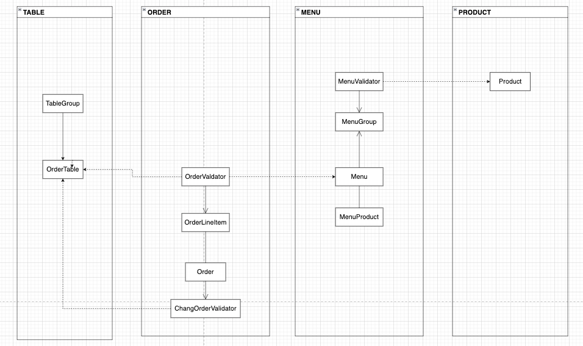

# 키친포스

## 요구 사항

### 상품
> 메뉴를 관리하는 기준이 되는 데이터   

* 상품은 상품의 이름과 가격이 존재한다.
* 상품을 등록할 수 있다.
* 상품의 가격이 올바르지 않으면 등록할 수 없다
  * 상품의 가격은 0원 보다 커야한다. 
* 상품들의 목록을 조회 할수 있다.

### 메뉴
> 실제 주문이 가능한 단위

* 메뉴는 메뉴 그룹이 없으면 등록할 수 없다.
* 메뉴의 가격이 올바르지 않으면 등록할 수 없다.
  * 메뉴의 가격은 0 이상 이어야한다.
  * 메뉴의 가격은 구성하고 있는 메뉴 상품들의 가격(상품가격 * 수량)의 합계보다 작아야 한다.
* 메뉴를 등록할 수 있다.
  * 메뉴에는 여러개의 메뉴 상품을 가질 수 있다.
  * 메뉴 상품도 같이 등록 된다.

* 메뉴의 목록을 조회 할 수 있다.

* 메뉴상품은 하나 이상 존재 해야한다.

### 메뉴 그룹
> 메뉴의 묶음
* 메뉴 그룹을 등록할 수 있다.
* 메뉴 그룹들을 조회할 수 있다.

### 주문 
> 매장에서 발생하는 주문
* 주문을 할 수 없다
  * 주문은 주문항목이 없으면 주문을 할 수 없다.
  * 등록되지 않은 메뉴를 주문하면 주문을 할 수 없다.
  * 존재하지 않은 테이블에 주문 할 수 없다.
  * 주문 받을 수 있는 주문 테이블이 없다면 주문을 할 수 없다.
* 주문을 한다.
  * 주문 테이블에 주문이 된다.
  * 주문이 조리가 된다.
  * 주문 항목을 참조하여 주문을 한다.

* 전체 주문을 조회 한다.
  * 주문항목과 함께 조회 된다.

* 주문의 상태를 변경한다.
  * 주문의 상태를 변경한다.
  
* 주문의 상태를 변경할 수 없다.
  * 주문이 완료가 되었으면 경우에는 주문을 변경 할 수 없다.
  * 주문이 존재하지 않으면 변경할 수 없다.

 ### 테이블
> 식당의 테이블

* 테이블에 주문을 받는다.
  * 주문 테이블이 생긴다.
  * 단체주문은 없는 상태로 생성이된다.

* 전체 주문테이블을 조회한다.

* 주문테이블을 빈테이블로 변경 할 수 없다.
  * 단체지정인 테이블인 경우에는 변경 할수 없다.
  * 주문 상태가 조리중이거나 식사중인 경우 변경할 수 없다.
* 주문테이블을 빈테이블로 변경한다.

* 방문자수가 음수 일 경우 변경할 수 없다.
* 해당 주문테이블이 없을 경우 방문자를 변경할 수 없다.
* 해당 주문테이블이 비어 있을경우 방문자를 변경 할 수 없다.

* 주문 테이블에 방문자수를 변경한다.

### 단체 지정
* 개별 주문 테이블이 2개 미만일 경우 단체석으로 지정할 수 없다.
* 단체지정할 주문 테이블이 없으면 단체석으로 지정할 수 없다.
* 단체지정할 주문 테이블이 없으면(빈 테이블) 단체석으로 지정할 수 없다.
* 단체 지정 테이블을 생성한다.
* 단체석이 생성된다.
  * 단체석의 날짜를 최신화한다.
  * 기존의 주문 테이블들에 단체석임을 기록한다.

* 단체석을 개인 주문테이블로 변경 한다.
* 단체석을 개인 주문테이블로 변경 할 수 없다.
  * 주문 테이블중 조리중인 경우에 변경 할 수 없다.

  
## 용어 사전

| 한글명 | 영문명 | 설명 |
| --- | --- | --- |
| 상품 | product | 메뉴를 관리하는 기준이 되는 데이터 |
| 메뉴 그룹 | menu group | 메뉴 묶음, 분류 |
| 메뉴 | menu | 메뉴 그룹에 속하는 실제 주문 가능 단위 |
| 메뉴 상품 | menu product | 메뉴에 속하는 수량이 있는 상품 |
| 금액 | amount | 가격 * 수량 |
| 주문 테이블 | order table | 매장에서 주문이 발생하는 영역 |
| 빈 테이블 | empty table | 주문을 등록할 수 없는 주문 테이블 |
| 주문 | order | 매장에서 발생하는 주문 |
| 주문 상태 | order status | 주문은 조리 ➜ 식사 ➜ 계산 완료 순서로 진행된다. |
| 방문한 손님 수 | number of guests | 필수 사항은 아니며 주문은 0명으로 등록할 수 있다. |
| 단체 지정 | table group | 통합 계산을 위해 개별 주문 테이블을 그룹화하는 기능 |
| 주문 항목 | order line item | 주문에 속하는 수량이 있는 메뉴 |
| 매장 식사 | eat in | 포장하지 않고 매장에서 식사하는 것 |

--- 
## 1단계 요구사항
 - [X] kitchenpos 패키지의 코드를 보고 키친포스의 요구 사항을 README.md에 작성한다.
 - [X] 정리한 키친포스의 요구 사항을 토대로 테스트 코드를 작성한다. 모든 Business Object에 대한 테스트 코드를 작성한다.
---
## 2단계 서비스 리팩터링
 - [X] 단위 테스트하기 어려운 코드와 단위 테스트 가능한 코드를 분리해 단위 테스트 가능한 코드에 대해 단위 테스트를 구현한다.
 * 프로그래밍 요구 사항
   - 이번 과정에서는 Lombok 없이 미션을 진행해 본다.
   - 자바 코드 컨벤션을 지키면서 프로그래밍한다.
   - 기본적으로 Google Java Style Guide을 원칙으로 한다.
   - 단, 들여쓰기는 '2 spaces'가 아닌 '4 spaces'로 한다.
   - indent(인덴트, 들여쓰기) depth를 2를 넘지 않도록 구현한다. 1까지만 허용한다.
   - 예를 들어 while문 안에 if문이 있으면 들여쓰기는 2이다.
   - 힌트: indent(인덴트, 들여쓰기) depth를 줄이는 좋은 방법은 함수(또는 메서드)를 분리하면 된다.
   - 3항 연산자를 쓰지 않는다.
   - else 예약어를 쓰지 않는다.
   - else 예약어를 쓰지 말라고 하니 switch/case로 구현하는 경우가 있는데 switch/case도 허용하지 않는다.
   - 힌트: if문에서 값을 반환하는 방식으로 구현하면 else 예약어를 사용하지 않아도 된다.
   - 모든 기능을 TDD로 구현해 단위 테스트가 존재해야 한다. 단, UI(System.out, System.in) 로직은 제외
   - 핵심 로직을 구현하는 코드와 UI를 담당하는 로직을 구분한다.
   - UI 로직을 InputView, ResultView와 같은 클래스를 추가해 분리한다.
   - 함수(또는 메서드)의 길이가 10라인을 넘어가지 않도록 구현한다.
   - 함수(또는 메소드)가 한 가지 일만 하도록 최대한 작게 만들어라.
   - 배열 대신 컬렉션을 사용한다.
   - 모든 원시 값과 문자열을 포장한다
   - 줄여 쓰지 않는다(축약 금지).
   - 일급 컬렉션을 쓴다.
   - 모든 엔티티를 작게 유지한다.
   - 3개 이상의 인스턴스 변수를 가진 클래스를 쓰지 않는다.

--- 
## 3단계 의존성 리팩터링

- 요구 사항
  - 이전 단계에서 객체 지향 설계를 의식하였다면 아래의 문제가 존재한다. 의존성 관점에서 설계를 검토해 본다.
  - 메뉴의 이름과 가격이 변경되면 주문 항목도 함께 변경된다. 메뉴 정보가 변경되더라도 주문 항목이 변경되지 않게 구현한다.
  - 클래스 간의 방향도 중요하고 패키지 간의 방향도 중요하다. 클래스 사이, 패키지 사이의 의존 관계는 단방향이 되도록 해야 한다.

- 힌트 
  - 함께 생성되고 함께 삭제되는 객체들을 함께 묶어라
  - 불변식을 지켜야 하는 객체들을 함께 묶어라
  - 가능하면 분리하라
  - 연관 관계는 다양하게 구현할 수 있다.

- 직접 참조 (객체 참조를 이용한 연관 관계)
- 간접 참조 (리포지토리를 통한 탐색)

- 작업 할일 & 순서
 1. 도메인간의 경계를 파악하여 패키지부터 나눠 보기 
    - (menu, product, order, table)
 2. 패키지 나눈 이후 사이클 및 의존성을 파악하여 의존성 분리 진행
 
 * 의존성 분리 완료 
  

## 4단계 모듈
- 요구 사항
  - Gradle의 멀티 모듈 개념을 적용해 자유롭게 서로 다른 프로젝트로 분리해 본다.
  - 컨텍스트 간의 독립된 모듈로 만들 수 있다.
  - 계층 간의 독립된 모듈로 만들 수 있다.
  - 의존성 주입, HTTP 요청/응답, 이벤트 발행/구독 등 다양한 방식으로 모듈 간 데이터를 주고받을 수 있다.

- 도메인 모듈 구성

 

