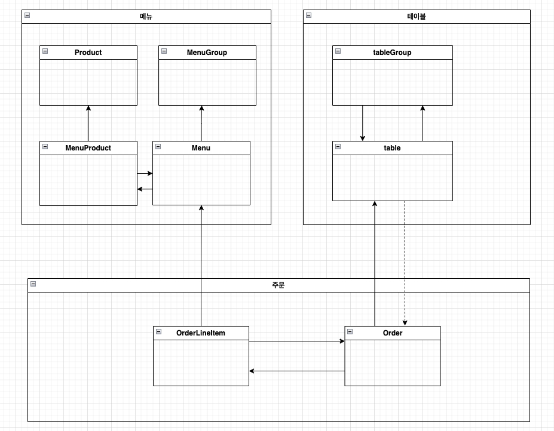
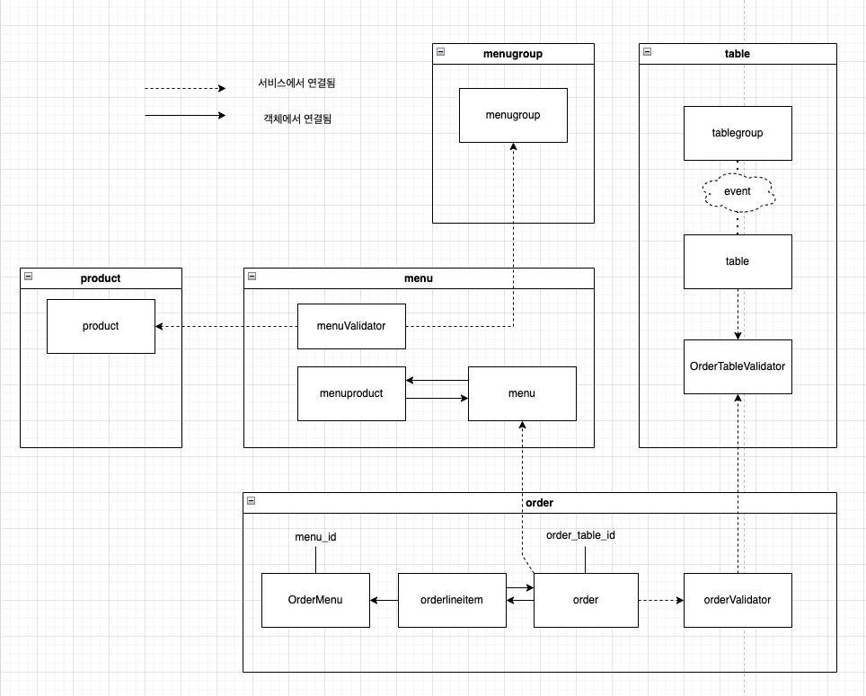

# 키친포스

## 요구 사항

- 요구사항에 맞춰 통합테스트를 작성한다.

### 상품

- [x] 상품을 등록한다.
    - [x] 가격이 0미만인 상품을 등록할 수 없다.
    - [x] 이름이 없는 상품을 등록할 수 없다.
- [x] 상품 목록을 조회한다.

### 메뉴 그룹

- [x] 메뉴그룹을 등록한다.
    - [x] 이름이 없는 메뉴그을 등록할 수 없다.
- [x] 메뉴 그룹 목록을 조회한다.

### 메뉴

- [x] 메뉴(+메뉴상품)를 등록한다.
    - [x] 가격이 0 미만인 메뉴를 등록할 수 없다.
    - [x] 가격이 없는 메뉴를 등록할 수 없다.
    - [x] 메뉴는 소속된 메뉴그룹이 없으면 안된다.
    - [x] 등록하려는 메뉴의 메뉴상품이 등록되지 않으면 등록할 수 없다.
    - [x] 메뉴의 가격을 메뉴상품의 총금액보다 높게 책정할 수 없다.
- [x] 메뉴(+메뉴상품) 목록을 조회한다.

### 테이블

- [x] 테이블을 등록한다.
    - [x] 빈 테이블을 등록한다.
    - [x] 채워진 테이블을 등록한다.
- [x] 테이블의 비움상태를 변경한다.
    - [x] 채워진 테이블을 빈테이블로 변환할 수 있다.
    - [x] 단체 지정이 되어있는 테이블의 비움 상태를 변경할 수 없다.
    - [x] 요리중이거나 식사중인 테이블의 비움 상태를 변경할 수 없다.
- [x] 테이블의 방문한 손님 수를 변경한다.
    - [x] 테이블의 손님 수를 변경할 수 있다.
    - [x] 변경 요청 손님수가 0 미만이면 변경할 수 없다.
    - [x] 빈 테이블의 손님수는 변경할 수 없다.
- [x] 테이블 목록을 조회한다.

### 단체 지정

- [x] 단체 지정 한다.
    - [x] 테이블이 2개 미만이면 단체지정 할 수 없다.
    - [x] 등록되지 않는 주문 테이블이 있으면 단체지정 할 수 없다.
    - [x] 채워진 테이블은 단체지정 할 수 없다.
    - [x] 이미 단체지정된 테이블은 단체지정 할 수 없다.
- [x] 단체지정을 취소한다.
    - [x] 조리, 식사중인 주문이 있는 테이블은 단체지정을 취소할 수 없다.

### 주문

- [x] 주문을 생성한다.
    - [x] 등록되지 않은 메뉴로는 주문을 생성할 수 없다.
    - [x] 빈테이블은 주문을 생성 할 수 없다.
- [x] 주문 목록을 조회한다.
- [x] 주문 상태를 변경한다.
    - [x] 주문상태가 현재 종료되었으면 상태를 변경할 수 없다.

## 용어 사전

| 한글명      | 영문명              | 설명                            |
|----------|------------------|-------------------------------|
| 상품       | product          | 메뉴를 관리하는 기준이 되는 데이터           |
| 메뉴 그룹    | menu group       | 메뉴 묶음, 분류                     |
| 메뉴       | menu             | 메뉴 그룹에 속하는 실제 주문 가능 단위        |
| 메뉴 상품    | menu product     | 메뉴에 속하는 수량이 있는 상품             |
| 금액       | amount           | 가격 * 수량                       |
| 주문 테이블   | order table      | 매장에서 주문이 발생하는 영역              |
| 빈 테이블    | empty table      | 주문을 등록할 수 없는 주문 테이블           |
| 주문       | order            | 매장에서 발생하는 주문                  |
| 주문 상태    | order status     | 주문은 조리 ➜ 식사 ➜ 계산 완료 순서로 진행된다. |
| 방문한 손님 수 | number of guests | 필수 사항은 아니며 주문은 0명으로 등록할 수 있다. |
| 단체 지정    | table group      | 통합 계산을 위해 개별 주문 테이블을 그룹화하는 기능 |
| 주문 항목    | order line item  | 주문에 속하는 수량이 있는 메뉴             |
| 매장 식사    | eat in           | 포장하지 않고 매장에서 식사하는 것           |

## Step2. 서비스 리팩토링

### 요구 사항

- [x] 단위 테스트하기 어려운 코드와 단위 테스트 가능한 코드를 분리해 단위 테스트 가능한 코드에 대해 단위 테스트를 구현한다.

- 리팩토링 작업순서
    1. 기존의 패키지 구조 변경
    2. JDBC -> JPA로 변경
    3. 단위테스트 구현
    4. 도메인객체 리팩토링

    - 도메인객체 엔티티 변경
    - 도메인객체 연관관계 매핑
    - 도메인객체 예외 추가

    5. 레포지토리 생성
    6. 요청 응답객체 생성
    7. 서비스 객체 수정
    8. 통합테스트 수정
    9. 컨트롤러 수정

- [x] 리팩토링
    - [x] 상품 리팩토링
    - [x] 메뉴그룹 리팩토링
    - [x] 메뉴 리팩토링
    - [x] 테이블 리팩토링
    - [x] 단체지정
    - [x] 주문 리팩토링

## Step3. 의존성

### 요구사항

- [x] 메뉴의 이름과 가격이 변경되면 주문 항목도 함께 변경된다. 메뉴 정보가 변경되더라도 주문 항목이 변경되지 않게 구현한다. => OrderMenu 중간객체 생성
- [x] 클래스와 패키지의 의존관계가 단방향이 되도록 한다.
    - 함께 생성되고 함께 삭제되는 객체들을 함께 묶어라
        - 메뉴생성 : Menu & MenuProduct
        - 주문 : Order & OrderLineItem & OrderMenu
    - 가능하면 분리하라
        - 테이블과 단체지정은 생성시점이 다르므로, 제약사항으로 묶여있더라도, 나누는 것이 좋아보인다. => 이벤트 핸들러를 적용해보자.

### 개선 전 - 후

- 개선 전
- 
- 문제
    - 테이블 패키지와 주문 패키지의 순환 의존성
    - 테이블그룹-테이블이 생성시점이 다름에도 하나의 패키지로 구성
    - 상품-메뉴-메뉴그룹 모두 생성시점이 다름에도 하나의 패키지로 구성
- 개선 후
- 
- 개선
    - 단방향 의존으로 변경
    - 테이블/테이블그룹 이벤트 퍼블리싱/핸들러로 연결
    - 상품/메뉴/메뉴그룹 각 패키지를 분리

## Step4. 멀티모듈 적용

### 요구사항

- [x] Gradle의 멀티 모듈 개념을 적용해 자유롭게 서로 다른 프로젝트로 분리해 본다.
    - [x] 컨텍스트 간의 독립된 모듈로 만들 수 있다.
    - [x] 계층 간의 독립된 모듈로 만들 수 있다.
- [x] 의존성 주입, HTTP 요청/응답, 이벤트 발행/구독 등 다양한 방식으로 모듈 간 데이터를 주고받을 수 있다.

### 모듈 분리 기준

- 애그리게이트 구분 원칙은 외부와의 의존은 약하게, 내부의 응집성을 높이는 방향으로 구분한다.
    - 비즈니스 로직상 강하게 연결되어 있는 도메인 분리
        - 주문 / 주문테이블 / 단체지정
        - 상품 / 메뉴 / 메뉴그룹
    - 내부 응집도를 높이기 위해 common 같은 공통 모듈 분리하지 않음
    - 최대한 손쉽게 분리할 수 있도록 구성

