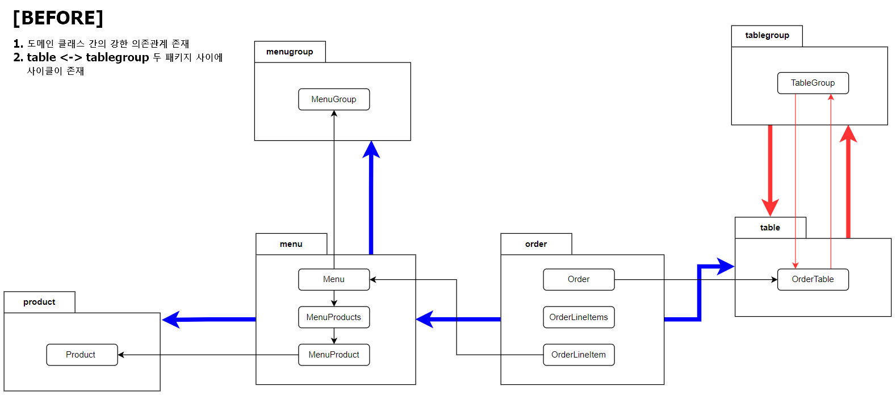

# 키친포스

## 요구 사항

### 1. MenuGroup
- [x] 메뉴그룹을 등록 할 수 있다.
- [x] 메뉴그룹 목록을 조회 할 수 있다.

### 2. Menu 
- [x] 메뉴를 등록 할 수 있다.
    - [x] 메뉴 가격은 필수 정보이며, 0원 이상이어야 한다.
    - [x] 메뉴는 자신이 속할 메뉴그룹이 존재하지 않으면 등록 할 수 없다.
    - [x] 메뉴는 메뉴를 구성하는 상품이 존재하지 않으면 등록 할 수 없다.
    - [x] 메뉴의 총 가격은 메뉴를 구성하는 각 상품의 가격 * 수량의 총합과 같거나 작아야한다.
- [x] 메뉴 목록을 조회 할 수 있다.

### 3. Product
- [x] 상품을 등록 할 수 있다.
    - [x] 상품 가격은 필수 정보이며, 0원 이상이어야 한다.
- [x] 상품 목록을 조회 할 수 있다.

### 4. Order
- [x] 주문을 등록 할 수 있다.
    - [x] 주문항목은 1건 이상이어야 한다.
    - [x] 전체 주문항목의 메뉴가 메뉴에 존재하지 않으면 주문을 등록 할 수 없다. 
    - [x] 주문을 한 주문 테이블이 존재하지 않으면 주문을 등록 할 수 없다.
    - [x] 주문 테이블이 빈 상태면 주문을 등록 할 수 없다.
    - [x] 주문을 등록할 때, 주문은 COOKING 상태가 된다.
    - [x] 주문을 등록할 때, 주문에 주문을 한 시간(현재 시간)이 설정된다.
- [x] 주문 목록을 조회할 수 있다.
- [x] 주문의 상태를 수정 할 수 있다.
    - [x] 이미 완료된 주문은 상태를 수정 할 수 없다.

### 5. Table
- [x] 테이블을 등록 할 수 있다.
    - [x] 단일 테이블 등록 시, TableGroup 은 존재하지 않는다.
- [x] 테이블 목록을 조회 할 수 있다.
- [x] 테이블 상태를 빈 테이블 상태로 변경 할 수 있다.
  - [x] 테이블이 존재하지 않으면 빈 테이블 상태로 변경 할 수 없다.
  - [x] 테이블 그룹이 존재하면 빈 테이블 상태로 변경 할 수 없다.
  - [x] 테이블에서 주문한 주문상태가 요리중(COOKING)이거나 식사중(MEAL) 이면 빈 테이블 상태로 변경 할 수 없다.
- [x] 테이블 손님의 수를 변경 할 수 있다
  - [x] 테이블 손님의 수는 0명 이상이어야 한다.
  - [x] 테이블이 존재하지 않으면 테이블 손님 수를 변경 할 수 없다.
  - [x] 테이블이 비어있으면 테이블 손님 수를 변경 할 수 없다.

### 6. TableGroup
- [x] 테이블 그룹을 등록 할 수 있다.
  - [x] 주문 테이블이 비어있거나 1개만 존재하면 테이블 그룹을 등록 할 수 없다.
  - [x] 테이블 그룹에 속하는 주문 테이블이 존재하지 않으면 테이블 그룹을 등록 할 수 없다.
  - [x] 테이블 그룹에 속하는 주문 테이블이 빈 테이블이 아니면 테이블 그룹을 등록 할 수 없다.
  - [x] 테이블 그룹에 속하는 주문 테이블이 이미 테이블 그룹에 속해있다면 테이블 그룹을 등록 할 수 없다.
- [x] 테이블 그룹을 해제 할 수 있다.
  - [x] 테이블에서 주문한 주문상태가 요리중(COOKING)이거나 식사중(MEAL) 이면 테이블 그룹을 해제 할 수 없다.

## 용어 사전

| 한글명 | 영문명 | 설명 |
| --- | --- | --- |
| 상품 | product | 메뉴를 관리하는 기준이 되는 데이터 |
| 메뉴 그룹 | menu group | 메뉴 묶음, 분류 |
| 메뉴 | menu | 메뉴 그룹에 속하는 실제 주문 가능 단위 |
| 메뉴 상품 | menu product | 메뉴에 속하는 수량이 있는 상품 |
| 금액 | amount | 가격 * 수량 |
| 주문 테이블 | order table | 매장에서 주문이 발생하는 영역 |
| 빈 테이블 | empty table | 주문을 등록할 수 없는 주문 테이블 |
| 주문 | order | 매장에서 발생하는 주문 |
| 주문 상태 | order status | 주문은 조리 ➜ 식사 ➜ 계산 완료 순서로 진행된다. |
| 방문한 손님 수 | number of guests | 필수 사항은 아니며 주문은 0명으로 등록할 수 있다. |
| 단체 지정 | table group | 통합 계산을 위해 개별 주문 테이블을 그룹화하는 기능 |
| 주문 항목 | order line item | 주문에 속하는 수량이 있는 메뉴 |
| 매장 식사 | eat in | 포장하지 않고 매장에서 식사하는 것 |

---

# 3단계 : 의존성 리팩토링

### 1. Before 의존관계
  
  - 도메인 클래스 간에 강한 의존성 결합이 존재
  - table <-> tablegroup 패키지 사이클이 존재

### 2. After 의존관계
  - [ ] 도메인 간 의존관계 해체 -> 객체간 직접 참조가 아닌 Repository 를 통해 우회
  - [ ] Event 방식을 통해 table <-> tablegroup 패키지 사이클 제거  