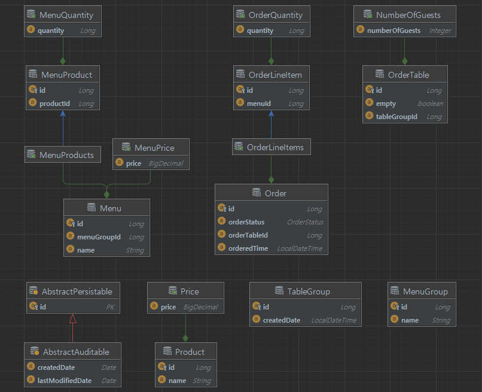
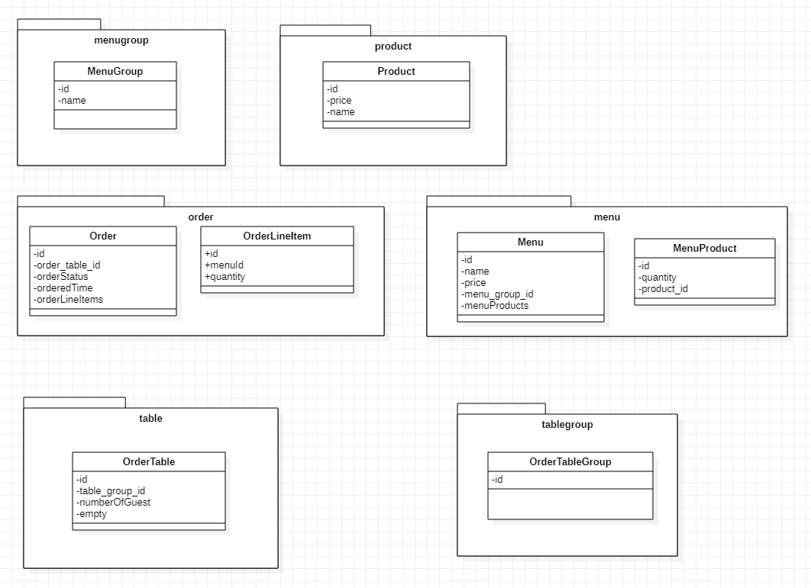

# 키친포스

## 요구 사항

## 용어 사전

| 한글명 | 영문명 | 설명 |
| --- | --- | --- |
| 상품 | product | 메뉴를 관리하는 기준이 되는 데이터 |
| 메뉴 그룹 | menu group | 메뉴 묶음, 분류 |
| 메뉴 | menu | 메뉴 그룹에 속하는 실제 주문 가능 단위 |
| 메뉴 상품 | menu product | 메뉴에 속하는 수량이 있는 상품 |
| 금액 | amount | 가격 * 수량 |
| 주문 테이블 | order table | 매장에서 주문이 발생하는 영역 |
| 빈 테이블 | empty table | 주문을 등록할 수 없는 주문 테이블 |
| 주문 | order | 매장에서 발생하는 주문 |
| 주문 상태 | order status | 주문은 조리 ➜ 식사 ➜ 계산 완료 순서로 진행된다. |
| 방문한 손님 수 | number of guests | 필수 사항은 아니며 주문은 0명으로 등록할 수 있다. |
| 단체 지정 | table group | 통합 계산을 위해 개별 주문 테이블을 그룹화하는 기능 |
| 주문 항목 | order line item | 주문에 속하는 수량이 있는 메뉴 |
| 매장 식사 | eat in | 포장하지 않고 매장에서 식사하는 것 |


--- 

## 1단계 - 테스트를 통한 코드 보호
- [x] 요구사항 정리하기
- [x] 요구사항 테스트 코드 작성하기

### 실습 환경 구축

[리팩터링](https://github.com/next-step/jwp-refactoring) 저장소를 기반으로 미션을 진행한다. 온라인 코드 리뷰 요청 1단계 문서를 참고해 실습 환경을 구축한다.
[온라인 코드 리뷰 요청 1단계](https://edu.nextstep.camp/s/Reggx5FJ/ls/Pdm0q6fC) 문서를 참고해 실습 환경을 구축한다.

1. 미션 시작 버튼을 눌러 미션을 시작한다.
2. 저장소에 자신의 GitHub 아이디로 된 브랜치가 생성되었는지 확인한다.
3. 저장소를 자신의 계정으로 Fork 한다.

### 요구 사항 1
`kitchenpos` 패키지의 코드를 보고 키친포스의 요구 사항을 `README.md`에 작성한다. 미션을 진행함에 있어 아래 문서를 적극 활용한다.
- [마크다운](https://dooray.com/htmls/guides/markdown_ko_KR.html)

### 요구 사항 2
- 정리한 키친포스의 요구 사항을 토대로 테스트 코드를 작성한다. 모든 Business Object에 대한 테스트 코드를 작성한다.
- `@SpringBootTest`를 이용한 통합 테스트 코드 또는 `@ExtendWith(MockitoExtension.class)`를 이용한 단위 테스트 코드를 작성한다.
- 인수 테스트 코드 작성은 권장하지만 필수는 아니다. 미션을 진행함에 있어 아래 문서를 적극 활용한다.
- [Testing in Spring Boot - Baeldung](https://www.baeldung.com/spring-boot-testing)
- [Exploring the Spring Boot TestRestTemplate](https://www.baeldung.com/spring-boot-testresttemplate)

### 프로그래밍 요구 사항
- Lombok은 그 강력한 기능만큼 사용상 주의를 요한다.
    - 무분별한 setter 메서드 사용
    - 객체 간에 상호 참조하는 경우 무한 루프에 빠질 가능성
    - [Lombok 주의사항](https://kwonnam.pe.kr/wiki/java/lombok/pitfall)
- 이번 과정에서는 Lombok 없이 미션을 진행해 본다.

### 힌트
- `http` 디렉터리의 `.http` 파일(HTTP client)을 보고 어떤 요청을 받는지 참고한다.
- [intellij의 .http 사용하기](https://jojoldu.tistory.com/266)
    ```text
    ###
    POST {{host}}/api/menu-groups
    Content-Type: application/json
    
    {
      "name": "추천메뉴"
    }
    
    ###
    GET {{host}}/api/menus-groups
    
    ###
    ```

- `src/main/resources/db/migration` 디렉터리의 `.sql` 파일을 보고 어떤 관계로 이루어져 있는지 참고한다.
    ```sql
    id BIGINT(20) NOT NULL AUTO_INCREMENT,
    order_table_id BIGINT(20) NOT NULL,
    order_status VARCHAR(255) NOT NULL,
    ordered_time DATETIME NOT NULL,
    PRIMARY KEY (id)
    ```
- 아래의 예제를 참고한다.
    ```text
    ### 상품
    
    * 상품을 등록할 수 있다.
    * 상품의 가격이 올바르지 않으면 등록할 수 없다.
        * 상품의 가격은 0 원 이상이어야 한다.
    * 상품의 목록을 조회할 수 있다.
   ```

  #### Business Object Test
    ```java
    @ExtendWith(MockitoExtension.class)
    public class BoTest {
        @Mock
        private Dao dao;
    
        @InjectMocks
        private Bo bo;
    
        @Test
        public void test() {
            given(dao.findById(anyLong()))
                    .willReturn(new Object());
        }
    }
    ```

  #### Controller Test
    ```java
    @WebMvcTest
    public class ControllerTest {
        @Autowired
        private MockMvc mockMvc;
        
        @Test
        public void test() {
            webMvc.perform(get("/"))
                    .andDo(print())
                    .andExpect(status().isOk());
           
        }
    }
    ```

--- 

## 1. 키친포스 요구사항 정리

```text
### 상품
* 상품의 목록을 조회할 수 있다. 
* 상품을 등록할 수 있다.
* 상품의 가격이 올바르지 않으면 등록할 수 없다.
    * 상품의 가격은 0 원 이상이어야 한다.


### 메뉴그룹 
* 메뉴 그룹을 등록할 수 있다.
* 메뉴 그룹을 조회할 수 있다.

### 메뉴
* 메뉴의 목록을 조회할 수 있다. 
* 메뉴를 등록할 수 있다.
* 메뉴의 가격이 올바르지 않으면 등록할 수 없다.
    * 메뉴의 가격은 0원 이상이어야 한다.
    * 메뉴의 가격은 메뉴상품들의 수량과 가격의 합과 일치하여야 한다.
* 메뉴는 메뉴상품이 올바르지 않으면 등록할 수 없다.
    * 메뉴상품은 상품이 등록되어 있어야 한다.
* 메뉴는 메뉴그룹이 올바르지 않으면 등록할 수 없다.
    * 메뉴그룹이 등록되어 있어야 한다.


### 테이블 
* 테이블 목록을 조회할 수 있다.
* 테이블을 등록할 수 있다.
* 테이블의 상태를 변경할 수 있다.
* 테이블 정보가 올바르지 않은 경우 상태를 변경할 수 없다.
    * 존재하지 않은 테이블은 상태를 변경할 수 없다.
    * 테이블이 그룹 테이블인 경우 변경할 수 없다.
    * 테이블의 주문 상태가 조리, 식사인 경우 변경할 수 없다.
* 테이블의 사용자 수를 변경할 수 있다.
* 테이블 정보가 올바르지 않을 경우 사용자 수를 변경할 수 없다.
    * 테이블의 사용자 수는 0명 이상이어야 한다.
    * 존재하지 않은 테이블의 사용자 수를 변경할 수 없다.
    * 빈 테이블의 사용자 수를 변경할 수 없다.


### 그룹 테이블
* 테이블을 그룹화할 수 있다.
* 테이블 리스트가 올바르지 않은 경우 그룹화 할 수 없다.
    * 테이블 리스트가 2개 보다 작은 경우 그룹화 할 수 없다.
    * 등록되지 않은 테이블인 경우 등록할 수 없다.
    * 테이블이 비어있지 않거나 그룹화된 테이블 인 경우 등록할 수 없다.
* 테이블의 그룹화를 해제할 수 있다.
* 테이블 리스트가 올바르지 않은 경우 그룹회를 해제할 수 없다.
    * 테이블 리스트의 주문 상태가 조리, 식사중인 경우 해제할 수 없다.
        
### 주문 
* 주문을 등록할 수 있다.
* 주문은 주문정보로 구성되어 있다.
* 주문은 주문정보가 올바르지 않으면 등록할 수 없다.
    * 주문정보가 존재하지 않을 경우 등록할 수 없다.
    * 주문정보의 메뉴는 등록되어 있어야 한다.
* 주문은 테이블정보가 올바르지 않으면 등록할 수 없다.
    * 테이블정보가 존재하지 않을 경우 등록할 수 없다.
    * 테이블이 빈 테이블인 경우 등록할 수 없다.
* 주문의 목록을 조회할 수 있다.
* 주문의 상태를 변경할 수 있다.
    * 주문이 존재하지 않은 경우 상태를 변경할 수 없다.
    * 주문 상태가 완료인 경우 상태를 변경할 수 없다.
```

--- 

## 2단계 - 서비스 리팩터링

### 요구 사항
- 단위 테스트하기 어려운 코드와 단위 테스트 가능한 코드를 분리해 단위 테스트 가능한 코드에 대해 단위 테스트를 구현한다.
  - Spring Data JPA 사용 시 `spring.jpa.hibernate.ddl-auto=validate` 옵션을 필수로 준다.
  - 데이터베이스 스키마 변경 및 마이그레이션이 필요하다면 아래 문서를 적극 활용한다.
    - [DB도 형상관리를 해보자!](https://meetup.toast.com/posts/173)

### 프로그래밍 요구 사항
- Lombok은 그 강력한 기능만큼 사용상 주의를 요한다.
  - 무분별한 setter 메서드 사용
  - 객체 간에 상호 참조하는 경우 무한 루프에 빠질 가능성
  - [Lombok 사용상 주의점(Pitfall)](https://kwonnam.pe.kr/wiki/java/lombok/pitfall)
  - 이번 과정에서는 Lombok 없이 미션을 진행해 본다.
- 자바 코드 컨벤션을 지키면서 프로그래밍한다.
  - 기본적으로 [Google Java Style Guide](https://google.github.io/styleguide/javaguide.html) 을 원칙으로 한다.
  - 단, 들여쓰기는 '2 spaces'가 아닌 '4 spaces'로 한다.
- indent(인덴트, 들여쓰기) depth를 2를 넘지 않도록 구현한다. 1까지만 허용한다.
  - indent(인덴트, 들여쓰기) depth를 2를 넘지 않도록 구현한다. 1까지만 허용한다.
  - 힌트: indent(인덴트, 들여쓰기) depth를 줄이는 좋은 방법은 함수(또는 메서드)를 분리하면 된다.
- 3항 연산자를 쓰지 않는다.
- else 예약어를 쓰지 않는다.
  - else 예약어를 쓰지 말라고 하니 switch/case로 구현하는 경우가 있는데 switch/case도 허용하지 않는다.
  - 힌트: if문에서 값을 반환하는 방식으로 구현하면 else 예약어를 사용하지 않아도 된다.
- 모든 기능을 TDD로 구현해 단위 테스트가 존재해야 한다. 단, UI(System.out, System.in) 로직은 제외
  - 핵심 로직을 구현하는 코드와 UI를 담당하는 로직을 구분한다.
  - UI 로직을 InputView, ResultView와 같은 클래스를 추가해 분리한다.
- 함수(또는 메서드)의 길이가 10라인을 넘어가지 않도록 구현한다.
  - 함수(또는 메소드)가 한 가지 일만 하도록 최대한 작게 만들어라.
- 배열 대신 컬렉션을 사용한다.
- 모든 원시 값과 문자열을 포장한다
- 줄여 쓰지 않는다(축약 금지).
- 일급 컬렉션을 쓴다.
- 모든 엔티티를 작게 유지한다.
- 3개 이상의 인스턴스 변수를 가진 클래스를 쓰지 않는다.

### 비즈니스 로직은 도메인 모델에 구현한다.

### 힌트
- 테스트하기 쉬운 부분과 어려운 부분을 분리
  - 모델에 비즈니스 로직을 최대한 모으면 순수히 해당 언어의 클래스 문법으로만 작성되고, 그 어떤 프레임워크나 외부 종속 없이도 테스트 가능한 객체가 된다.
  - 이런 객체는 테스트하기 매우 용이해서 더 많은 테스트 코드를 작성하게 하는 순기능이 있다.
- 한 번에 완벽한 설계를 하겠다는 욕심을 버려라.
  - 초기에는 도메인에 대한 이해도가 낮아 설계 품질이 낮다. 반복적인 설계와 구현을 통해 도메인에 대한 이해도를 높인다.
  - 도메인에 대한 이해도가 높아야 추상화 수준도 높아진다.
- 모델에 setter 메서드 넣지 않기
 ```text
changeShippingInfo() vs setShippingInfo()
completePayment() vs setOrderState()
 ```

---

## 3단계 - 의존성 리팩터링

### 요구 사항
##### 이전 단계에서 객체 지향 설계를 의식하였다면 아래의 문제가 존재한다. 의존성 관점에서 설계를 검토해 본다.

- 메뉴의 이름과 가격이 변경되면 주문 항목도 함께 변경된다.
- 메뉴 정보가 변경되더라도 주문 항목이 변경되지 않게 구현한다.
- 클래스 간의 방향도 중요하고 패키지 간의 방향도 중요하다.
- 클래스 사이, 패키지 사이의 의존 관계는 단방향이 되도록 해야 한다.
- 데이터베이스 스키마 변경 및 마이그레이션이 필요하다면 아래 문서를 적극 활용한다.
  - [DB도 형상관리를 해보자!](https://meetup.toast.com/posts/173)

### 프로그래밍 요구 사항
- Lombok은 그 강력한 기능만큼 사용상 주의를 요한다.
  - Lombok은 그 강력한 기능만큼 사용상 주의를 요한다.
  - 무분별한 setter 메서드 사용
  - 객체 간에 상호 참조하는 경우 무한 루프에 빠질 가능성
  - [Lombok 사용상 주의점(Pitfall)](https://kwonnam.pe.kr/wiki/java/lombok/pitfall)
  - 이번 과정에서는 Lombok 없이 미션을 진행해 본다.

### 힌트
- 함께 생성되고 함께 삭제되는 객체들을 함께 묶어라
- 불변식을 지켜야 하는 객체들을 함께 묶어라
- 가능하면 분리하라
- 연관 관계는 다양하게 구현할 수 있다.
  - 직접 참조 (객체 참조를 이용한 연관 관계)
  - 간접 참조 (리포지토리를 통한 탐색)


- 느슨한 결합과 강한 결합
  - 외부 서비스가 정상이 아닐 경우 트랜잭션 처리를 어떻게 해야 할지 애매
  - 외부 서비스 성능에 직접적인 영향을 받는 문제가 있다.
  - 도메인 객체에 서비스를 전달하면 추가로 설계상 문제가 나타날 수 있다.
  - 도메인 객체에 서비스를 전달할 떄 또 다른 문제는 기능을 추가할 때 발생한다.
  - 비동기 이벤트를 사용하면 두 시스템 간의 결합을 크게 낮출 수 있다.


- 이벤트
  - 이벤트가 발생한다는 것은 상태가 변경됐다는 것을 의미한다.
  - 도메인 모델에서도 UI 컴포넌트와 유사하게 도메인의 상태 변경을 이벤트로 표현할 수 있다.
  - 보통 '~할 때', '~가 발생하면', '만약 ~하면'과 같은 요구사항은 도메인의 상태 변경과 관련된 경우가 많고 이런 요구사항을 이벤트를 이용해서 구현할 수 있다.


- 이벤트 관련 구성요소
  - 도메인 모델에서 이벤트 주체는 엔티티, 밸류, 도메인 서비스와 같은 도메인 객체이다.
  - 도메인 객체는 도메인 로직을 실행해서 상태가 바뀌면 관련 이벤트를 발생한다.
  - 이벤트 핸들러(handler)는 이벤트 생성 주체가 발생한 이벤트에 반응한다.
  - 이벤트 핸들러는 생성 주체가 발생한 이벤트를 전달받아 이벤트에 담긴 데이터를 이용해서 원하는 기능을 실행한다.
  - 이벤트 생성 주체와 이벤트 핸들러를 연결해 주는 것이 이벤트 디스패처(dispatcher)이다.
  - 이벤트를 전달받은 디스패처는 해당 이벤트를 처리할 수 있는 핸들러에 이벤트를 전파한다.


- 이벤트의 구성
  - 이벤트는 현재 기준으로 (바로 직전이라도) 과거에 벌어진 것을 표현하기 때문에 이벤트 이름에는 과거 시제를 사용한다.
  - 이벤트는 이벤트 핸들러가 작업을 수행하는 데 필요한 최소한의 데이터를 담아야 한다.


- 이벤트 용도
  - 도메인의 상태가 바뀔 때 다른 후처리를 해야 할 경우 후처리를 실행하기 위한 트리거로 이벤트를 사용할 수 있다.
  - 이벤트의 두 번째 용도는 서로 다른 시스템 간의 데이터 동기화이다.


- 이벤트 장점
  - 서로 다른 도메인 로직이 섞이는 것을 방지할 수 있다.
  - 이벤트 핸들러를 사용하면 기능 확장도 용이하다


- 비동기 이벤트 처리
  - 로컬 핸들러를 비동기로 실행하기
  - 메시지 큐를 사용하기
  - 이벤트 저장소와 이벤트 포워더 사용하기
  - 이벤트 저장소와 이벤트 제공 API 사용하기


- 스프링 ApplicationEvent 소개
  - ApplicationEventPublisher
    - 이벤트 프로그래밍에 필요한 인터페이스 제공
    - ApplicationEvent 상속 (4.2 이전)
    - ApplicationEventPublisher.publishEvent();
    - ApplicationEventPublisherAware


- 이벤트 핸들러
  - ApplicationListener 상속 (4.2 이전)
  - @EventListener
  - @Order
  - @Async (@EnableAsync)


### 의존성 리팩토링 목표

- [x] 양방향 의존성을 제거하기
- [x] 다중성이 적은 방향을 선택하기
- [x] 의존성이 필요 없으면 제거
- [x] 패키지 사이의 의존성 사이클을 제거 


### 문제점 파악하기 
 - 현재 의존 관계 분석  (화살표의 방향은 현재 연관관계(의존성)를 의미한다.) 
 ```text
                                                     [MenuGroup]
                                                         ↑ (1)  
                                                         |
                                                         | (1)  
  [Product] (1) <---- (*) [MenuProduct] (*) -----> (1) [Menu]  
                                                         ↑ (1)
                                                         |
                                                         | (*)
                                                  [OrderLineItem]
                                                         ↑ (*)
                                                         |
                                                         ↓ (1)
  [TableGroup] (1) <--- (*) [OrderTable] (1) <---> (*) [Order]
  ```
 1) 양방향 의존관계 제거하기  
 ```text
                                                     [MenuGroup]
                                                         ↑ (1)  
                                                         |
                                             (v)         | (1)  
  [Product] (1) <---- (*) [MenuProduct] (*) -----> (1) [Menu]  
                                                         ↑ (1)
                                                         |
                                                         | (*)
                                                  [OrderLineItem]
                                                         ↑ (*)
                                                      (v)|
                    (v)                        (v)       | (1)
  [TableGroup] (1) <--- (*) [OrderTable] (1) <---- (*) [Order]
  ```
   
 - 불필요한 객체 참조를 제거한다. 
   - `OrderLineItem.Order` => `OrderLineItem.orderId`
   - `OrderLineItem.Menu` => `OrderLineItem.menuId`
   - `Order.OrderTable` => `Order.orderTableId` 
   - `Menu.MenuGroup` => `Menu.menuGroupId`
   - `MenuProduct.Menu` => `MenuProduct.menuId`
   - `Order.OrderTable` => `Order.orderTableId`
   - `OrderTable.orders` => `제거`
   - `OrderTable.TableGroup` => `OrderTable.tableGroupId`
   - `TableGroup.orderTables` => `제거` 

### 변경 사항
  - Validator 사용 
    - MenuValidator: Product, MenuGroup 의존성 사이클을 제거한다.
    - OrderValidator: Menu, OrderTable 의존성 사이클을 제거한다.
    - TableValidator: Order 와 의존성 사잌르을 제거한다.
    - TableGroupValidator: Order, OrderTable 의존성 사이클을 제거한다.
    
  - Event 사용
    - TableGroup event publish  
    - Table event Listener

### 엔티티 릴레이션 


### 패키지 분리 

