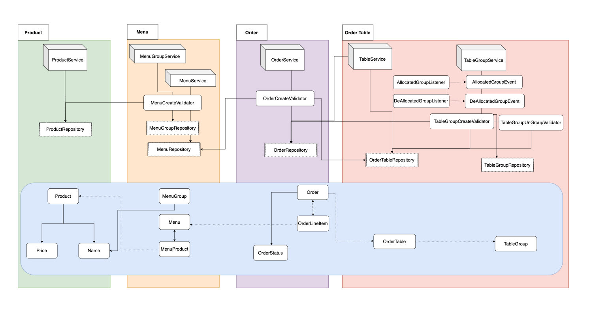
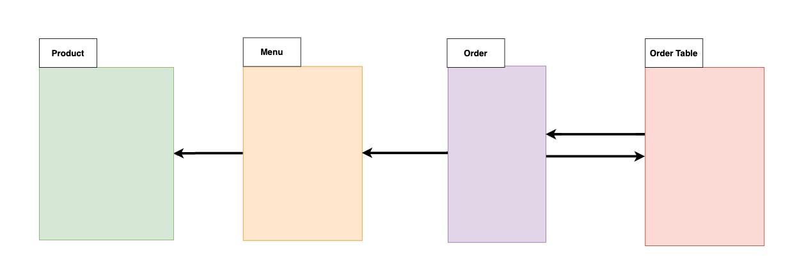
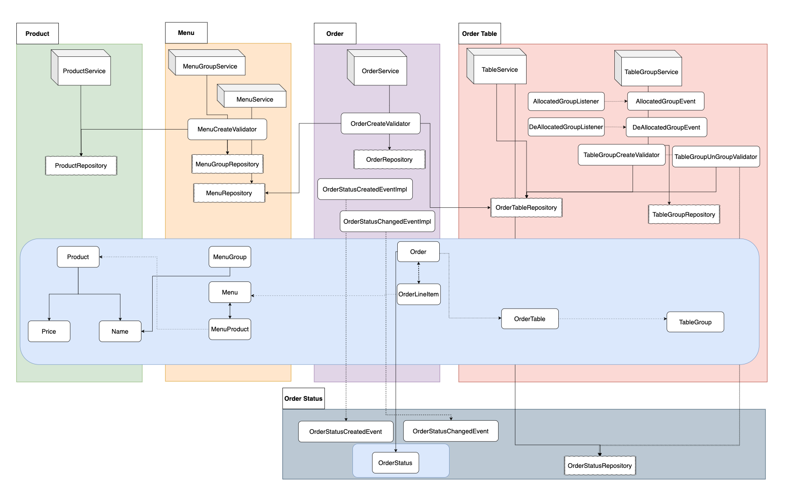
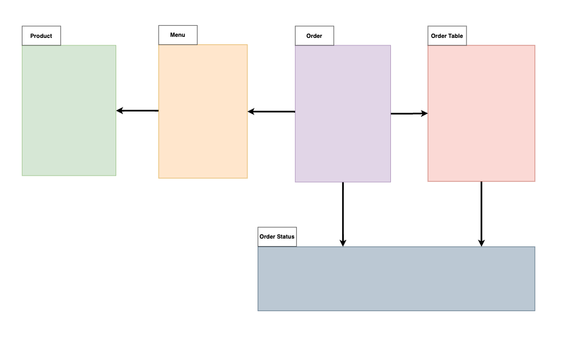

# 키친포스

## 요구 사항

## 용어 사전

| 한글명 | 영문명 | 설명 |
| --- | --- | --- |
| 상품 | product | 메뉴를 관리하는 기준이 되는 데이터 |
| 메뉴 그룹 | menu group | 메뉴 묶음, 분류 |
| 메뉴 | menu | 메뉴 그룹에 속하는 실제 주문 가능 단위 |
| 메뉴 상품 | menu product | 메뉴에 속하는 수량이 있는 상품 |
| 금액 | amount | 가격 * 수량 |
| 주문 테이블 | order table | 매장에서 주문이 발생하는 영역 |
| 빈 테이블 | empty table | 주문을 등록할 수 없는 주문 테이블 |
| 주문 | order | 매장에서 발생하는 주문 |
| 주문 상태 | order status | 주문은 조리 ➜ 식사 ➜ 계산 완료 순서로 진행된다. |
| 방문한 손님 수 | number of guests | 필수 사항은 아니며 주문은 0명으로 등록할 수 있다. |
| 단체 지정 | table group | 통합 계산을 위해 개별 주문 테이블을 그룹화하는 기능 |
| 주문 항목 | order line item | 주문에 속하는 수량이 있는 메뉴 |
| 매장 식사 | eat in | 포장하지 않고 매장에서 식사하는 것 |

## 키친포스 요구사항

* 상품
    * 생성
        * `상품`의 가격은 0 이상이어야 한다
        * `상품` 이름은 중복이 가능하다
    * 목록 조회
        * `상품` 목록이 조회 된다
* 메뉴그룹
    * 성격
        * `메뉴그룹`은 여러 `메뉴`를 포함하는 카테고리 성격의 데이터 이다
    * 생성
        * `메뉴그룹`이 생성 된다
    * 조회
        * `메뉴그룹` 목록이 조회 된다
* 메뉴
    * 생성
        * `메뉴`의 가격은 0 이상이어야 한다
        * `메뉴`는 하나의 `메뉴그룹`에 반드시 포함 되어야 한다
            * `메뉴그룹`은 `메뉴` 생성 이전에 반드시 존재해야 한다
        * `메뉴`는 여러개의 `메뉴상품` 을 가질 수 있어야 한다
            * `상품`은 `메뉴` 생성 이전에 반드시 존재해야 한다
            * `메뉴상품`은 `메뉴` 생성 이후에 함께 생성 된다
        * `메뉴`의 `가격`은 메뉴에 포함 된 `상품 목록`의 `가격` 합과 같거나 더 작아야한다
    * 목록 조회
        * `메뉴 목록`이 조회 된다
* 주문
    * 생성
        * 하나 이상의 `주문 항목`을 가져야 한다
        * `주문`에 포함 된`주문 항목`의 갯수는 `주문 항목`에 포함 된 `메뉴`의 갯수와 일치해야 한다
        * `주문 테이블`은 주문 이전에 반드시 존재해야 한다
        * `주문` 생성 시점에 `주문 테이블`은 `빈 테이블`이 아니어야한다
        * `주문`을 생성하면 `주문 상태`는 `조리`상태가 된다
    * 목록 조회
        * `주문` 목록을 조회하면 `주문 항목` 목록도 함께 조회 된다
    * 주문 상태 변경
        * `주문 상태`를 변경하고자 하는 `주문`은 반드시 존재해야 한다
        * `주문 상태`를 변경하고자 하는 `주문`의 상태는 `계산 완료` 상태가 아니어야 한다
* 주문 테이블
    * 생성
        * `주문 테이블`을 생성한다
    * 목록 조회
        * `주문 테이블` 목록을 조회한다
    * 빈 테이블로 변경
        * `주문 테이블`의 상태를 `빈 테이블` 로 변경한다
        * `빈 테이블로 변경`을 수행하려는 `주문 테이블`은 반드시 존재해야 한다
        * `주문 테이블`에 속한 `주문`의 `주문 상태`는 `계산 완료` 상태어야 한다.
    * 방문 손님 수 변경
        * `방문 손님`의 수는 1명 이상이어야 한다
        * `방문 손님` 수를 변경하려는 `주문 테이블`은 반드시 존재해야 한다
        * `주문 테이블`은 비어 있으면 안된다
        * (방문 손님 수를 변경한다)
* 단체 지정
    * 생성
        * `단체 지정` 요청 `주문 테이블`이 비어 있으면 안 된다
        * `단체 지정` 요청 `주문 테이블`의 수는 2 이상이어야 한다
        * `단체 지정` 요청 `주문 테이블`은 실제 존재하는 `주문 테이블`의 수와 일치 해야 한다
        * `단체 지정` 요청 `주문 테이블`은 `다른 단체 지정`에 속해 있으면 안된다
    * 단체 지정 해제
        * `단체 지정`에 속해 있는 모든 `주문`의 (상태)는 (결제 완료) 상태어야 한다

# 2단계 - 서비스 리펙터링

## 요구 사항

* 단위 테스트하기 어려운 코드와 `단위 테스트 가능한 코드`를 `분리`하고, `단위 테스트 가능한 코드`에 대해 `단위 테스트를 구현`한다
* JPA 구현체인 Spring Data Jpa로의 코드 마이그레이션을 수행한다
* 현재 테스트의 보호를 받고 있는 상태로, 테스트의 보호 속에서 4-step 으로 리펙터링을 진행한다
    1. `table.Application Layer`에 존재하는 비즈니스 로직(생성과 같은 단순한 기능)을 `Domain Layer`로 옮기기 (소극적 기능 리펙터링)(TDD)
    2. `Domain Layer` 와 `Infra Layer` 간의 의존 구조 개선하기
        * JPA 구현체인 Spring-Data-Jpa 도입
    3. `Infra Layer`의 보호 아래 `도메인 객체`를 세부적으로 분리 (적극적 기능 리펙터링)
        * 래핑 클래스, 일급 컬렉션 등 활용
    4. 패키지 분리

### 힌트

* 테스트하기 쉬운 부분과 어려운 부분을 분리
* 한 번에 완벽한 설계를 하겠다는 욕심을 버려라
* 모델에 setter 메서드 넣지 않기

# 3단계 - 의존성 리펙터링

## 요구사항

* `메뉴` 정보가 변경 되더라도 `주문 항목`이 변경되지 않게 구현한다
    * 2단계 - 의존성 리펙터링 리뷰 중 간접 참조하는 방식으로 개선 완료
* 클래스 사이, 패키지 사이의 `의존 관계`는 `단방향`이 되도록 개선한다
* DB 스키마 변경이 필요하면 Flyway 로 관리한다

## 힌트

* 함께 생성되고 함께 삭제되는 객체들을 묶자
* 불변식을 지켜야하는 객체들을 함께 묶자
* 가능하면 분리하라
* 직접 참조
    * 협력 객체를 통해 직접 참조
* 간접 참조
    * 협력 객체의 id 를 참조한다
    * 협력 객체에 메세지를 전달해야 할 때는 협력 객체의 id 값을 상위 Layer 혹은 Domain Service에 위임하여 메세지를 전달한다
* 의존성이 순환하는 구조를 제거한다

### 강한 결합과 느슨한 결합

* 강한 결합일 때, 외부 서비스가 정상이 아닐 경우 트랜잭션 처리를 어떻게 해야 할지 애매하다
* 강한 결합일 때, 외부 서비스 성능에 직접적인 영향을 받는 문제가 있다
* 강한 결합일 때, 도메인 객체에 서비스를 전달하면 설계상 문제가 나타날 수 있다 (`Layer 간의 의존 관게`는 항상 `바깥쪽`에서 `안쪽`으로 흐르게 한다)
* 강한 결합일 때, 도메인 객체에 서비스를 전달 하면, 기능을 추가할 때 문제가 발생할 수 있다
* 느슨한 결합 : 비동기 이벤트를 사용하면 두 시스템 간의 결합을 크게 낮출 수 있다

### 이벤트

* `이벤트가 발생`했다는 건 `상태가 변경`되었다는 것을 의미한다
* 도메인의 `상태 변경`을 `이벤트`로 표현할 수 있다
* `~할 때,` , `~가 발생하면` , `만약 ~하면` 과 같은 요구사항은 도메인의 상태변경과 관련된 경우가 많고 그러한 요구사항들은 이벤트를 통해 구현이 가능하다
* 도메인 모델에서의 이벤트 주체 : 도메인 레이어에 위치한 모든 객체
    * 엔티티
    * 벨류
    * 도메인 서비스
* `도메인 객체`는 도메인 로직 수행 후, `상태가 바뀌`면 관련 `이벤트를 발행(publish)`한다
* `이벤트 핸들러(handler)`는 본인이 관심 있는 `이벤트에 반응`한다
* `이벤트 핸들러`는 발행 된(published) `이벤트를 전달`받아, `포함되어 있는 데이터를 사용`하여 `원하는 기능을 수행`한다
* `이벤트 발행자(publisher)`와 `이벤트 핸들러(handler)`를 `연결`해 주는 것이 `디스패처(dispatcher)`다 (영어로는 전달자 라고 해석한다)
* 이벤트를 전달 받은 `디스패처`는 해당 `이벤트에 관심 있는 핸들러`에게 `이벤트를 전파`한다
* 이벤트는 과거에 벌어진 것이기에 `이벤트 이름`은 `과거 시제`를 사용한다
* 이벤트는 작업 수행에 필요한 최소한의 데이터를 담아야 한다

### 이벤트의 용도

* `도메인 객체`의 `상태가 변경`되고, 변경 된 상태에 대한 후처리가 필요할 경우 `후처리를 실행`하기 위한 트리거로 사용할 수 있다
* 서로 다른 `시스템 간의 데이터 동기화`에 사용할 수 있다

### 이벤트의 장점

* 서로 다른 도메인 로직이 섞이는 것을 방지할 수 있다
    * 각 도메인은 서비스의 전체적인 흐름을 알 필요가 없다
    * 단지 내가 관심 있는 이벤트를 전달 받았을 때 어떤 일을 할거야 라는 정보만 알고 있으면 된다
* 이벤트 핸들러를 사용하면 기능 확장이 용이하다
    * 이벤트를 사용하면 내 서비스 자체를 하나의 블랙 박스로 만들 수 있다
    * 입구와 출구만 지켜진다면 내부 구현의 변경 영향 범위가 다른 서비스에 전파되는 것을 방지할 수 있다

### 다시 구현으로 돌아와서...

* 다른 서비스에 의존적이지 않고 `독립적인 생명주기`를 가지는 도메인
    * 상품
    * 메뉴 그룹
    * 주문 테이블
* 다른 서비스에 의존적인 도메인
    * 주문
        * 상품에 의존
        * 메뉴에 의존
    * 단체 지정 테이블
        * 주문 테이블에 의존
* 생명주기를 함께하는 객체 (협력 관계로 사용해도 괜찮다)
    * 메뉴 + 메뉴 상품
    * 주문 + 주문 항목

* 이벤트가 필요한 부분 = 도메인의 상태가 변경될 때, 후처리가 필요한 부분 (데이터 동기화)
    * 단체 지정 테이블
        * 단체 지정 설정 --> 주문 테이블의 단체 지정 값 설정
        * 단체 지정 해제 --> 주문 테이블의 단체 지정 값 초기화

# 4단계 - 멀티 모듈 적용

## 요구사항

* Gradle의 멀티 모듈 개념을 적용해 컨텍스트 간의 독립된 모듈로 만들어본다

초기 계획은 컨텍스트를 생명주기 및 도메인 간 의존성에 따라 총 4가지 모듈로 나누려고 했다

1. 상품 모듈
    * 상품
2. 메뉴 모듈
   * 메뉴
   * 메뉴 상품
   * 메뉴 그룹
3. 주문 모듈
   * 주문
   * 주문 메뉴
   * 주문 상태
4. 주문 테이블 모듈
   * 주문 테이블
   * 단체 지정

하지만 구현된 내용으로 의존성 흐름도를 그려본 결과 의존성 cycle이 생기고 있었다

개선 전 의존관계 구성도

모듈간 의존성 흐름만 간략하게 보면 다음과 같다

보이는 것과 같이 `주문` 컨텍스트와 `주문 테이블` 컨텍스트가 서로를 참조하고 있었다

의존성의 가장 상위에 있는 도메인은 `주문` 도메인이다.

따라서 현재 의존성 cycle은 `주문` 에서 `주문 테이블` 로 흘러야 하는 흐름이

`주문 테이블` 에서 `주문` 으로 흐르고 있었기에 발생하였다.

따라서 `주문 테이블` 에서 `주문` 도메인으로 흐르고 있는 의존성이 무엇인지 분석해보니
총 두 가지의 참조를 발견할 수 있었다

1. 주문 테이블을 빈 테이블로 변경할 경우 `주문의 상태`가 `결제 완료 상태`인지 `체크`한다
2. 단체 지정을 해제할 때 `주문의 상태`가 `결제 완료 상태`인지 `체크`한다

의존성 cycle의 원인은 `주문의 상태`에 있음을 찾아냈다

따라서 주문 상태에 대한 도메인을 분리하고 

별도의 스키마로 관리하도록 개선을 진행한다

개선 후 의존관계 구성도

개선 후 의존관계 흐름도

개선 이후

`주문 컨텍스트`는 `주문 생성 및 상태 변경` 시 `주문 상태 컨텍스트`에 해당하는 `이벤트를 발행`하고,
`주문 테이블 컨텍스트`는 `테이블 상태 변경 가능 여부`를 `validation` 하기 위해 `주문 상태 레포지토리를 직접 참조`한다

개선 후 의존관계 흐름도를 보면 

기존에 존재하던 의존성 cycle이 해소된 것을 확인할 수 있다

* 추가 개선사항
  * 모듈 간 TestFixture 기능 활용
  * 가독성을 위해 UI 테스트를 RestAssured 로 수행하도록 개선
