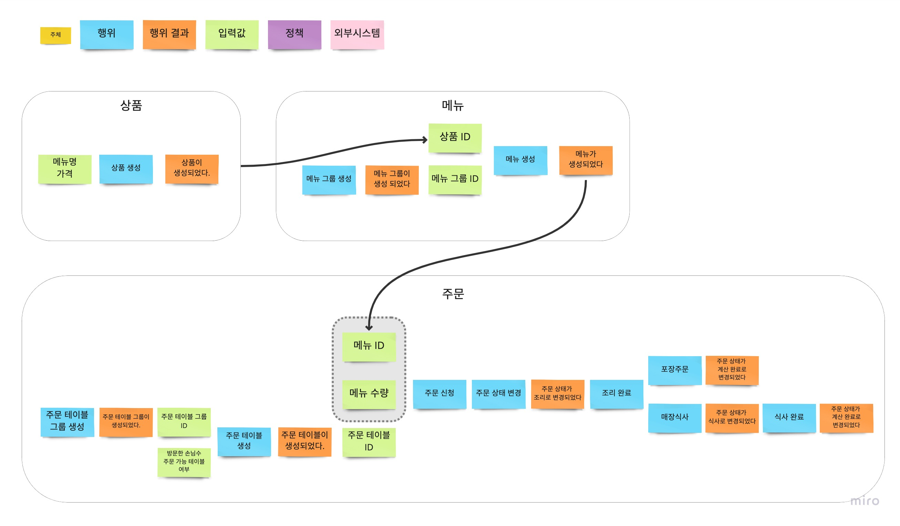

# 키친포스

## 키친포스 요구사항
### 상품
- 상품을 등록할 수 있다.
- 상품의 가격이 올바르지 않으면 등록할 수 없다.
    - 상품의 가격은 0 원 이상이어야 한다.
- 상품의 목록을 조회할 수 있다.

### 메뉴
#### 메뉴 그룹
- 메뉴 그룹을 등록할 수 있다.
- 메뉴 그룹 목록을 조회힐 수 있다.
#### 메뉴
- 메뉴를 등록할 수 있다.
- 메뉴 목록을 조회할 수 있다.
- 메뉴 등록시 입력이 올바르지 않으면 등록할 수 없다.
  - 메뉴 가격이 0원 이상이어야 한다.
  - 메뉴 그룹이 존재해야 한다.
  - 상품이 존재해야 한다.
  - 메뉴 가격이 상품의 가격 합보다 같거나 작아야 한다.

### 주문
#### 주문 테이블
- 주문 테이블을 등록할 수 있다.
- 주문 테이블을 목록을 조회할 수 있다.
- 주문 테이블을 빈 테이블로 수정할 수 있다.
- 주문 테이블을 주문 불가 테이블로 수정할 수 있다.
- 주문 테이블의 손님 수를 변경할 수 있다.
- 주문 테이블 변경시 입력이 올바르지 않으면 변경할 수 없다.
  - 주문 테이블이 존재해야 한다. 
  - 방문한 손님 수는 0명 또는 1명 이상이어야 한다.
  - 주문 테이블의 주문 상태가 '조리중' 이거나 '식사중'이면 안된다.
  - 주문 테이블이 그룹 테이블에 존재하면 안된다.
#### 주문 테이블 그룹
- 주문 테이블 그룹을 지정하여 주문 테이블을 등록할 수 있다.
- 주문 테이블 그룹 목록을 조회할 수 있다.
- 주문 테이블 그룹 등록시 입력이 올바르지 않으면 변경할 수 없다.
  - 주문 테이블이 존재해야 한다.
  - 주문 테이블은 2개 이상이어야 한다.
- 주문 테이블 그룹을 해제할 수 있다.
  - 주문 테이블의 주문 상태가 '조리중' 이거나 '식사중'이면 그룹을 해제할 수 없다.

#### 주문
- 주문을 등록할 수 있다.
- 주문을 등록하면 주문이 조리 상태로 설정된다. 
- 주문 등록시 입력이 올바르지 않으면 등록할 수 없다.
  - 주문 항목에는 메뉴 ID와 해당 메뉴의 수량이 존재해야 한다.
  - 주문 테이블이 존재해야 한다.
  - 주문 테이블이 비어 있지 않아야 한다
- 주문 상태를 변경할 수 있다.
- 주문 상태는 다음 중 하나여야 한다.
  - 조리
  - 식사
- 계산 완료의 주문은 주문 상태를 변경할 수 없다.

## 용어 사전

| 한글명 | 영문명 | 설명 |
| --- | --- | --- |
| 상품 | product | 메뉴를 관리하는 기준이 되는 데이터 |
| 메뉴 그룹 | menu group | 메뉴 묶음, 분류 |
| 메뉴 | menu | 메뉴 그룹에 속하는 실제 주문 가능 단위 |
| 메뉴 상품 | menu product | 메뉴에 속하는 수량이 있는 상품 |
| 금액 | amount | 가격 * 수량 |
| 주문 테이블 | order table | 매장에서 주문이 발생하는 영역 |
| 빈 테이블 | empty table | 주문을 등록할 수 없는 주문 테이블 |
| 주문 | order | 매장에서 발생하는 주문 |
| 주문 상태 | order status | 주문은 조리 ➜ 식사 ➜ 계산 완료 순서로 진행된다. |
| 방문한 손님 수 | number of guests | 필수 사항은 아니며 주문은 0명으로 등록할 수 있다. |
| 단체 지정 | table group | 통합 계산을 위해 개별 주문 테이블을 그룹화하는 기능 |
| 주문 항목 | order line item | 주문에 속하는 수량이 있는 메뉴 |
| 매장 식사 | eat in | 포장하지 않고 매장에서 식사하는 것 |

## 브레인스토밍

[Miro 보기](https://miro.com/app/board/uXjVP74L7mA=/?share_link_id=914015128005)

## 🚀 1단계 - 테스트를 통한 코드 보호

### 요구 사항 1
- **Kitchenpos** 패키지의 코드를 보고 키친포스의 요구 사항을 `README.md`에 작성한다.

### 요구 사항 2
- 정리한 키친포스의 요구 사항을 토대로 테스트 코드를 작성한다. 
- 모든 Business Object에 대한 테스트 코드를 작성한다. 
- `@SpringBootTest`를 이용한 통합 테스트 코드 또는 `@ExtendWith(MockitoExtension.class)`를 이용한 단위 테스트 코드를 작성한다.
