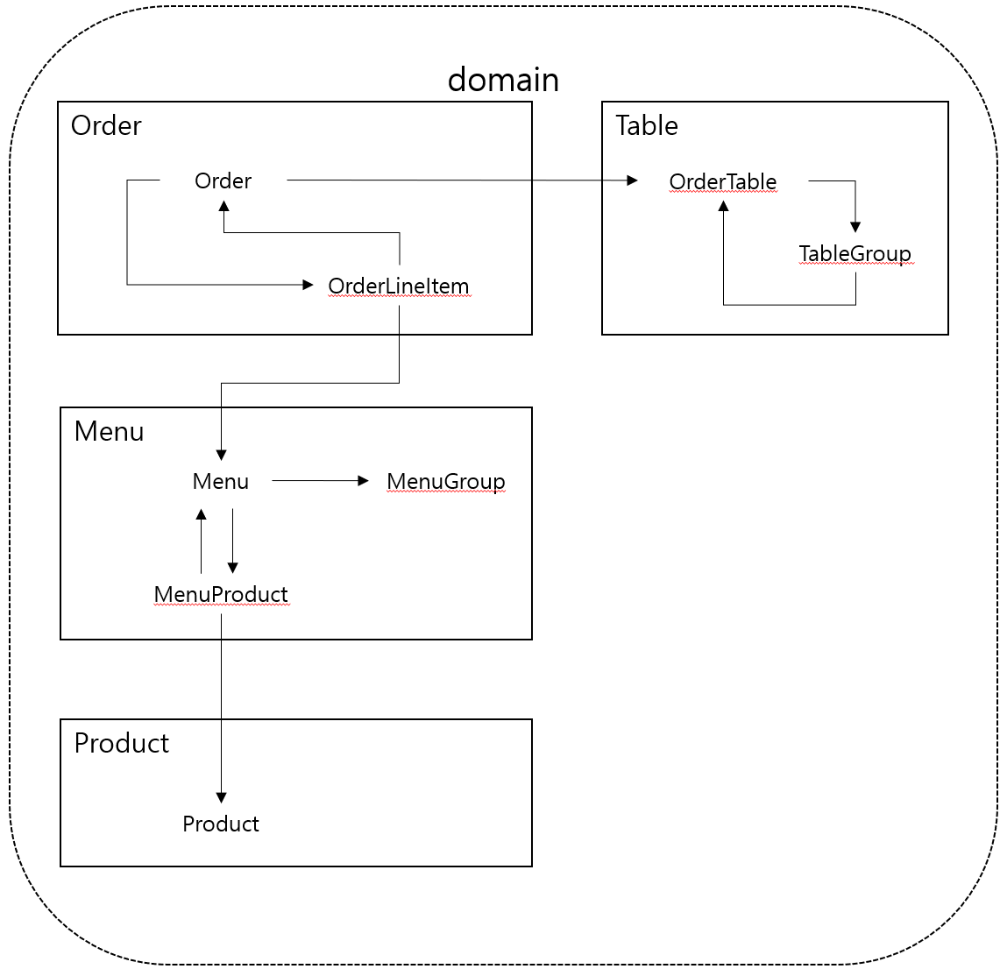
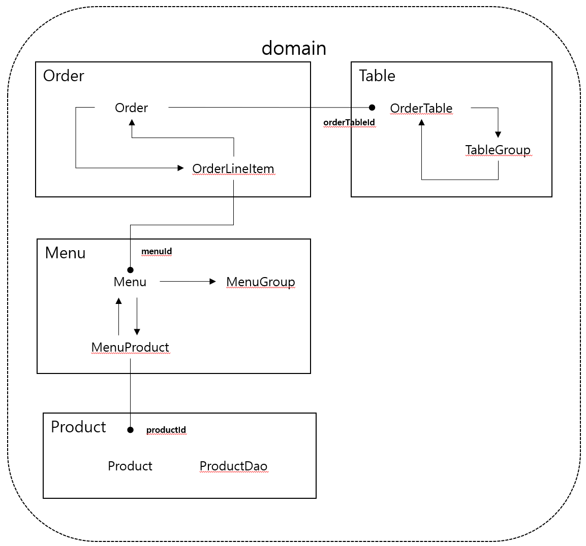

# 키친포스

## 요구 사항

- [x] README.md 작성
- [x] 테스트 코드 작성

기능 요구 사항

## 기능 요구사항

1. Menu

* Menu (항목)
  - [x] 메뉴를 생성한다.
    - 메뉴의 가격이 올바르지 않으면 등록할 수 없다.
      - 메뉴의 가격은 0원보다 커야 한다.
      - 메뉴의 가격은 메뉴 상품 금액의 합보다 작거나 같아야 한다.
      - 존재하는 상품이어야 한다.
    - 메뉴 그룹 정보가 올바르지 않으면 등록할 수 없다.
      - 존재하는 메뉴 그룹이어야 한다.
    - 메뉴를 생성한다.
    - 메뉴 상품을 생성한다.
  - [x] 메뉴의 목록을 조회한다.

* Menu Group
  - [x] 메뉴 그룹을 생성한다.
  - [x] 메뉴 그룹의 목록을 조회한다.

2. Order

- [x] 주문을 생성한다.
  - 정보가 올바르지 않으면 등록할 수 없다.
    - 주문 항목이 있어야 한다.
    - 주문 항목은 존재하는 메뉴이어야 한다.
    - 존재하는 주문 테이블이어야 한다.
    - 주문 테이블이 비어있으면 안 된다.
  - 주문을 생성한다.
    - `주문 테이블 정보`를 지정한다.
    - 주문 상태를 `요리중`으로 지정한다.
    - 주문 시간을 `현재 시간`으로 지정한다.
  - 주문 항목을 생성한다.
- [x] 주문의 목록을 조회한다.
- [x] 주문 상태를 변경한다.
  - 정보가 올바르지 않으면 상태를 변경할 수 없다.
    - 존재하는 주문이어야 한다.
    - 주문의 상태가 `주문 완료` 상태면 안 된다.

3. Product

- [x] 상품을 생성한다.
  - 상품의 가격이 올바르지 않으면 등록할 수 없다.
    - 상품의 가격은 0원보다 커야 한다.
- [x] 상품의 목록을 조회한다.

4. Table

* Table
  - [x] 주문 테이블을 생성한다.
  - [x] 주문 테이블의 목록을 조회한다.
  - [x] 특정 주문 테이블의 빈 테이블 상태를 변경한다.
    - 정보가 올바르지 않으면 변경할 수 없다.
      - 존재하는 주문 정보여야 한다.
      - 테이블 그룹 정보가 있어야 한다.
      - 주문의 상태가 `요리중`이거나 `식사`면 안 된다.
  - [x] 특정 주문 테이블의 방문 손님 수를 변경한다.
    - 정보가 올바르지 않으면 변경할 수 없다.
      - 방문한 손님 수가 0 이상이어야 한다.
      - 존재하는 주문 테이블이어야 한다.
      - 빈 주문 테이블이면 안 된다.

* Table Group(단체 지정)
  - [x] 테이블 그룹을 생성한다.
    - 정보가 올바르지 않으면 생성할 수 없다.
      - 주문 테이블의 수가 2개 이상이어야 한다.
      - 존재하는 주문 테이블이여야 한다.
      - 주문 테이블이 비어있지 않거나 이미 테이블 그룹이 지정되어 있으면 안 된다.
  - [x] 주문 테이블의 단체 지정을 해제한다.
    - 정보가 올바르지 않으면 해제할 수 없다.
      - 주문의 상태가 `요리중`이거나 `식사`면 안 된다.

(도메인) 다이어그램

* 변경 전 다이어그램

* 변경 후 다이어그램

## 용어 사전

| 한글명 | 영문명 | 설명 |
| --- | --- | --- |
| 상품 | product | 메뉴를 관리하는 기준이 되는 데이터 |
| 메뉴 그룹 | menu group | 메뉴 묶음, 분류 |
| 메뉴 | menu | 메뉴 그룹에 속하는 실제 주문 가능 단위 |
| 메뉴 상품 | menu product | 메뉴에 속하는 수량이 있는 상품 |
| 금액 | amount | 가격 * 수량 |
| 주문 테이블 | order table | 매장에서 주문이 발생하는 영역 |
| 빈 테이블 | empty table | 주문을 등록할 수 없는 주문 테이블 |
| 주문 | order | 매장에서 발생하는 주문 |
| 주문 상태 | order status | 주문은 조리 ➜ 식사 ➜ 계산 완료 순서로 진행된다. |
| 방문한 손님 수 | number of guests | 필수 사항은 아니며 주문은 0명으로 등록할 수 있다. |
| 단체 지정 | table group | 통합 계산을 위해 개별 주문 테이블을 그룹화하는 기능 |
| 주문 항목 | order line item | 주문에 속하는 수량이 있는 메뉴 |
| 매장 식사 | eat in | 포장하지 않고 매장에서 식사하는 것 |
