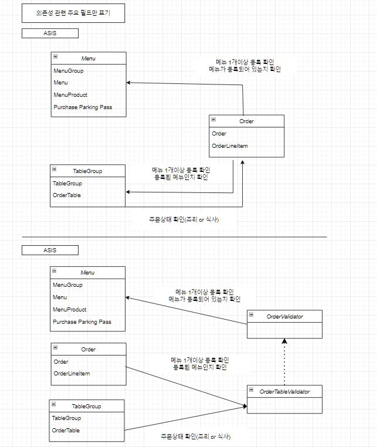

# 키친포스

## 요구 사항

## 용어 사전

| 한글명 | 영문명 | 설명 |
| --- | --- | --- |
| 상품 | product | 메뉴를 관리하는 기준이 되는 데이터 |
| 메뉴 그룹 | menu group | 메뉴 묶음, 분류 |
| 메뉴 | menu | 메뉴 그룹에 속하는 실제 주문 가능 단위 |
| 메뉴 상품 | menu product | 메뉴에 속하는 수량이 있는 상품 |
| 금액 | amount | 가격 * 수량 |
| 주문 테이블 | order table | 매장에서 주문이 발생하는 영역 |
| 빈 테이블 | empty table | 주문을 등록할 수 없는 주문 테이블 |
| 주문 | order | 매장에서 발생하는 주문 |
| 주문 상태 | order status | 주문은 조리 ➜ 식사 ➜ 계산 완료 순서로 진행된다. |
| 방문한 손님 수 | number of guests | 필수 사항은 아니며 주문은 0명으로 등록할 수 있다. |
| 단체 지정 | table group | 통합 계산을 위해 개별 주문 테이블을 그룹화하는 기능 |
| 주문 항목 | order line item | 주문에 속하는 수량이 있는 메뉴 |
| 매장 식사 | eat in | 포장하지 않고 매장에서 식사하는 것 |

## Step1 테스트를 통한 코드 보호
### API 요구사항 정리

---
#### 상품(Product)
- `상품`을 `등록`할 수 있다.
    - 상품 등록을 위해선 아래의 정보를 필수로 입력해야 한다.
        - `상품`은 `상품명`을 갖는다.
        - `상품`은 `0원 이상의 가격`을 갖고 있다.
- `상품` 목록을 `조회`하는 기능이 있다.
---
#### 메뉴(Menu)
- `메뉴`를 `등록`할 수 있다.
    - 메뉴 등록을 위해선 아래의 정보를 필수로 입력해야 한다.
        - `메뉴`는 `메뉴명`과 `0원 이상의 가격`이 있다.
        - `메뉴의 가격`은 메뉴에 속한 `상품들의 총(상품가격 * 갯수) 금액`보다 클 수 없다.
        - `메뉴`는 하나의 `메뉴그룹`에 속한다.
        - `메뉴`에는 여러 종류의 `메뉴상품`이 있다.
          - `메뉴상품`은 `수량정보`가 있다.
- `메뉴` 목록을 `조회`하는 기능이 있다.
---
#### 메뉴그룹(Menu groups)
- `메뉴그룹`을 `등록`할 수 있다.
    - 메뉴그룹 등록을 위해선 아래의 정보를 필수로 입력해야 한다.
        - `메뉴그룹`은 `메뉴그룹명`을 갖는다.
- `메뉴그룹` 목록을 `조회`하는 기능이 있다.
---
#### 주문(Order)
- `주문`을 `등록`할 수 있다.
    - 주문을 등록하기 위해선 아래의 정보를 필수로 입력해야 한다.
        - `주문`이 속할 `주문 테이블`이 등록되어있어야한다.
        - `주문`정보에는 `주문테이블`정보와 여러개의 `주문항목`이 있을 수 있다.
            - `주문항목`에는 `메뉴`정보와 `메뉴주문수량`이 있다.
- `주문` 목록을 `조회`하는 기능이 있다.
- 특정 `주문`에 대한 주문 상태를 `수정`하는 기능이 있다.
    - 주문 상태는 조리 -> 식사 -> 계산완료로 이루어진다.
---
#### 테이블(Table)
- `테이블`을 `등록`할 수 있다.
    - 테이블 등록을 위해선 아래의 정보를 입력해야 한다.
        - 0이상의 방문한 손님의 수를 입력하며, 필수는 아니다.
        - 빈테이블 여부 정보가 있다.
- `테이블` 목록을 `조회`하는 기능이 있다.
- 특정 `테이블`의 빈테이블 여부를 `수정`하는 기능이 있다.
- `테이블`의 `방문한 손님 수`를 변경 할 수 있다.
    - `테이블`의 `방문한 손님 수`는 0명 이상이어야 변경할 수 있다.
    - `테이블`이 `빈 테이블`이 아니어야, 손님 수 를 변경할 수 있다.
---
#### 단체지정(Table-groups)
- 개별주문 `테이블`을 `그룹화`하여 `등록`할 수 있다.
    -  2개 이상의 주문테이블 정보가 필요하다.
- 그룹화한 개별주문 `테이블`을 `삭제`할 수 있다.
---
## Step2 서비스 리팩터링
### 요구사항
- [X] 단위 테스트 가능한 코드를 분리해 단위 테스트 구현
- [X] 서비스 리팩터링
- [X] Flyway 적용
### 요구사항  설명
- 테스트하기 쉬운 부분과 어려운 부분을 분리 
    - 도메인에 비즈니스 로직을 최대한 옮기기
- 한 번에 완벽한 설계를 하겠다는 욕심을 버리기
    - 반복적인 설계와 구현을 통해 도메인에 대한 이해도를 높임
    - 도메인에 대한 이해도가 높아야 추상화 수준이 높아짐
- 모델에 setter 메서드 넣지 않기
    - 도메인 객체가 불완전한 상태로 사용되는 것을 막기 위해 생성시점에 필요한 것을 전달
    - setter 명명 보다는 message 형태의 메서드명을 사용
~~~
changeShippingInfo() vs setShippingInfo()
completePayment() vs setOrderState()
~~~
### 회고

- 레거시 리팩토링을 위한 테스트코드를 작성하기 위한 기초 작업 및 전략은 많은 고민을 할수록 좋음
- 이번 미션에서 느낀점은 초기 테스트코드를  도메인 단위별로 갈지, 레이어별로 갈지, 전체 api 별 테스트로 가져갈지 고민이 필요
- 무작정하다보니, commit 도 꼬이고, 체계적이지 못하다라는 생각이 듦 
- 고로 테스트코드에 대한 연습 및 리팩토링에 대한 학습 필요 !

## Step3 의존성 리팩터링
### 요구사항
~~~
이전 단계에서 객체 지향 설계를 의식하였다면 아래의 문제가 존재한다. 의존성 관점에서 설계를 검토해 본다.
~~~
- 메뉴의 이름과 가격이 변경되면 주문 항목도 함께 변경된다.  
    `->` 메뉴 정보가 변경되더라도 주문 항목이 변경되지 않게 구현한다.

- 클래스 간의 방향도 중요하고 패키지 간의 방향도 중요하다.   
    `->` 클래스 사이, 패키지 사이의 의존 관계는 단방향이 되도록 해야 한다.
### 요구사항 설명
- 함께 생성되고 함께 삭제되는 객체들을 함께 묶어라
- 도메인 제약사항을 공유하는 객체들을 함께 묶어라
- 불변식을 지켜야하는 객체들을 함께 묶어라
- 가능하면 분리하라
- 연관관계 구현
    - 직접 참조 (객체 참조를 이용한 연관 관계)
    - 간접 참조 (리포지토리를 통한 탐색)
- 느슨한 결합과 강한 결합
    - 외부 서비스가 정상이 아닐 경우 트랜잭션 처리를 어떻게 해야할지 애매함
    - 외부 서비스 성능에 직접적인 영향을 받는 문제가 있음
    - 도메인 객체에 서비스를 전달하면 추가로 설계상 문제가 나타날 수 있음
    - 도메인 객체에 서비스를 전달할 때 또 다른 문제는 기능을 추가할 때 발생함
    - 비동기 이벤트를 사용하면 두 시스템 간의 결합을 크게 낮출 수 있음
### 패키지 의존성 사이클을 제거하는 3가지 방법
- 새로운 객체로 변환
- 의존성 역전
- 새로운 패키지 추가

### 의존성 점검 및 개선
- `/src/main/resources/static/dependency_diagram.JPG` 이미지 파일에 첨부하였습니다.
  
- 참고 자료로 포함되어 있는 조영호님의 우아한 객체지향 강의 학습하고,   
  `절차지향적 Validation Logic`과 `인터페이스를 이용한 의존성 역전`을 적용해 보았습니다.
### Step3 회고
- 의존성 개선이 미션의 주요 목표였음에도 모호하게 구현
- 아직 `의존성 개선`, `의존성 역전`이라는 말은 많이 들었으나, 실제 구현에는 생경함
- 프로그램 구현하면서 중간 중간 설계한 그림과 대조해볼 필요가 있음 

## Step4 멀티 모듈 적용
### 요구사항 정리

---
- Gradle의 멀티 모듈 개념을 적용해 자유롭게 서로 다른 프로젝트로 분리해 본다.
    - 컨텍스트 간의 독립된 모듈로 만들 수 있다.
    - 계층 간의 독립된 모듈로 만들 수 있다. 
- 의존성 주입, HTTP 요청/응답, 이벤트 발행/구독 등 다양한 방식으로 모듈 간 데이터를 주고받을 수 있다.
--- 
### 모듈 분리 계획
- 공통영역
- web(application) 영역
- api(data 조회) 영역
    - order 영역
    - menu 영역
---
