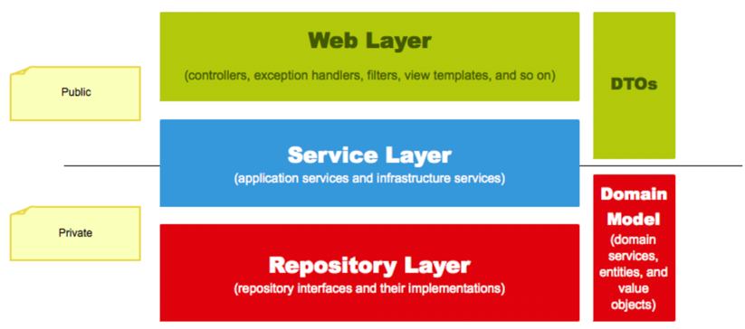

## 요구 사항

#### Product(상품)
- 상품은 `상품명`과 `가격`으로 구성된다.
- 상품을 생성할 수 있다.
  - 상품의 가격은 0원 이상이어야 한다.
- 상품의 목록을 조회할 수 있다.

#### MenuGroup(메뉴 그룹)
- 메뉴 그룹은 `메뉴그룹명`으로 구성된다.
- 메뉴 그룹을 생성할 수 있다.
- 메뉴 그룹의 목록을 조회할 수 있다.

#### Menu(메뉴)
- 메뉴 그룹은 `메뉴명`, `가격`, `메뉴그룹`, `상품목록`으로 구성된다.  
- 메뉴를 생성할 수 있다.
  - 메뉴의 가격은 0원 이상이어야 한다.
  - 메뉴의 가격은 메뉴 구성 상품들의 총 가격보다 작거나 같다.
  - 메뉴의 메뉴 그룹이 존재하지 않으면 메뉴를 생성할 수 없다.
  - 메뉴 상품의 상품이 등록되어 있지 않으면 메뉴를 생성할 수 없다.
- 메뉴의 목록을 조회할 수 있다.

### OrderLineItem(주문항목)
- 주문 항목은 `주문`, `주문 메뉴`, `주문 메뉴 수량`으로 구성된다.

#### OrderTable(주문 테이블)
- 주문 테이블은 `단체 주문 테이블`, `손님의 수`, `빈 테이블 여부` 로 구성된다.
- 주문 테이블을 생성할 수 있다.
- 주문 테이블의 목록을 조회할 수 있다.
- 주문 테이블의 빈 상태를 변경할 수 있다.
    - 등록된 주문 테이블이 없으면 주문 테이블의 빈 상태를 변경할 수 없다.
    - 주문 테이블이 단체로 지정이 되어있으면 빈 테이블로 상태 변경할 수 없다.
    - 주문 테이블의 주문 상태가 `조리` 또는 `식사증`이면 주문 테이블의 빈 상태를 변경할 수 없다.
- 주문 테이블의 방문한 손님 수를 변경할 수 있다.
    - 손님의 수는 최소 0 이상이다.
    - 변경할 주문 테이블이 존재해야 한다.
    - 주문 테이블이 빈 테이블이면 손님 수를 변경할 수 없다.

#### TableGroup(단체 지정)
- 단체는 `단체지정 시각`, `주문 테이블 목록`으로 구성된다.
- 단체 지정을 할 수 있다.
  - 단체로 지정할 주문 테이블은 2개 이상이어야 한다.
  - 단체로 지정할 주문 테이블이 등록된 주문 테이블이 아니면 단체로 지정할 수 없다.
  - 단체로 지정할 주문 테이블 중 빈 테이블이 존재하거나 이미 단체로 지정이되어 있다면 단제로 지정할 수 없다.
- 단체 지정을 취소할 수 있다.
    - 단체 지정된 주문 테이블들의 상태가 조리 또는 식사이면 단체 지정을 취소할 수 없다.

#### Order(주문)
- 주문은 `주문한 테이블`, `주문상태`, `주문시각`, `주문 항목 목록`로 구성된다.
- 주문을 생성 할 수 있다.
    - 주문 항목은 필수값이다.
    - 즈믄 메뉴 하나당 주문 항목이 한개씩 존재해야 한다.
    - 주문 테이블이 등록되어 있지 않다면 주문을 생성할 수 없다.
    - 주문 테이블이 빈 테이블이면 주문을 생성할 수 없다.
- 주문의 목록을 조회할 수 있다.
- 주문의 상태를 변경할 수 있다.
  - 주문 상태가 완료되었거나 주문이 없으면 주문 상태를 변경할 수 없다.

## 용어 사전
| 한글명 | 영문명 | 설명 |
| --- | --- | --- |
| 상품 | product | 메뉴를 관리하는 기준이 되는 데이터 |
| 메뉴 그룹 | menu group | 메뉴 묶음, 분류 |
| 메뉴 | menu | 메뉴 그룹에 속하는 실제 주문 가능 단위 |
| 메뉴 상품 | menu product | 메뉴에 속하는 수량이 있는 상품 |
| 금액 | amount | 가격 * 수량 |
| 주문 테이블 | order table | 매장에서 주문이 발생하는 영역 |
| 빈 테이블 | empty table | 주문을 등록할 수 없는 주문 테이블 |
| 주문 | order | 매장에서 발생하는 주문 |
| 주문 상태 | order status | 주문은 조리 ➜ 식사 ➜ 계산 완료 순서로 진행된다. |
| 방문한 손님 수 | number of guests | 필수 사항은 아니며 주문은 0명으로 등록할 수 있다. |
| 단체 지정 | table group | 통합 계산을 위해 개별 주문 테이블을 그룹화하는 기능 |
| 주문 항목 | order line item | 주문에 속하는 수량이 있는 메뉴 |
| 매장 식사 | eat in | 포장하지 않고 매장에서 식사하는 것 |


---

🚀 1단계 - 테스트를 통한 코드 보호
<details>
<summary> </summary>

#### 요구사항1
- kitchenpos 패키지의 코드를 보고 키친포스의 요구 사항을 README.md에 작성한다. 미션을 진행함에 있어 아래 문서를 적극 활용한다.
- https://dooray.com/htmls/guides/markdown_ko_KR.html

#### 요구사항2
- 정리한 키친포스의 요구 사항을 토대로 테스트 코드를 작성한다.   
- 모든 Business Object에 대한 테스트 코드를 작성한다. `@SpringBootTest`를 이용한 통합 테스트 코드 또는 `@ExtendWith(MockitoExtension.class)`를 이용한 단위 테스트 코드를 작성한다.
- https://www.baeldung.com/spring-boot-testing
- https://www.baeldung.com/spring-boot-testresttemplate

#### 프로그래밍 요구 사항
Lombok은 그 강력한 기능만큼 사용상 주의를 요한다.
  * 무분별한 setter 메서드 사용
  * 객체 간에 상호 참조하는 경우 무한 루프에 빠질 가능성
  * Lombok 사용상 주의점(Pitfall)   

이번 과정에서는 Lombok 없이 미션을 진행해 본다.

#### 힌트
`http` 디렉터리의 `.http` 파일(HTTP client)을 보고 어떤 요청을 받는지 참고한다.
  * https://jojoldu.tistory.com/266

```
###
POST {{host}}/api/menu-groups
Content-Type: application/json

{
  "name": "추천메뉴"
}

###
GET {{host}}/api/menus-groups

###
```

- `src/main/resources/db/migration` 디렉터리의 `.sql` 파일을 보고 어떤 관계로 이루어져 있는지 참고한다.
```
id BIGINT(20) NOT NULL AUTO_INCREMENT,
order_table_id BIGINT(20) NOT NULL,
order_status VARCHAR(255) NOT NULL,
ordered_time DATETIME NOT NULL,
PRIMARY KEY (id)
```

```
### 상품

* 상품을 등록할 수 있다.
* 상품의 가격이 올바르지 않으면 등록할 수 없다.
    * 상품의 가격은 0 원 이상이어야 한다.
* 상품의 목록을 조회할 수 있다.
```

**Business Object Test**
```
@ExtendWith(MockitoExtension.class)
public class BoTest {
    @Mock
    private Dao dao;

    @InjectMocks
    private Bo bo;

    @Test
    public void test() {
        given(dao.findById(anyLong()))
                .willReturn(new Object());
    }
}
```

**Controller Test**
```
@WebMvcTest
public class ControllerTest {
    @Autowired
    private MockMvc mockMvc;
    
    @Test
    public void test() {
        webMvc.perform(get("/"))
                .andDo(print())
                .andExpect(status().isOk())
        ;
    }
}
```
</details>


🚀 2단계 - 서비스 리팩터링
<details>
<summary> </summary>

### 요구 사항
단위 테스트하기 어려운 코드와 단위 테스트 가능한 코드를 분리해 단위 테스트 가능한 코드에 대해 단위 테스트를 구현한다.

* Spring Data JPA 사용 시 `spring.jpa.hibernate.ddl-auto=validate` 옵션을 필수로 준다.
* 데이터베이스 스키마 변경 및 마이그레이션이 필요하다면 아래 문서를 적극 활용한다.
* https://meetup.toast.com/posts/173


### 프로그래밍 요구 사항
Lombok은 그 강력한 기능만큼 사용상 주의를 요한다.

* 무분별한 setter 메서드 사용
* 객체 간에 상호 참조하는 경우 무한 루프에 빠질 가능성
* Lombok 사용상 주의점(Pitfall) : https://kwonnam.pe.kr/wiki/java/lombok/pitfall   
이번 과정에서는 Lombok 없이 미션을 진행해 본다.

* 자바 코드 컨벤션을 지키면서 프로그래밍한다.
  * 기본적으로 Google Java Style Guide을 원칙으로 한다.
  * 단, 들여쓰기는 '2 spaces'가 아닌 '4 spaces'로 한다.
* indent(인덴트, 들여쓰기) depth를 2를 넘지 않도록 구현한다. 1까지만 허용한다.
  * 예를 들어 while문 안에 if문이 있으면 들여쓰기는 2이다.
  * 힌트: indent(인덴트, 들여쓰기) depth를 줄이는 좋은 방법은 함수(또는 메서드)를 분리하면 된다.
* 3항 연산자를 쓰지 않는다.
* else 예약어를 쓰지 않는다.
  * else 예약어를 쓰지 말라고 하니 switch/case로 구현하는 경우가 있는데 switch/case도 허용하지 않는다.
  * 힌트: if문에서 값을 반환하는 방식으로 구현하면 else 예약어를 사용하지 않아도 된다.
* 모든 기능을 TDD로 구현해 단위 테스트가 존재해야 한다. 단, UI(System.out, System.in) 로직은 제외
  * 핵심 로직을 구현하는 코드와 UI를 담당하는 로직을 구분한다.
  * UI 로직을 InputView, ResultView와 같은 클래스를 추가해 분리한다.
* 함수(또는 메서드)의 길이가 10라인을 넘어가지 않도록 구현한다.
  * 함수(또는 메소드)가 한 가지 일만 하도록 최대한 작게 만들어라.
* 배열 대신 컬렉션을 사용한다.
* 모든 원시 값과 문자열을 포장한다
* 줄여 쓰지 않는다(축약 금지).
* 일급 컬렉션을 쓴다.
* 모든 엔티티를 작게 유지한다.
* 3개 이상의 인스턴스 변수를 가진 클래스를 쓰지 않는다.

### 비즈니스 로직은 어느 곳에 구현하는 것이 좋을까?
다음과 같은 계층형 아키텍처 기반 하에서 핵심 비즈니스 로직은 어디에 구현하는 것이 맞을까?

응용 애플리케이션을 개발할 때 TDD, OOP를 적용하려면 핵심 비즈니스 로직을 도메인 객체가 담당하도록 구현하는 것이다.   
즉, 테스트하기 쉬운 부분과 테스트하기 어려운 부분을 분리해 테스트하기 쉬운 부분에 대한 단위 테스트를 구현하고 지속적인 리팩터링을 한다.   

### 힌트
**테스트하기 쉬운 부분과 어려운 부분을 분리**
모델에 비즈니스 로직을 최대한 모으면 순수히 해당 언어의 클래스 문법으로만 작성되고, 그 어떤 프레임워크나 외부 종속 없이도 테스트 가능한 객체가 된다.    
이런 객체는 테스트하기 매우 용이해서 더 많은 테스트 코드를 작성하게 하는 순기능이 있다.

**한 번에 완벽한 설계를 하겠다는 욕심을 버려라.**
초기에는 도메인에 대한 이해도가 낮아 설계 품질이 낮다.    
반복적인 설계와 구현을 통해 도메인에 대한 이해도를 높인다. 도메인에 대한 이해도가 높아야 추상화 수준도 높아진다.   

**모델에 setter 메서드 넣지 않기**
모델에 getter, setter 메서드를 무조건 추가하는 것은 좋지 않은 버릇이다.   
특히 setter 메서드는 도메인의 핵심 개념이나 의도를 코드에서 사라지게 한다.   
setter 메서드의 또 다른 문제는 도메인 객체를 생성할 때 완전한 상태가 아닐 수도 있다는 것이다.   
도메인 객체가 불완전한 상태로 사용되는 것을 막으려면 생성 시점에 필요한 것을 전달해 주어야 한다.
```
changeShippingInfo() vs setShippingInfo()
completePayment() vs setOrderState()
```

</details>
