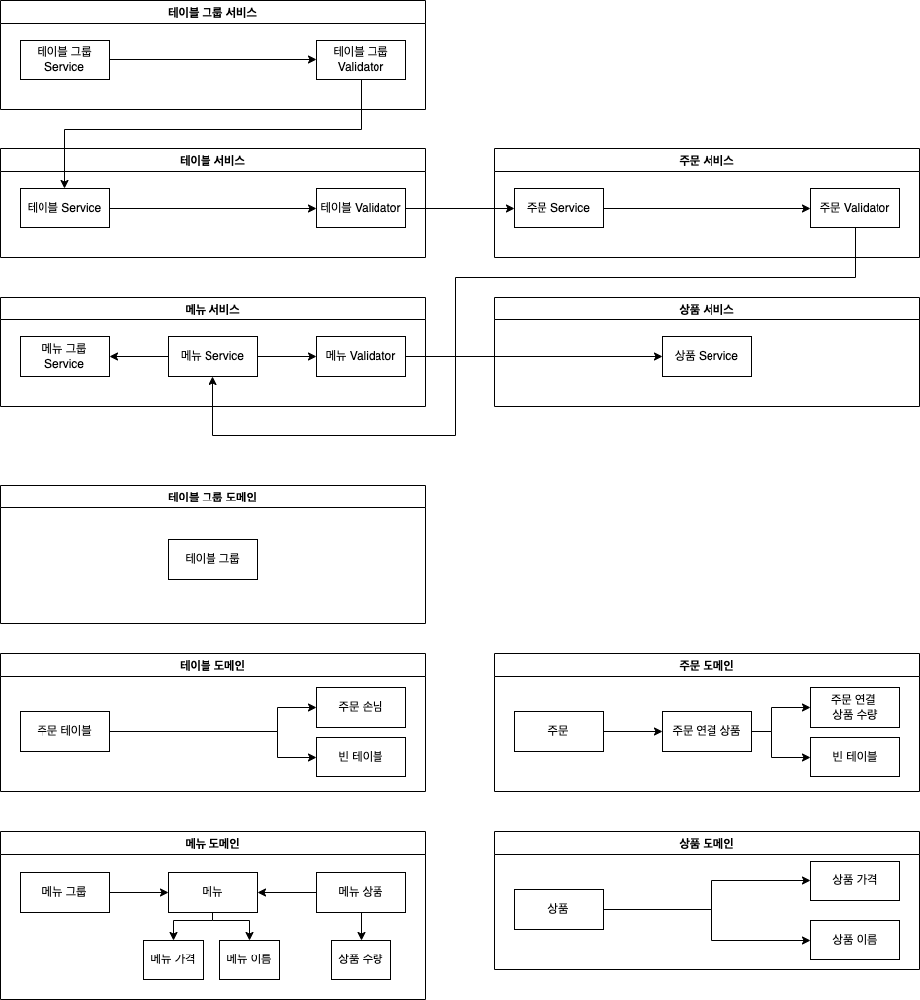

# 키친포스

## 요구 사항

## 용어 사전

| 한글명 | 영문명 | 설명 |
| --- | --- | --- |
| 상품 | product | 메뉴를 관리하는 기준이 되는 데이터 |
| 메뉴 그룹 | menu group | 메뉴 묶음, 분류 |
| 메뉴 | menu | 메뉴 그룹에 속하는 실제 주문 가능 단위 |
| 메뉴 상품 | menu product | 메뉴에 속하는 수량이 있는 상품 |
| 금액 | amount | 가격 * 수량 |
| 주문 테이블 | order table | 매장에서 주문이 발생하는 영역 |
| 빈 테이블 | empty table | 주문을 등록할 수 없는 주문 테이블 |
| 주문 | order | 매장에서 발생하는 주문 |
| 주문 상태 | order status | 주문은 조리 ➜ 식사 ➜ 계산 완료 순서로 진행된다. |
| 방문한 손님 수 | number of guests | 필수 사항은 아니며 주문은 0명으로 등록할 수 있다. |
| 단체 지정 | table group | 통합 계산을 위해 개별 주문 테이블을 그룹화하는 기능 |
| 주문 항목 | order line item | 주문에 속하는 수량이 있는 메뉴 |
| 매장 식사 | eat in | 포장하지 않고 매장에서 식사하는 것 |

## 기능 정리
### 1단계 : 테스트를 통한 코드 보호
#### 요구 사항 1
- kitchenpos 패키지의 코드를 보고 키친포스의 요구 사항을 README.md에 작성한다. 미션을 진행함에 있어 아래 문서를 적극 활용한다.
- 마크다운(Markdown) - Dooray!

#### 요구 사항 2
- 정리한 키친포스의 요구 사항을 토대로 테스트 코드를 작성한다.
- 모든 Business Object에 대한 테스트 코드를 작성한다.
- @SpringBootTest를 이용한 통합 테스트 코드 또는 @ExtendWith(MockitoExtension.class)를 이용한 단위 테스트 코드를 작성한다.
- 인수 테스트 코드 작성은 권장하지만 필수는 아니다. 미션을 진행함에 있어 아래 문서를 적극 활용한다.
    - Testing in Spring Boot - Baeldung
    - Exploring the Spring Boot TestRestTemplate

#### 프로그래밍 요구 사항
- Lombok은 그 강력한 기능만큼 사용상 주의를 요한다.
- 무분별한 setter 메서드 사용
    - 객체 간에 상호 참조하는 경우 무한 루프에 빠질 가능성
- Lombok 사용상 주의점(Pitfall)
    - 이번 과정에서는 Lombok 없이 미션을 진행해 본다.

#### 진행 사항 정리
- [X] `kitchenpos` 요구사항 작성
 ```
 ### 메뉴
 
* 메뉴를 등록할 수 있다.
  * 중복 메뉴는 등록할 수 없다. 
  * 하나의 메뉴의 여러개의 메뉴 상품이 등록될 수 있다.
  * 메뉴의 가격이 올바르지 않으면 등록할 수 없다.
    * 메뉴의 가격은 0 원 이상이어야 한다.
  * 메뉴의 가격은 메뉴 상품들의 합한 가격보다 작아야 한다.
* 메뉴의 속한 상품들을 등록할 수 있다.
  * 등록된 상품들을 조회하여 메뉴 상품으로 등록한다.
* 전체 메뉴의 목록을 조회할 수 있다.
  * 메뉴의 속한 전체 상품들을 조회할 수 있다.

 ### 메뉴그룹

* 메뉴그룹을 등록할 수 있다.
* 메뉴그룹 목록을 조회할 수 있다.

 ### 주문

* 주문을 등록할 수 있다.
  * 주문 항목이 없으면 등록할 수 없다.
  * 주문은 처음 등록 시 `COOKING` 상태로 등록된다.
  * 주문 항목은 메뉴의 등록되어 있어야 주문으로 등록할 수 있다.
  * 주문은 주문 테이블의 등록되어 있어야 주문으로 등록할 수 있다.
  * 여러개의 주문 항목은 하나의 주문의 속할 수 있다.
* 전체 주문의 목록을 조회할 수 있다.
  * 주문의 속한 주문 항목 목록에 대해서 조회할 수 있다.
* 주문의 상태가 변경될 수 있다.
  * 주문 상태가 `완료`인 경우 변경 불가능하다.
  * 변경 완료 시 주문의 속한 주문 항목도 같이 보여준다.

 ### 상품
* 상품의 가격이 올바르지 않으면 등록할 수 없다.
  * 상품의 가격은 0 원 이상이어야 한다.
* 전체 상품의 목록을 조회할 수 있다.

 ### 주문 테이블
* 주문 테이블을 등록할 수 있다.
  * 주문 테이블 처음 등록 시 단체 지정은 할 수 없다.
* 전체 주문 테이블의 목록을 조회할 수 있다.
* 주문을 등록할 수 없는 주문 테이블로 변경할 수 있다.
  * 빈 테이블로 변경하려는 주문테이블의 등록된 주문만 가능하다.
  * 주문의 상태가 `COOKING` 또는 `MEAL` 상태이면 불가능하다.
* 주문 테이블의 손님수를 변경할 수 있다.
  * 변경하려는 손님수는 1명 이상이어야 한다.
  * 주문 테이블의 등록되어 있어야 한다.
  
 ### 단체 지정
* 주문 테이블 그룹을 등록할 수 있다.
  * 등록되지 않은 주문 테이블이 있다면 단체 지정으로 등록할 수 없다.
  * 주문 테이블이 하나인 경우 단체 지정으로 등록할 수 없다.
  * 등록되지 않은 주문이 있다면 단제 지정으로 등록할 수 없다.
  * 이미 단체 지정으로 등록된 주문 테이블을 등록할 수 없다.
* 주문테이블그룹을 해지할 수 있다.
  * 해지하려고 하는 단체 지정의 등록된 주문만 가능하다.
  * 주문의 상태가 `COOKING` 또는 `MEAL` 상태이면 해지할 수 없다.
 ```
- 진행 내용
  - 서비스 단위 테스트 작성
    - [X] 메뉴
    - [X] 메뉴 그룹
    - [X] 주문
    - [X] 상품
    - [X] 주문 테이블
    - [X] 단체 지정
  - Controller 단위 테스트 작성
    - [X] 메뉴
    - [X] 메뉴 그룹
    - [X] 주문
    - [X] 상품
    - [X] 주문 테이블
    - [X] 단체 지정
  - 그외 
    - [X] 도메인 정적 메소드 생성
    - [X] 컨벤션 수정
    - [X] 커스텀 익센셥 생성

### 2단계 : 서비스 리팩터링
#### 요구 사항
단위 테스트하기 어려운 코드와 단위 테스트 가능한 코드를 분리해 단위 테스트 가능한 코드에 대해 단위 테스트를 구현한다. 
- Spring Data JPA 사용 시 spring.jpa.hibernate.ddl-auto=validate 옵션을 필수로 준다.
- 데이터베이스 스키마 변경 및 마이그레이션이 필요하다면 아래 문서를 적극 활용한다. 
  - DB도 형상관리를 해보자!

#### 프로그래밍 요구 사항
Lombok은 그 강력한 기능만큼 사용상 주의를 요한다. 
- 무분별한 setter 메서드 사용
- 객체 간에 상호 참조하는 경우 무한 루프에 빠질 가능성
- Lombok 사용상 주의점(Pitfall)
이번 과정에서는 Lombok 없이 미션을 진행해 본다.

- 자바 코드 컨벤션을 지키면서 프로그래밍한다. 
  - 기본적으로 Google Java Style Guide을 원칙으로 한다.
  - 단, 들여쓰기는 '2 spaces'가 아닌 '4 spaces'로 한다.
- indent(인덴트, 들여쓰기) depth를 2를 넘지 않도록 구현한다. 1까지만 허용한다. 
  - 예를 들어 while문 안에 if문이 있으면 들여쓰기는 2이다.
  - 힌트: indent(인덴트, 들여쓰기) depth를 줄이는 좋은 방법은 함수(또는 메서드)를 분리하면 된다.
- 3항 연산자를 쓰지 않는다. 
- else 예약어를 쓰지 않는다. 
  - else 예약어를 쓰지 말라고 하니 switch/case로 구현하는 경우가 있는데 switch/case도 허용하지 않는다.
  - 힌트: if문에서 값을 반환하는 방식으로 구현하면 else 예약어를 사용하지 않아도 된다.
- 모든 기능을 TDD로 구현해 단위 테스트가 존재해야 한다. 단, UI(System.out, System.in) 로직은 제외 
  - 핵심 로직을 구현하는 코드와 UI를 담당하는 로직을 구분한다. 
  - UI 로직을 InputView, ResultView와 같은 클래스를 추가해 분리한다.
- 함수(또는 메서드)의 길이가 10라인을 넘어가지 않도록 구현한다. 
  - 함수(또는 메소드)가 한 가지 일만 하도록 최대한 작게 만들어라.
- 배열 대신 컬렉션을 사용한다. 
- 모든 원시 값과 문자열을 포장한다 
- 줄여 쓰지 않는다(축약 금지). 
- 일급 컬렉션을 쓴다. 
- 모든 엔티티를 작게 유지한다. 
- 3개 이상의 인스턴스 변수를 가진 클래스를 쓰지 않는다.

#### 비즈니스 로직은 어느 곳에 구현하는 것이 좋을까?
다음과 같은 계층형 아키텍처 기반 하에서 핵심 비즈니스 로직은 어디에 구현하는 것이 맞을까?
응용 애플리케이션을 개발할 때 TDD, OOP를 적용하려면 핵심 비즈니스 로직을 도메인 객체가 담당하도록 구현하는 것이다.
즉, 테스트하기 쉬운 부분과 테스트하기 어려운 부분을 분리해 테스트하기 쉬운 부분에 대한 단위 테스트를 구현하고 지속적인 리팩터링을 한다.

#### 힌트
테스트하기 쉬운 부분과 어려운 부분을 분리
- 모델에 비즈니스 로직을 최대한 모으면 순수히 해당 언어의 클래스 문법으로만 작성되고, 그 어떤 프레임워크나 외부 종속 없이도 테스트 가능한 객체가 된다. 이런 객체는 테스트하기 매우 용이해서 더 많은 테스트 코드를 작성하게 하는 순기능이 있다.

한 번에 완벽한 설계를 하겠다는 욕심을 버려라.
- 초기에는 도메인에 대한 이해도가 낮아 설계 품질이 낮다. 반복적인 설계와 구현을 통해 도메인에 대한 이해도를 높인다. 도메인에 대한 이해도가 높아야 추상화 수준도 높아진다.

모델에 setter 메서드 넣지 않기
- 모델에 getter, setter 메서드를 무조건 추가하는 것은 좋지 않은 버릇이다. 특히 setter 메서드는 도메인의 핵심 개념이나 의도를 코드에서 사라지게 한다. setter 메서드의 또 다른 문제는 도메인 객체를 생성할 때 완전한 상태가 아닐 수도 있다는 것이다. 도메인 객체가 불완전한 상태로 사용되는 것을 막으려면 생성 시점에 필요한 것을 전달해 주어야 한다.

#### 진행 사항 정리
- 이전 피드백 진행
  - [X] 컨트롤러 또는 어드바이스에서 응답 상태 코드 결정
  - 예외와 HTTP 상태 코드 분리
    - 질문 요청
- 진행 내용
  - 서비스 리팩토링
    - [X] 메뉴 
      - 메뉴를 등록할 수 있다.
      - 중복 메뉴는 등록할 수 없다. 
      - 하나의 메뉴의 여러개의 메뉴 상품이 등록될 수 있다. 
      - 메뉴의 가격은 0 원 이상이어야 한다. 
      - 메뉴의 가격은 메뉴 상품들의 합한 가격보다 작아야 한다. 
      - 메뉴의 속한 상품들을 등록할 수 있다. 
      - 전체 메뉴의 목록을 조회할 수 있다. 
    - [X] 메뉴 그룹
      - 메뉴그룹을 등록할 수 있다. 
      - 메뉴그룹 목록을 조회할 수 있다.
    - [X] 주문
      - 주문 항목이 없으면 등록할 수 없다. 
      - 주문은 처음 등록 시 `COOKING` 상태로 등록된다. 
      - 주문 항목은 메뉴의 등록되어 있어야 주문으로 등록할 수 있다. 
      - 주문은 주문 테이블의 등록되어 있어야 주문으로 등록할 수 있다. 
      - 여러개의 주문 항목은 하나의 주문의 속할 수 있다. 
      - 주문의 속한 주문 항목 목록에 대해서 조회할 수 있다. 
      - 주문 상태가 `완료`인 경우 변경 불가능하다.
    - [X] 상품 
      - 상품의 가격은 0 원 이상이어야 한다. 
      - 전체 상품의 목록을 조회할 수 있다.
    - [X] 주문 테이블 
      - 주문 테이블을 등록할 수 있다.
      - 주문 테이블 처음 등록 시 단체 지정은 할 수 없다.
      - 전체 주문 테이블의 목록을 조회할 수 있다. 
      - 빈 테이블로 변경하려는 주문테이블의 등록된 주문만 가능하다. 
      - 주문의 상태가 `COOKING` 또는 `MEAL` 상태이면 불가능하다. 
      - 변경하려는 손님수는 1명 이상이어야 한다. 
      - 주문 테이블의 등록되어 있어야 한다.
    - [X] 단체 지정 
      - 등록되지 않은 주문 테이블이 있다면 단체 지정으로 등록할 수 없다. 
      - 주문 테이블이 하나인 경우 단체 지정으로 등록할 수 없다. 
      - 등록되지 않은 주문이 있다면 단제 지정으로 등록할 수 없다. 
      - 이미 단체 지정으로 등록된 주문 테이블을 등록할 수 없다.
      - 해지하려고 하는 단체 지정의 등록된 주문만 가능하다. 
      - 주문의 상태가 `COOKING` 또는 `MEAL` 상태이면 해지할 수 없다.
    - 각 도메인 JPA 변경
      - [X] 메뉴
      - [X] 메뉴 그룹
      - [X] 메뉴 상품
      - [X] 메뉴 상품들
      - [X] 주문
      - [X] 주문 상품
      - [X] 주문 상품들
      - [X] 주문 테이블
      - [X] 주문 테이블들
      - [X] 테이블 그룹
      - [X] 상품
      - [X] 이름
      - [X] 가격
      - [X] 손님
      - [X] 수량
      - [X] 빈테이블
    - 그외
      - [X] 도메인 정적 메소드 생성
      - [X] 컨벤션 수정
      - [X] 커스텀 익센셥 생성
    - [X] 요청 / 응답 객체 생성
    - [X] 각 도메인 객체 단위 테스트 작성
    - [X] 서비스 / 컨트롤러 테스트 리팩토링
- 피드백 반영
  - [X] 객체의 불변식 검증 -> 상태변화 시점으로 처리 변경
  - [X] 불필요한 쿼리복잡도 제거 -> 필터링으로 처리
  - [X] 전반적으로 메소드 안 역할의 따른 개행
  - [X] 픽스텨 테스트를 활요한 테스트 반영
  - [X] 불필요한 생성, set메소드 단위테스트 제거

### 3단계 요구사항 정리
#### 요구 사항
- 이전 단계에서 객체 지향 설계를 의식하였다면 아래의 문제가 존재한다. 의존성 관점에서 설계를 검토해 본다. 
  - 메뉴의 이름과 가격이 변경되면 주문 항목도 함께 변경된다. 메뉴 정보가 변경되더라도 주문 항목이 변경되지 않게 구현한다. 
  - 클래스 간의 방향도 중요하고 패키지 간의 방향도 중요하다. 클래스 사이, 패키지 사이의 의존 관계는 단방향이 되도록 해야 한다. 
  - 데이터베이스 스키마 변경 및 마이그레이션이 필요하다면 아래 문서를 적극 활용한다. 
    - DB도 형상관리를 해보자!

#### 프로그래밍 요구 사항
- Lombok은 그 강력한 기능만큼 사용상 주의를 요한다. 
  - 무분별한 setter 메서드 사용
  - 객체 간에 상호 참조하는 경우 무한 루프에 빠질 가능성
  - Lombok 사용상 주의점(Pitfall)
이번 과정에서는 Lombok 없이 미션을 진행해 본다.

#### 힌트
- 함께 생성되고 함께 삭제되는 객체들을 함께 묶어라 
- 불변식을 지켜야 하는 객체들을 함께 묶어라 
- 가능하면 분리하라

연관 관계는 다양하게 구현할 수 있다. 
- 직접 참조 (객체 참조를 이용한 연관 관계)
- 간접 참조 (리포지토리를 통한 탐색)

#### 도메인 이벤트
##### 느슨한 결합과 강한 결합 
- 외부 서비스가 정상이 아닐 경우 트랜잭션 처리를 어떻게 해야 할지 애매
- 외부 서비스 성능에 직접적인 영향을 받는 문제가 있다.
- 도메인 객체에 서비스를 전달하면 추가로 설계상 문제가 나타날 수 있다.
- 도메인 객체에 서비스를 전달할 떄 또 다른 문제는 기능을 추가할 때 발생한다.
- 비동기 이벤트를 사용하면 두 시스템 간의 결합을 크게 낮출 수 있다.

##### 이벤트
- 이벤트가 발생한다는 것은 상태가 변경됐다는 것을 의미한다.
- 도메인 모델에서도 UI 컴포넌트와 유사하게 도메인의 상태 변경을 이벤트로 표현할 수 있다.
- 보통 '~할 때', '~가 발생하면', '만약 ~하면'과 같은 요구사항은 도메인의 상태 변경과 관련된 경우가 많고 이런 요구사항을 이벤트를 이용해서 구현할 수 있다.

##### 이벤트 관련 구성요소
- 도메인 모델에서 이벤트 주체는 엔티티, 밸류, 도메인 서비스와 같은 도메인 객체이다.
- 도메인 객체는 도메인 로직을 실행해서 상태가 바뀌면 관련 이벤트를 발생한다.
- 이벤트 핸들러(handler)는 이벤트 생성 주체가 발생한 이벤트에 반응한다.
- 이벤트 핸들러는 생성 주체가 발생한 이벤트를 전달받아 이벤트에 담긴 데이터를 이용해서 원하는 기능을 실행한다.
- 이벤트 생성 주체와 이벤트 핸들러를 연결해 주는 것이 이벤트 디스패처(dispatcher)이다.
- 이벤트를 전달받은 디스패처는 해당 이벤트를 처리할 수 있는 핸들러에 이벤트를 전파한다.

##### 이벤트의 구성
- 이벤트는 현재 기준으로 (바로 직전이라도) 과거에 벌어진 것을 표현하기 때문에 이벤트 이름에는 과거 시제를 사용한다.
- 이벤트는 이벤트 핸들러가 작업을 수행하는 데 필요한 최소한의 데이터를 담아야 한다.

##### 이벤트 용도
- 도메인의 상태가 바뀔 때 다른 후처리를 해야 할 경우 후처리를 실행하기 위한 트리거로 이벤트를 사용할 수 있다.
- 이벤트의 두 번째 용도는 서로 다른 시스템 간의 데이터 동기화이다.

##### 이벤트 장점
- 서로 다른 도메인 로직이 섞이는 것을 방지할 수 있다.
- 이벤트 핸들러를 사용하면 기능 확장도 용이하다.

##### 비동기 이벤트 처리
- 로컬 핸들러를 비동기로 실행하기
- 메시지 큐를 사용하기
- 이벤트 저장소와 이벤트 포워더 사용하기
- 이벤트 저장소와 이벤트 제공 API 사용하기

#### 스프링 ApplicationEvent 소개
##### Spring Events

##### ApplicationEventPublisher
- 이벤트 프로그래밍에 필요한 인터페이스 제공
- ApplicationEvent 상속 (4.2 이전)
- ApplicationEventPublisher.publishEvent();
- ApplicationEventPublisherAware

##### 이벤트 핸들러
- ApplicationListener 상속 (4.2 이전)
- @EventListener
- @Order
- @Async (@EnableAsync)

#### 진행 사항 정리
- [X] 도메인 의존성 개선: 객체 참조를 ID 참조로 변경하여 개선 
  - [X] 메뉴상품 의 상품 참조 
    - [X] MenuValidator 생성
      - 상품 조회 검증
  - [X] 주문 의 주문테이블 참조
    - [X] OrderValidator 생성
      - 주문테이블 조회 검증
  - 주문 상품 의 메뉴 참조
    - [X] OrderValidator 생성
      - 메뉴 조회 검증
- [X] 패키지 내 객체 의존성 개선: 객체 간 단방향 관계로 변경 
  - TableGroup 의 OrderTables 관계 끊기
- [X] 이벤트 퍼블리싱 기법을 통해 의존성 개선
  - 단체 그룹 지정
  - 단체 그룹 해제
- Diagram 
  - 

### 4단계 요구사항 정리
#### 지난 피드백 반영
- [X] validator 라는 목적의 맞게 역할 및 네이밍 수정
- [X] 이벤트 발생시점의 파라미터(도메인 -> id) 변경
- [X] 유효성 검사 일관되게 수정

#### 요구 사항 정리
- Gradle의 멀티 모듈 개념을 적용해 자유롭게 서로 다른 프로젝트로 분리해 본다. 
  - 컨텍스트 간의 독립된 모듈로 만들 수 있다.
  - 계층 간의 독립된 모듈로 만들 수 있다.
- 의존성 주입, HTTP 요청/응답, 이벤트 발행/구독 등 다양한 방식으로 모듈 간 데이터를 주고받을 수 있다.

#### 힌트
- Gradle 멀티 프로젝트 관리
- Gradle Multi Project

#### 진행 사항 정리
- 기존 프로젝트에서 다음과 겉이 분리
  - jwp-common 
    - 공통 도메인 제공
    - 이름, 가격, 수량, 빈테이블 등
  - jwp-menu
    - 메뉴 도메인 및 서비스 제공
  - jwp-order
    - 주문 도메인 및 서비스 제공
  - jwp-product
    - 상품 도메인 및 서비스 제공
  - jwp-table
    - 테이블 도메인 및 서비스 제공

