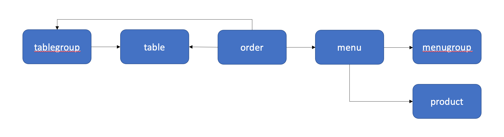
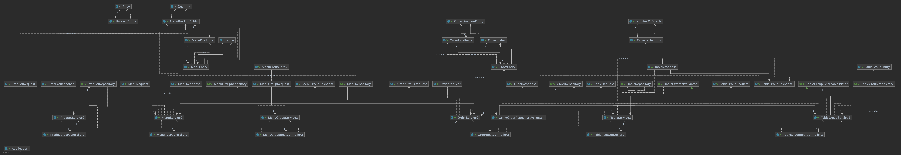

# 키친포스

## 요구 사항
- [x] 1.domain별 요구사항 정리
- [x] 2.요구사항을 토대로 테스트코드 작성

### 1.domain별 요구사항 정리
#### 상품
* 상품의 이름과 가격을 입력받아 저장할 수 있다.
    * 상품의 가격은 0 이상이다.
* 전체 상품 목록을 조회할 수 있다.

#### 메뉴그룹
* 메뉴그룹의 이름을 입력받아 저장할 수 있다.
* 전체 메뉴그룹의 목록을 조회할 수 있다.

#### 메뉴
* 메뉴 이름, 가격, 메뉴그룹, 메뉴상품 목록을 입력받아 저장할 수 있다.
  * 가격은 0 이상이다.
  * 메뉴그룹은 존재하는 메뉴그룹만 지정할 수 있다.
  * 가격이 메뉴상품 목록 세부 가격의 합보다 작거나 같아야 한다.
* 전체 메뉴의 목록을 조회할 수 있다.

#### 주문
* 주문테이블, 주문 항목을 입력받아 저장할 수 있다.
  * 주문 항목은 반드시 1개 이상이어야 한다.
  * 주문 항목은 각기 다른 메뉴여야 한다.
  * 주문테이블은 존재하는 주문테이블만 지정할 수 있다.
  * 주문테이블이 주문을 등록할 수 있는 테이블이어야 한다.
* 전체 주문 목록을 조회할 수 있다.
* 주문 ID와 주문 상태를 입력받아 주문의 현재 상태를 변경할 수 있다.
  * 존재하는 주문만 상태를 변경할 수 있다.
  * 완료 상태의 주문이 아니어야 상태를 변경할 수 있다.

#### 테이블
* 손님수, 주문을 등록할 수 있는 테이블 여부를 입력받아 저장할 수 있다.
* 전체 테이블 목록을 조회할 수 있다.
* 테이블 ID와 주문을 등록할 수 있는 테이블 여부를 입력받아 테이블의 주문을 등록할 수 있는 테이블 여부를 변경할 수 있다.
  * 존재하는 테이블만 상태를 변경할 수 있다.
  * 연결된 테이블 그룹이 존재하지않아야 한다.
  * 주문이 상태가 진행 중 (조리 or 식사)이지 않아야 한다.
* 테이블 ID와 손님수를 입력받아 테이블의 손님수를 변경할 수 있다.
  * 손님 수는 0 이상이어야 한다.
  * 존재하는 테이블만 손님수를 변경할 수 있다.
  * 빈 테이블만 손님수를 변경할 수 있다.

#### 테이블그룹
* 그룹으로 지정될 테이블 목록을 입력받아 테이블 그룹을 저장할 수 있다.
  * 그룹으로 지정되는 테이블은 2개 이상이어야 한다.
  * 그룹으로 지정되는 테이블은 서로 다른 테이블이어야 한다.
  * 빈 테이블이어야 한다.
  * 이미 다른 테이블 그룹에 묶여있지 않아야 한다.
* 테이블 그룹 아이디를 입력받아 테이블 그룹을 제거할 수 있다.
  * 주문의 상태가 진행 중 (조리 or 식사)이지 않아야 한다.

## 용어 사전

| 한글명 | 영문명 | 설명 |
| --- | --- | --- |
| 상품 | product | 메뉴를 관리하는 기준이 되는 데이터 |
| 메뉴 그룹 | menu group | 메뉴 묶음, 분류 |
| 메뉴 | menu | 메뉴 그룹에 속하는 실제 주문 가능 단위 |
| 메뉴 상품 | menu product | 메뉴에 속하는 수량이 있는 상품 |
| 금액 | amount | 가격 * 수량 |
| 주문 테이블 | order table | 매장에서 주문이 발생하는 영역 |
| 빈 테이블 | empty table | 주문을 등록할 수 없는 주문 테이블 |
| 주문 | order | 매장에서 발생하는 주문 |
| 주문 상태 | order status | 주문은 조리 ➜ 식사 ➜ 계산 완료 순서로 진행된다. |
| 방문한 손님 수 | number of guests | 필수 사항은 아니며 주문은 0명으로 등록할 수 있다. |
| 단체 지정 | table group | 통합 계산을 위해 개별 주문 테이블을 그룹화하는 기능 |
| 주문 항목 | order line item | 주문에 속하는 수량이 있는 메뉴 |
| 매장 식사 | eat in | 포장하지 않고 매장에서 식사하는 것 |

---

# 2단계 - 서비스 리팩터링

## 요구 사항
단위 테스트하기 어려운 코드와 단위 테스트 가능한 코드를 분리해 단위 테스트 가능한 코드에 대해 단위 테스트를 구현한다.

## TODO
- [x] 이전단계 코드리뷰 반영
- [x] 상품 - 메뉴 - 주문 - 테이블 패키지 분리
- [x] jpa dependency 추가
- [x] Product 패키지 리팩토링
- [x] 메뉴그룹 aggregate 패키지로 분리
- [x] 테이블그룹 aggregate 패키지로 분리
- [x] menugroup 패키지 리팩토링
- [x] menu 패키지 리팩토링
- [x] order 패키지 리팩토링
    - [x] tableDao를 제외한 리팩토링 완료
    - [x] tableDao를 tableRepository로 리팩토링 완료
- [x] tablegroup 패키지 리팩토링
- [x] table 패키지 리팩토링
- [x] 리팩토링 전 코드들 삭제

## 코드리뷰 반영
- [x] 정적 팩토리 메서드의 네이밍을 좀더 의미있게
- [x] 클래스명.MIN_클래스명 과 같은 형태의 상수명 simplify
- [x] 매직넘버 제거
- [x] 컨벤션에 맞지않는 메서드 위치 수정

---

# 3 단계 - 의존성 리팩터링

## 요구 사항
* 메뉴의 이름과 가격이 변경되면 주문 항목도 함께 변경된다. 메뉴 정보가 변경되더라도 주문 항목이 변경되지 않게 구현한다.
* 클래스 간의 방향도 중요하고 패키지 간의 방향도 중요하다. 클래스 사이, 패키지 사이의 의존 관계는 단방향이 되도록 해야 한다.

## TODO
- [x] Menu Aggregate에서 다른 Aggregate의 entity 직접 참조 제거
- [x] 패키지 간 의존성 사이클 제거
  * 패키지간 의존성 사이클 제거 전
    
    * import kitchenpos.패키지. 으로 검색해서 다른 패키지를 참조하는 방향을 알아낸 뒤 도식화 진행.
    * order 에서는 주문 전 테이블 상태를 확인하면서 order -> table 의존성 발생 
    * table 에서는 테이블 상태를 바꿀 때 테이블에 연결된 조리중 혹은 식사중 주문이 있는지 확인하면서 table -> order 의존성 발생
    
  * 패키지간 의존성 사이클 제거 후
    
    * table 패키지에 TableExternalValidator interface를 두고 테이블 상태를 바꿀 때 해당 인터페이스로 validation을 하고,
      구현체는 order패키지에 둬서 order -> table 의존만 남게 변경
    * 잘 변하지 않는 패키지인 tablegroup이 잘 변하는 패키지인 order를 의존하는 형태가 어색해보여
      tablegroup 패키지에 TableGroupExternalValidator interface를 두고 
      구현체는 order패키지에 둬서 order -> tablegroup으로 의존성 역전
    
## 클래스 의존 다이어 그램

* 다이어 그램상 의존성이 한 방향 (그림 상 아래에서 위로) 흐르는 것으로 보인다.

---

# 4단계 - 멀티 모듈 적용

* aggregate로 설정해 둔 단위로 패키지를 분리해 두었으니, 각자의 패키지가 module이 되면 좋을 것 같음.
* module-product, module-menugroup, module-menu, module-table, module-tablegroup, module-order로 분리해본다.

## 이전 단계 코드리뷰 TODO
- [x] 이전단계 코드리뷰 -  ProductEntity내에서 price.getter 사용하는 부분 개선
- [ ] 이전단계 코드리뷰 -  MenuEntity에서 중복된 생성자 로직 개선
- [ ] 이전단계 코드리뷰 -  UsingOrderRepositoryValidator domain 패키지로 이동
