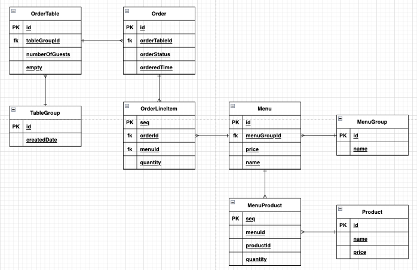
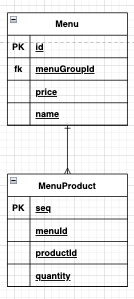
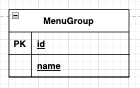
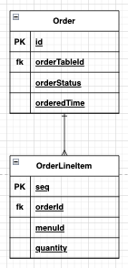
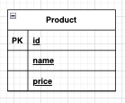
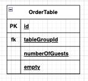
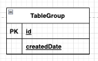

# 키친포스

## 요구사항

### 메뉴

* 메뉴의 가격은 0원 이상이어야 한다
* 메뉴 생성 시 메뉴 그룹에 속해있어야 한다
* 메뉴에는 하나 이상의 상품이 속해있어야 한다
* 메뉴의 상품은 상품 종류와 수량 정보가 있어야 하며, 메뉴의 전체 가격은 메뉴에 포함된 `상품별 가격 * 수량의 전체 합`이어야 한다

### 상품

* 상품의 가격은 0원 이상이어야 한다

### 주문

* 주문에는 1개 이상의 주문 물품 리스트가 존재해야 한다
* 주문의 상태는 다음과 같은 상태를 가져야 한다
    1. 요리중 - 주문이 생성되면 요리중 상태로 주문이 생성된다
    2. 식사중 - 주문의 요리가 완료 되어 식사중인 상태이다
    3. 완료 - 식사를 완료하여 해당 주문이 종료된 상태이다
* 주문 테이블의 정보는 단체 지정, 좌석 수, 빈 자리 여부 정보가 포함되어 있어야 한다
* 주문 생성 시 해당 주문의 상태는 `COOKING` 이어야 한다
* 주문 상태 변경 시 해당 주문의 상태가 `COMPLETION` 상태이면 예외가 발생해야 한다 (주문 상태를 변경할 수 없다)

### 주문 테이블

* 좌석 수는 0 이상 이어야 한다
* 주문 테이블 생성시 다음과 같은 조건을 만족해야 한다
    * 테이블의 단체 지정 정보가 있으면 예외가 발생해야 한다
* 주문 테이블 빈 자리 여부 변경시 다음을 만족해야 한다
    * 테이블의 주문 상태가 `COOKING` / `MEAL` 상태인 경우 빈 자리 여부를 변경 할 수 없다
    * 테이블의 단체 지정 정보가 있으면 예외가 발생해야 한다

### 단체 지정

* 단체 지정에 속한 주문 테이블의 수는 1개 초과이어야 한다
* 주문 테이블에 단체 지정이 포함될 경우 해당되는 모든 주문 테이블의 빈 상태는 비어있지 않은 상태로 되어야 한다
* 단체 지정 해제 시 주문 테이블 목록 중 `COOKING` / `MEAL` 상태인 경우가 존재하면 예외가 발생해야 한다

## 전체 엔티티

### 메뉴

#### 기능

* 생성
* 전체 조회

#### 엔티티

* 메뉴의 정보는 이름과 가격, 속해있는 메뉴 그룹, 해당 메뉴의 상품 리스트가 포함되어 있어야 한다

### 메뉴 그룹

#### 기능

* 생성
* 전체 조회
* 단건 조회
    * 메뉴 그룹 조회 결과가 없을 경우 예외가 발생해야 한다

#### 엔티티

* 메뉴 그룹의 정보는 이름이 포함되어 있어야 한다

### 주문

#### 기능

* 생성
* 전체 조회
    * 주문 상태에 해당하는 주문 단건 조회
* 주문 상태 변경

#### 엔티티

* 주문의 정보는 주문 테이블, 주문 상태, 주문 시간, 주문 물품 리스트가 포함되어 있어야 한다
    * 주문 물품의 정보는 메뉴 정보와 수량이 포함되어 있어야 한다

#### 주문 상태

* `COOKING(요리중)`: 주문가 생성될 때 `COOKING` 상태이어야 한다
* `MEAL(식사중)`: 주문를 주문자에게 전달되어 주문자가 식사 중인 상태이다
* `COMPLETION(종료)`: 주문의 모든 프로세스가 종료된 상태이다

### 상품

#### 기능

* 생성
* 전체 조회
* 단건 조회
    * 상품 조회 결과가 없을 경우 예외가 발생해야 한다

#### 엔티티

* 상품의 정보는 이름과 가격 정보가 포함되어 있어야 한다

### 주문 테이블

#### 기능

* 생성
* 전체 조회
* 단건 조회
    * 주문 테이블 조회 결과가 없을 경우 예외가 발생해야 한다
* 테이블 빈자리 여부 변경
* 테이블 좌석 수 변경

#### 엔티티

### 단체 지정

#### 기능

* 생성
* 단체 지정 해제

#### 엔티티

* 단체 지정의 정보는 생성 시간, 주문 테이블 리스트가 포함되어 있어야 한다

## 용어 사전

| 한글명 | 영문명 | 설명 |
| --- | --- | --- |
| 상품 | product | 메뉴를 관리하는 기준이 되는 데이터 |
| 메뉴 그룹 | menu group | 메뉴 묶음, 분류 |
| 메뉴 | menu | 메뉴 그룹에 속하는 실제 주문 가능 단위 |
| 메뉴 상품 | menu product | 메뉴에 속하는 수량이 있는 상품 |
| 금액 | amount | 가격 * 수량 |
| 주문 테이블 | order table | 매장에서 주문이 발생하는 영역 |
| 빈 테이블 | empty table | 주문을 등록할 수 없는 주문 테이블 |
| 주문 | order | 매장에서 발생하는 주문 |
| 주문 상태 | order status | 주문은 조리 ➜ 식사 ➜ 계산 완료 순서로 진행된다. |
| 방문한 손님 수 | number of guests | 필수 사항은 아니며 주문은 0명으로 등록할 수 있다. |
| 단체 지정 | table group | 통합 계산을 위해 개별 주문 테이블을 그룹화하는 기능 |
| 주문 항목 | order line item | 주문에 속하는 수량이 있는 메뉴 |
| 매장 식사 | eat in | 포장하지 않고 매장에서 식사하는 것 |

---

## 미션 요구사항

### 1단계

* [x] 프로젝트의 패키지의 코드를 보고 키친포스의 요구 사항을 `README.md` 파일에 작성한다
* [x] 정리한 요구 사항을 바탕으로 테스트 코드를 작성한다
    * [x] 모든 Business Object 에 대한 테스트 코드를 작성한다
    * [x] 인수 테스트 코드 작성은 권장사항이다
  
### 2단계

* [ ] 단위 테스트하기 어려운 코드와 가능한 코드를 분리하여 단위 테스트를 작성한다
* 미션 진행 순서
    * [x] 도메인별 패키지 정리
    * [x] 도메인의 엔티티를 JPA 엔티티로 변경
    * [x] 기존 DAO 를 Repository 로 변경
    * [x] Service 에 존재하는 도메인 로직을 도메인으로 리펙토링
  
## 프로그래밍 요구사항

* Lombok 없이 미션을 진행한다
* [Google Java Style Guide](https://google.github.io/styleguide/javaguide.html) 를 원칙으로 진행한다
* UI 를 제외한 모든 기능은 TDD 로 진행한다
* 객체지향 생활 체조 원칙을 지켜야 한다
    1. 한 메서드에 오직 한 단계의 들여쓰기만 한다.
    2. else 예약어는 쓰지 않는다.
    3. 모든 원시값과 문자열을 포장한다.
    4. 일급 콜렉션을 쓴다.
    5. 한 줄에 점을 하나만 찍는다.
    6. 줄여쓰지 않는다. (축약 금지)
    7. 모든 엔티티를 작게 유지한다.
    8. 2개 이상의 인스턴스 변수를 가진 클래스를 쓰지 않는다.
    9. (getter)/setter/property 를 쓰지 않는다.
