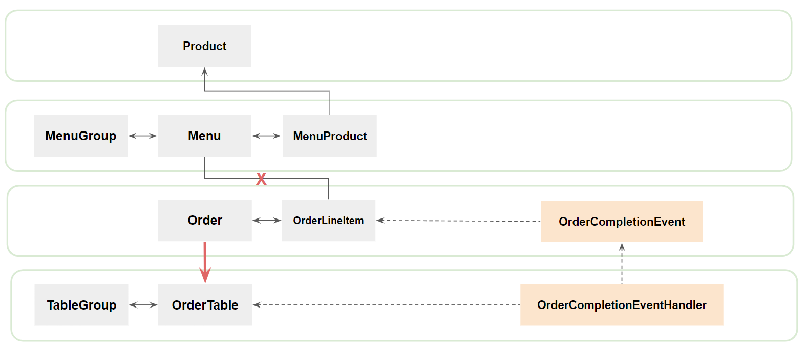

# 키친포스

## 미션 내용
### 미션1 - 테스트를 통한 코드 보호
### 미션2 - 서비스 리팩터링
### 미션3 - 의존성 리팩터링
* 메뉴 정보가 변경되더라도 주문 항목이 변경되지 않게 구현
  
* 의존성 관점에서 설계를 검토! (힌트)
  
  * 클래스 간의 방향도 중요하고 패키지 간의 방향도 중요하다.  
    클래스 사이, 패키지 사이의 의존 관계는 단방향이 되도록 해야 한다.
  
  * 객체 묶기
    * 함께 생성되고 함께 삭제되는 객체들을 함께 묶어라
    * 불변식을 지켜야 하는 객체들을 함께 묶어라
    * 가능하면 분리하라
    * 직접 연관 관계 vs 간접 연관 관계
    
  * 외부 애그리거트의 상태값 변경을 위해서 '이벤트' 를 활용
  

### 객체 의존 관계 BEFORE :

- 생애 주기가 비슷한 객체들을 묶음
  - Product
  - Menu
  - Order
  - Table

### 객체 의존 관계 AFTER :

- 의존 관계가 강하고 transaction 단위가 크면, 설계상/ 성능상의 문제가 발생한다.
- 관계 해제가 적당하다고 생각되는 부분 의존성 개선
  
  - orderLineItem 과 menu 객체 연관 관계 해제
  - orderTable - order 관계 양방향 -> 단방향 변경

### 이벤트 작동 방식 :

- 주문 종료 시에 table 객체 그룹에 이벤트를 보낼 수 있도록 ApplicationEventPublisher, Handler 추가
- order - table 사이 관계를 끊지 않았지 때문에 이벤트 활용이 꼭 필요하지는 않을 수 있음
- 의존성 리팩터링 시 필요한 실습인 것 같아 진행.
---

## 요구 사항

### 상품
* 상품을 등록할 수 있다.
* 상품의 가격이 올바르지 않으면 등록할 수 없다.
    * 상품의 가격은 0 원 이상이어야 한다.
* 상품의 목록을 조회할 수 있다.

### 메뉴 그룹
* 메뉴 그룹을 등록할 수 있다.
* 메뉴 그룹 목록을 조회할 수 있다.

### 메뉴
* 메뉴를 등록할 수 있다.
* 메뉴 정보가 올바르지 않으면 등록할 수 없다.
  * 가격은 0 원 이상이어야 한다.
  * 존재하는 메뉴 그룹이어야 한다.
  * 존재하는 상품이어야 한다.
  * (상품 가격*수량) 의 합이 메뉴 가격보다 작거나 같아야 한다.
* 메뉴 목록을 조회할 수 있다.

### 주문 테이블
* 주문 테이블을 등록할 수 있다.
* 주문 테이블 목록을 조회할 수 있다.
  
* 주문 테이블을 빈 테이블로 변경할 수 있다.
* 주문 테이블을 빈 테이블로 변경할 수 없는 경우.
  * 주문 테이블이 등록되어 있지 않음.
  * 주문 테이블 그룹이 단체 지정 되어있는 경우.
  * 주문 테이블이 '조리' 나 '식사' 상태인 경우.
  
* 주문 테이블의 방문한 손님 수를 변경할 수 있다.
* 주문 테이블의 방문한 손님 수를 변경할 수 없는 경우.
  * 변경할 손님 수가 0보다 작을 경우.
  * 주문 테이블이 등록되어 있지 않음.
  * 주문 테이블이 빈 테이블일 경우.

* 주문 등록 후 메뉴 정보가 바뀌어도 주문 정보는 바뀌지 않는다.

### 단체 지정 (주문 테이블 그룹)
* 주문 테이블 목록을 단체 지정할 수 있다.
* 주문 테이블 목록을 단체 지정할 수 없는 경우.
  * 주문 테이블 목록이 비어있는 경우.
  * 주문 테이블 갯수가 2보다 작은 경우.
  * 주문 테이블은 등록되어 있어야하고, 주문 테이블 목록은 unique 해야 한다.
  * 주문 테이블이 빈 테이블이 아닌 경우
  * 주문 테이블의 주문 테이블 그룹이 이미 등록된 경우.
  
* 단체 지정을 해제할 수 있다.
* 단체 지정을 해제할 수 없는 경우.
  * 주문 테이블 목록 중 '조리' 나 '식사' 상태가 있는 경우.

### 주문
* 주문을 등록할 수 있다. 
* 주문이 올바르지 않을 경우 등록할 수 없다.
  * 주문 항목은 비어있을 수 없다.
  * 주문 항목의 메뉴는 등록되어 있고, 메뉴 목록은 unique 해야 한다. 
  * 등록되어 있는 주문 테이블이어야 한다.
  * 주문 테이블이 빈 테이블이 아니어야 한다.

* 주문 목록을 조회할 수 있다.
* 주문의 상태를 변경할 수 있다. 
  * 조리 -> 식사 -> 완료
  * 완료로 변경할 경우 주문 테이블은 빈테이블이 된다.
* 이미 완료된 주문은 변경할 수 없다.

## 용어 사전

| 한글명 | 영문명 | 설명 |
| --- | --- | --- |
| 상품 | product | 메뉴를 관리하는 기준이 되는 데이터 |
| 메뉴 그룹 | menu group | 메뉴 묶음, 분류 |
| 메뉴 | menu | 메뉴 그룹에 속하는 실제 주문 가능 단위 |
| 메뉴 상품 | menu product | 메뉴에 속하는 수량이 있는 상품 |
| 금액 | amount | 가격 * 수량 |
| 주문 테이블 | order table | 매장에서 주문이 발생하는 영역 |
| 빈 테이블 | empty table | 주문을 등록할 수 없는 주문 테이블 |
| 주문 | order | 매장에서 발생하는 주문 |
| 주문 상태 | order status | 주문은 조리 ➜ 식사 ➜ 계산 완료 순서로 진행된다. |
| 방문한 손님 수 | number of guests | 필수 사항은 아니며 주문은 0명으로 등록할 수 있다. |
| 단체 지정 | table group | 통합 계산을 위해 개별 주문 테이블을 그룹화하는 기능 |
| 주문 항목 | order line item | 주문에 속하는 수량이 있는 메뉴 |
| 매장 식사 | eat in | 포장하지 않고 매장에서 식사하는 것 |
