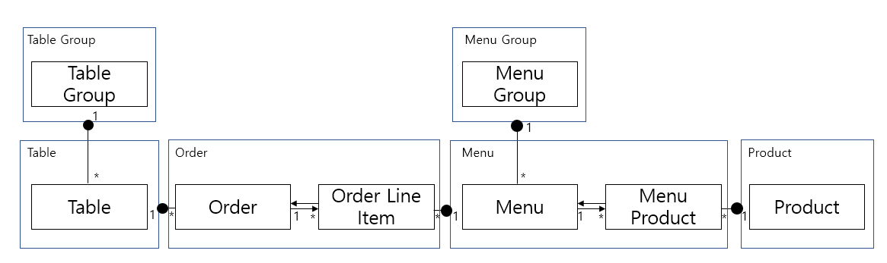
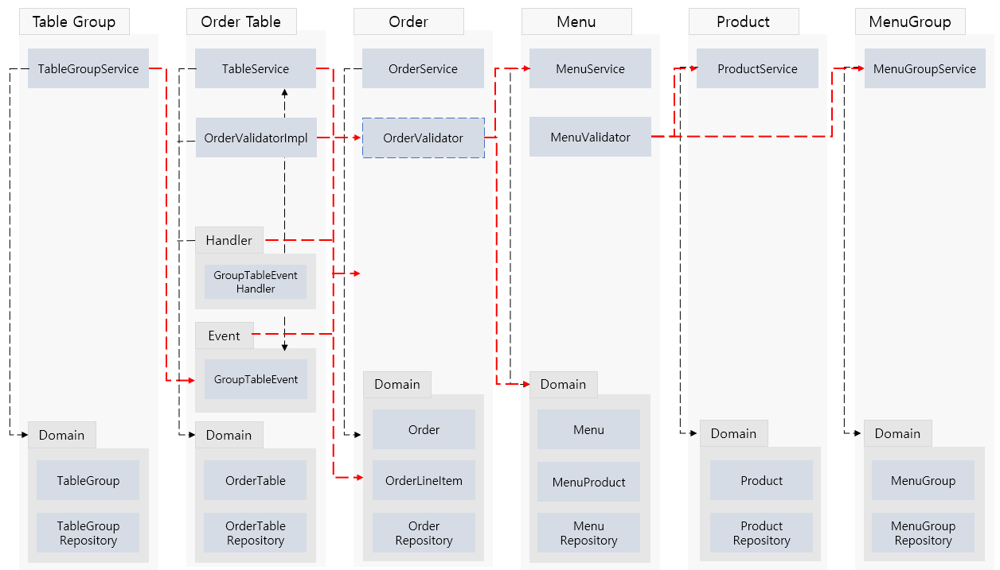

__# 키친포스

## 요구 사항

### 1. 상품
- 데이터구성
    1. 이름과 가격을 갖는다
- 기능 목록
    1. 상품을 등록할 수 있다
        - 상품의 가격은 0 이상이다.
    2. 상품의 목록을 조회할 수 있다

### 2. 메뉴그룹
- 데이터 구성
    1.  이름을 갖는다
- 기능 목록
    1. 메뉴그룹을 등록할 수 있다
    2. 메뉴그룹의 목록을 조회할 수 있다

### 3. 메뉴
- 데이터 구성
    1. 이름과 가격을 갖는다
    2. 하나의 `메뉴그룹`에 속한다
    3. 다수개의 `메뉴상품`을 갖는다
        - `메뉴상품` 은 `상품`과 수량을 갖는다
- 기능 목록
    1. 메뉴를 등록할 수 있다
        - 메뉴의 가격은 0 이상이다
        - 등록하려는 `메뉴그룹`이 존재해야 한다
        - 등록하려는 `메뉴상품`도 같이 등록되어야 한다
        - 등록하려는 `메뉴상품`의 `상품`이 존재해야 한다
        - 메뉴의 가격은, `메뉴상품`의 정가의 합보다 클 수 없다
    2. 메뉴의 목록을 조회할 수 있다

### 4. 주문
- 데이터 구성
    1. `주문상태`와 생성시간을 갖는다
        - `주문상태`는 `조리중`, `식사중`, `완료`이 있다
    2. 하나의 `주문테이블`에 속한다
    3. 다수개의 `주문항목`을 갖는다
        - `주문항목`은 `메뉴`와 수량을 갖는다
- 기능 목록
    1. 주문을 등록할 수 있다
        - 초기 `주문상태`는 `조리중` 상태이다
        - `주문항목`은 비어있을 수 없다
        - `주문항목`의 `메뉴`는 중복될 수 없다
        - 등록하려는 `주문테이블`이 존재해야 한다
        - 등록하려는 `주문테이블`은 비어있을 수 없다
        - 등록하려는 `주문항목`도 같이 등록되어야 한다
        - 등록하려는 `주문항목`의 `메뉴`가 존재해야 한다
    2. 주문의 목록을 조회할 수 있다
    3. 주문의 상태를 업데이트할 수 있다
        - 업데이트하려는 주문이 존재해야 한다
        - `주문상태`가 `완료`이면 업데이트할 수 없다

### 5. 테이블그룹 (단체 지정)
- 데이터 구성
    1. 생성 시간을 갖는다
    2. 다수개의 `주문테이블`을 갖는다
- 기능 목록
    1. 테이블그룹을 등록할 수 있다
        - 테이블그룹 내 `주문테이블`은 2개 이상이어야 한다
        - 등록하려는 테이블그룹의 `주문테이블`이 모두 존재해야 한다
        - 테이블그룹 내 `주문테이블`은 중복될 수 없다
        - 비어있는 `주문테이블`만 등록할 수 있다
        - 이미 테이블그룹에 속해있는 `주문테이블`은 등록할 수 없다
    3. 테이블 그룹을 삭제할 수 있다
        - `주문테이블`에 `조리중`이나 `식사중` 상태의 `주문`이 있으면 삭제할 수 없다

### 6. 주문 테이블
- 데이터 구성
    1. 손님 수를 갖는다
    2. 비어있는지 여부를 갖는다
    3. 하나의 `테이블그룹`에 속할 수 있다
- 기능 목록
    1. 주문테이블을 등록할 수 있다
    2. 주문테이블의 목록을 조회할 수 있다
    3. 주문테이블의 비어있음 여부를 업데이트할 수 있다
        - 업데이트할 주문테이블이 존재해야 한다
        - 주문테이블이 `테이블그룹`에 등록되어있으면 안된다
        - 주문테이블에 `조리중`이나 `식사중` 상태의 `주문`이 있으면 안된다
    4. 주문테이블의 손님 수를 업데이트할 수 있다
        - 손님 수는 0 이상이다
        - 업데이트할 주문테이블이 존재해야 한다
        - 주문테이블이 비어있으면 안된다

-----

## 용어 사전

| 한글명 | 영문명 | 설명 |
| --- | --- | --- |
| 상품 | product | 메뉴를 관리하는 기준이 되는 데이터 |
| 메뉴 그룹 | menu group | 메뉴 묶음, 분류 |
| 메뉴 | menu | 메뉴 그룹에 속하는 실제 주문 가능 단위 |
| 메뉴 상품 | menu product | 메뉴에 속하는 수량이 있는 상품 |
| 금액 | amount | 가격 * 수량 |
| 주문 테이블 | order table | 매장에서 주문이 발생하는 영역 |
| 빈 테이블 | empty table | 주문을 등록할 수 없는 주문 테이블 |
| 주문 | order | 매장에서 발생하는 주문 |
| 주문 상태 | order status | 주문은 조리 ➜ 식사 ➜ 계산 완료 순서로 진행된다. |
| 방문한 손님 수 | number of guests | 필수 사항은 아니며 주문은 0명으로 등록할 수 있다. |
| 테이블 그룹 (단체 지정) | table group | 통합 계산을 위해 개별 주문 테이블을 그룹화하는 기능 |
| 주문 항목 | order line item | 주문에 속하는 수량이 있는 메뉴 |
| 매장 식사 | eat in | 포장하지 않고 매장에서 식사하는 것 |

---------------------

## 의존성 리팩터링
- [X] 클래스 사이 의존관계는 단방향이 되어야 한다
- [X] 패키지 사이 의존관계는 단방향이 되어야 한다

#### Entity 연관관계 도식도
- 화살표는 직접참조, 점은 ID를 통한 간접참조를 의미

####Class/Package 간 의존성 도식도
- 빨간 화살표는 Package 간 의존성, 검정 화살표는 Package 내부 의존성을 의미

