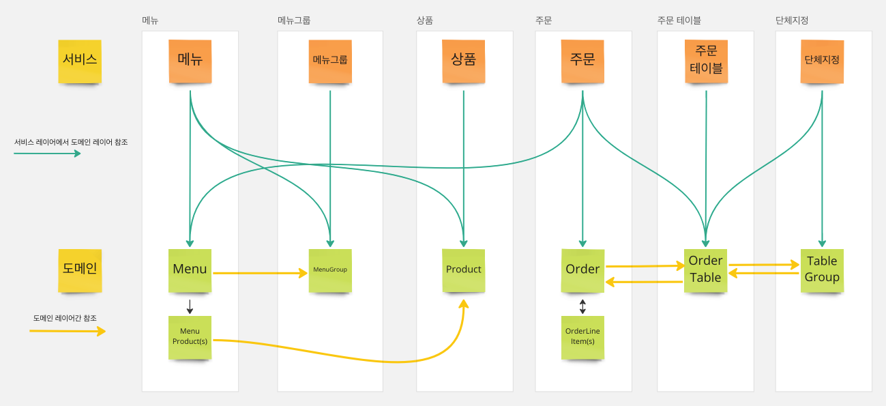
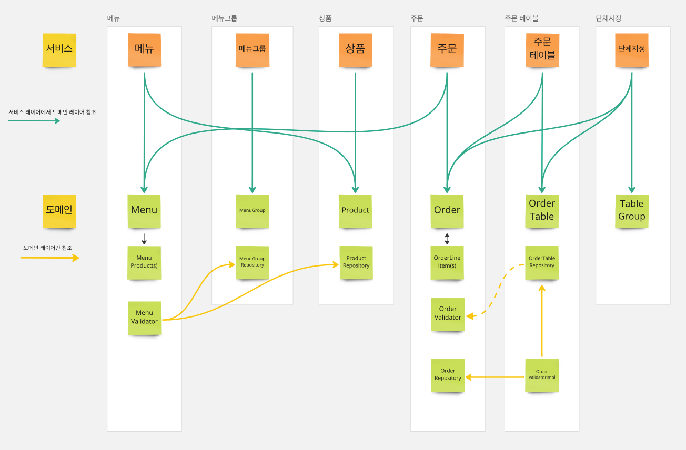

# 키친포스

## Step1 - 테스트를 통한 코드 보호

- 키친포스의 요구사항 정리
- 정리한 요구사항을 토대로 테스트 코드 작성(모든 Business Object에 대한 테스트 코드 작성)

### 요구 사항

#### 상품

- 상품을 생성할 수 있다.
  - 상품의 가격이 올바르지 않으면 상품을 생성할 수 없다.
    - 상품의 가격은 0원 이상이어야 한다.
- 상품의 목록을 조회할 수 있다.

#### 메뉴 그룹

- 메뉴 그룹을 생성할 수 있다.
- 메뉴 그룹의 목록을 조회할 수 있다.

#### 메뉴

- 메뉴를 생성할 수 있다.
  - 메뉴의 가격이 올바르지 않으면 메뉴를 생성할 수 없다.
    - 메뉴의 가격은 0원 이상이어야 한다.
  - 메뉴의 메뉴 그룹이 존재하지 않으면 메뉴를 생성할 수 없다.
  - 메뉴 상품의 상품이 등록되어 있지 않으면 메뉴를 생성할 수 없다.
  - 메뉴의 가격이 메뉴 상품들의 가격의 합보다 크면 메뉴를 생성할 수 없다.
- 메뉴의 목록을 조회할 수 있다.

#### 주문 테이블

- 주문 테이블을 생성할 수 있다.
- 주문 테이블의 목록을 조회할 수 있다.
- 주문 테이블의 빈 상태를 변경할 수 있다.
  - 등록된 주문 테이블이 없으면 주문 테이블의 빈 상태를 변경할 수 없다.
  - 주문 테이블이 단체 지정이 되어있으면 주문 테이블의 빈 상태를 변경할 수 없다.
  - 주문 테이블의 주문 상태가 조리 또는 식사이면 주문 테이블의 빈 상태를 변경할 수 없다.
- 주문 테이블의 방문한 손님 수를 변경할 수 있다.
  - 주문 테이블의 방문한 손님 수가 0 미만이면 방문한 손님 수를 변경할 수 없다.
  - 등록된 주문 테이블이 없으면 방문한 손님 수를 변경할 수 없다.
  - 주문 테이블이 빈 테이블이면 방문한 손님 수를 변경할 수 없다.

#### 단체 지정

- 단체 지정을 할 수 있다.
  - 단체 지정할 주문 테이블이 2개 이상이 아니면 단체 지정을 할 수 없다.
  - 단체 지정할 주문 테이블이 등록된 주문 테이블이 아니면 단체 지정을 할 수 없다.
  - 등록된 주문 테이블 하나라도 빈 테이블이 아니거나 이미 단체 지정이 된 주문 테이블이면 단체 지정을 할 수 없다.
- 단체 지정을 취소할 수 있다.
  - 단체 지정된 주문 테이블들의 상태가 조리 또는 식사이면 단체 지정을 취소할 수 없다.

#### 주문

- 주문을 생성 할 수 있다.
  - 주문 항목이 비어있으면 주문을 생성할 수 없다.
  - 주문 항목이 메뉴에 등록되어 있지 않다면 주문을 생성할 수 없다.
  - 주문 테이블이 등록되어 있지 않다면 주문을 생성할 수 없다.
  - 주문 테이블이 빈 테이블이면 주문을 생성할 수 없다.
- 주문의 목록을 조회할 수 있다.
- 주문의 상태를 변경할 수 있다.
  - 주문이 없으면 주문의 상태를 변경할 수 없다.
  - 주문 상태가 계산 완료이면 주문의 상태를 변경할 수 없다.

## 용어 사전

| 한글명 | 영문명 | 설명 |
| --- | --- | --- |
| 상품 | product | 메뉴를 관리하는 기준이 되는 데이터 |
| 메뉴 그룹 | menu group | 메뉴 묶음, 분류 |
| 메뉴 | menu | 메뉴 그룹에 속하는 실제 주문 가능 단위 |
| 메뉴 상품 | menu product | 메뉴에 속하는 수량이 있는 상품 |
| 금액 | amount | 가격 * 수량 |
| 주문 테이블 | order table | 매장에서 주문이 발생하는 영역 |
| 빈 테이블 | empty table | 주문을 등록할 수 없는 주문 테이블 |
| 주문 | order | 매장에서 발생하는 주문 |
| 주문 상태 | order status | 주문은 조리 ➜ 식사 ➜ 계산 완료 순서로 진행된다. |
| 방문한 손님 수 | number of guests | 필수 사항은 아니며 주문은 0명으로 등록할 수 있다. |
| 단체 지정 | table group | 통합 계산을 위해 개별 주문 테이블을 그룹화하는 기능 |
| 주문 항목 | order line item | 주문에 속하는 수량이 있는 메뉴 |
| 매장 식사 | eat in | 포장하지 않고 매장에서 식사하는 것 |

---

## Step2 - 서비스 리팩토링

### 요구 사항

- 단위 테스트하기 어려운 코드와 단위 테스트 가능한 코드를 분리
- 단위 테스트 가능한 코드에 대해 단위 테스트를 구현한다.

## Step3 - 의존성 리팩터링

- 메뉴의 이름과 가격이 변경되더라도 주문 항목이 변경되지 않게 구현한다.
- 클래스 사이, 패키지 사이 의존 관계는 단방향이 되도록 한다.
- 함께 생성되고 함께 삭제되는 객체들을 함께 묶는다.
- 불변식을 지켜야 하는 객체들을 함께 묶는다.
- 가능하면 분리한다.
- 연관관계 구현
  - 직접 참조 (객체 참조를 이용한 연관 관계)
  - 간접 참조 (리포지토리를 통한 탐색)

의존성 수정 전/후 결과

`의존 수정 전`

`의존 수정 후`

- Order와 OrderTable 간의 순환참조 제거
- OrderTable과 TableGroup 간의 순환참조 제거

