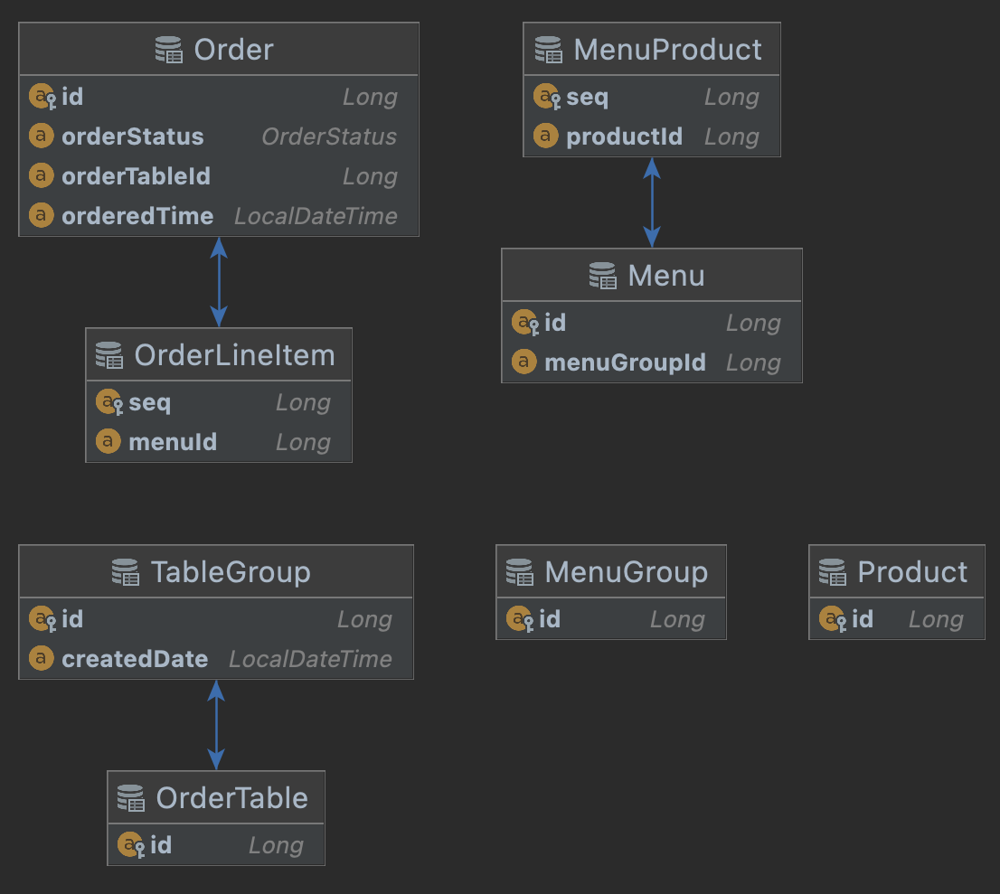

# 키친포스

> 식당을 전산화 할때는 좋았는데 왜 개발자들이 점점더 개발을 힘들어 할까?
>
> 뭔가 변화가 필요해 보인다...... 미션시작

## 요구 사항

### 상품

* 상품을 등록할 수 있어야 합니다.
    * 상품 가격은 필수로 입력해야 합니다.
    * 상품 가격이 0원 이상이여야 합니다.
    * 상품 이름도 필수로 입력해야 합니다.
* 상품을 조회할 수 있어야 합니다.

### 메뉴 그룹

* 메뉴 그룹을 등록할 수 있어야 합니다.
* 메뉴 그룹 목록을 조회할 수 있어야 합니다.

### 메뉴

* 메뉴를 등록할 수 있어야 합니다.
    * 메뉴 가격은 필수로 입력해야 합니다.
    * 메뉴 가격은 0원 이상이여야 합니다.
    * 메뉴 그룹에 없는 메뉴는 등록할 수 없습니다.
    * 메뉴 상품에 없는 메뉴는 등록할 수 없습니다.
    * [상품 가격 * 메뉴 상품 수량]이 0 이상이여야 합니다.
    * 메뉴의 가격이 상품들의 가격의 합보다 크면 안됩니다.
* 메뉴 목록을 조회할 수 있어야 합니다.

### 테이블

* 주문 테이블을 추가할 수 있어야 합니다.
    * 주문 테이블 등록시 단체 지정은 해제 됩니다.
* 주문 테이블을 빈 테이블로 변경할 수 있어야 합니다.
    * 주문 테이블 정보가 없으면 안됩니다.
    * 주문 테이블이 단체로 지정되어 있으면 안됩니다.
    * 주문 테이블의 주문 상태가 조리중 이거나 식사중이면 변경 불가능 합니다.
* 빈 테이블을 주문 테이블로 변경할 수 있어야 합니다.
    * 주문 테이블 정보가 없으면 안됩니다.
    * 주문 테이블이 단체로 지정되어 있으면 안됩니다.
    * 주문 테이블의 주문 상태가 조리나 식사면 변경 불가능 합니다.
* 주문 테이블의 방문한 손님 수를 변경할 수 있어야 합니다.
    * 방문한 손님 수 는 0이상이여야 합니다.
    * 주문 테이블 정보가 없으면 안됩니다.
    * 주문 테이블이 빈 테이블이면 안됩니다.

### 단체 지정

* 통합 계산을 위해 개별 주문을 단체 지정 할 수 있어야 합니다.
    * 주문 테이블이 없거나 주문 테이블이 2개 미만이라면 단체 지정이 불가능 합니다.
    * 단체 지정 요청한 주문 테이블이 하나라도 없으면 안됩니다.
    * 단체 지정 요청한 주문 테이블이 하나도 없거나 주문 테이블의 그룹이 이미 있으면 안됩니다.
* 단체 지정한 주문 테이블을 단체 지정을 해제할 수 있어야 합니다.
    * 단체 지정한 주문 테이블의 주문 상태가 조리 이거나 식사 라면 단체 지정 해제가 불가능 합니다.

### 주문

* 주문을 할 수 있어야 합니다.
    * 주문 항목은 필수로 입력해야 합니다.
    * 주문 항목중 메뉴에 없는 항목이 있어서는 안됩니다.
    * 주문 테이블 없이 주문을 할 수 없습니다.
    * 주문 테이블이 빈 테이블이면 안됩니다.
    * 주문 후 주문 상태는 조리가 됩니다.
    * 주문 후 주문 시간이 표시 됩니다.
* 주문 상태를 수정할 수 있어야 합니다.
    * 상태를 수정할 주문이 없으면 안됩니다.
    * 주문 상태가 계산 완료 상태면 수정이 불가능 합니다.
* 주문 목록을 조회할 수 있어야 합니다.

## 🚀 2단계 - 서비스 리팩터링

* DTO, Domain분리 [완료]
* 도메인별 패키지 분리 [완료]
* 서비스별 해피케이스 테스트 작성 [완료]
* Service 에서 로직별 함수 추출 [완료]
* Service 에서 도메인이 아니라 Request 받도록 수정. [완료]
* 함수 단위 테스트 생성 [완료]
* 도메인으로 비즈니스 로직 이동 [완료]

### 2차 피드백을 통한 개선사항

* 모든 도메인에 대한 단위테스트 작성 [완료]
* Service 의 해피케이스, 언 해피케이스 작성 [완료]
* given / when / then 방식으로 표기 [완료]
* 라인 하나에 너무 많은 로직이 있는 경우 찾아서 분리 진행 [완료]
* 예외에 대한 상세 메시지 제공 [완료]
* DAO Suffix Repository로 변경 [완료]
* Entity 기본생성자를 protected 로 변경 [완료]
* 필요 없는 Getter, Setter 제거 [완료]
* 일급 컬렉션등 초기화 [완료]
* 컨트롤러 RequestMapping 으로 통합 가능한 부분 통합 [완료]
* Enum -> String 으로 변환하는 부분 제거 후 순수하게 Enum 사용 [완료]
* Enum 에 description 추가 [완료]
* Indent 두개 이상 한개로 변경 [완료]
* price 등 의미를 갖는 변수 객체로 래핑 [완료]
* 생성자가 지나치게 많은경우 전체 생성자 생성후 원하는 부분을 제외하고 null 전달 [완료]
* 메서드체이닝이 한줄로 계속 이어지는 부분 수정. [완료]
* copy후 분리 처리
  

## 🚀 3단계 - 의존성 리팩터링

### 요구사항 정리

* 메뉴의 이름과 가격이 변경되면 주문 항목도 함께 변경된다. 메뉴 정보가 변경되더라도 주문 항목이 변경되지 않게 구현한다.
* 클래스 간의 방향도 중요하고 패키지 간의 방향도 중요하다. 클래스 사이, 패키지 사이의 의존 관계는 단방향이 되도록 해야 한다.

### 힌트

* 함께 생성되고 함께 삭제되는 객체들을 함께 묶어라
* 불변식을 지켜야 하는 객체들을 함께 묶어라
* 가능하면 분리하라

연관 관계는 다양하게 구현할 수 있다.

* 직접 참조 (객체 참조를 이용한 연관 관계)
* 간접 참조 (리포지토리를 통한 탐색)

### 시작전 생각 정리

* 도메인은 크게 4가지가 있다
    * 상품
    * 테이블
    * 상품
    * 메뉴
* 도메인의 특징상 연관관계가 생길 수 밖에 없는 구조가 있다
    * 메뉴를 만드려면 상품을 알아야 한다
        * 메뉴 -> 상품
    * 주문을 하려면 어떤 메뉴를 주문했는지와 어떤 테이블에서 주문하는줄 알아야 한다.
        * 주문 -> 테이블
        * 주문 -> 메뉴 -> 상품
    * 위의 같은 흐름때문에 요구사항 내용과 같은 문제 발생
    * 문제 발생을 방지하기 위해 아래와 같이 참조 구조 변경
        * 주문 -> 주문테이블 <- 테이블
        * 메뉴 -> 메뉴상품 <- 상품

### 시작전 해야할 항목 정리

* 의존 관계 확인하기
    * Dependency Matrix 를 이용해서 분석
        * Matrix실행 양방향 참조는 많이 안보이므로 위에서 서술한 흐름에 역순이 있는지만 확인

          
        * menu 도메인에서 상품 도메인을 강하게 참조함

          
        * order 도메인 에서 메뉴 도메인을 강하게 참조함

          
        * 이런건 괜춘하다

          

    * 패키지 import 를 확인하면서 분석
        * Menu
            * MenuProduct 가 Product 참조중

              

## 4단계

* 컨텍스트간 모듈화 진행 [완료]

### 피드백 사항 정리

* validator 가 하나만 역활만 진행하도록 변경.
* request 에서 생성하는게 아닌 service layer 에서 생성하도록 일부 변화 [완료]
* 너무 길게 이어지는 함수형 간소화 [MenuRequest] [완료]
* dao 패키지명 repository 로 변경 [완료]
* order와 Ordertable 패키지 분리
* Menugroup validator 로 위임
* flyway 하나만 남겨놓고 제거 [완료]

## 용어 사전

| 한글명         | 영문명           | 설명                                                |
| ---------------- | ------------------ | ----------------------------------------------------- |
| 상품           | product          | 메뉴를 관리하는 기준이 되는 데이터                  |
| 메뉴 그룹      | menu group       | 메뉴 묶음, 분류                                     |
| 메뉴           | menu             | 메뉴 그룹에 속하는 실제 주문 가능 단위              |
| 메뉴 상품      | menu product     | 메뉴에 속하는 수량이 있는 상품                      |
| 금액           | amount           | 가격 * 수량                                         |
| 주문 테이블    | order table      | 매장에서 주문이 발생하는 영역                       |
| 빈 테이블      | empty table      | 주문을 등록할 수 없는 주문 테이블                   |
| 주문           | order            | 매장에서 발생하는 주문                              |
| 주문 상태      | order status     | 주문은 조리 ➜ 식사 ➜ 계산 완료 순서로 진행된다.   |
| 방문한 손님 수 | number of guests | 필수 사항은 아니며 주문은 0명으로 등록할 수 있다.   |
| 단체 지정      | table group      | 통합 계산을 위해 개별 주문 테이블을 그룹화하는 기능 |
| 주문 항목      | order line item  | 주문에 속하는 수량이 있는 메뉴                      |
| 매장 식사      | eat in           | 포장하지 않고 매장에서 식사하는 것                  |
