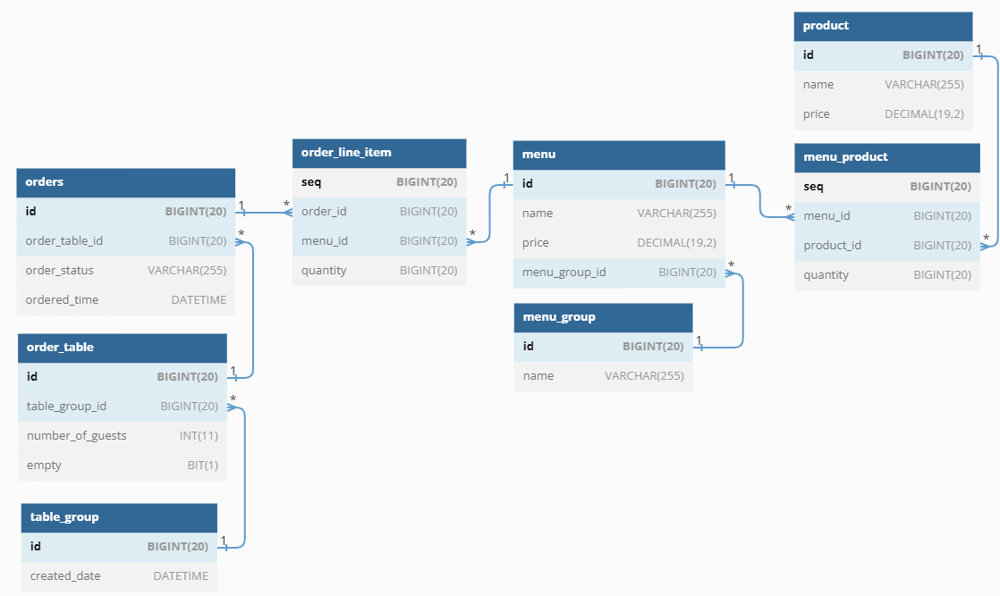

### 테스트를 통한 코드 보호

* [x] `kitchenpos` 패키지의 코드를 보고 키친포스의 요구 사항을 `README.md`에 작성
* [x] 정리한 키친포스의 요구 사항을 토대로 테스트 코드 작성
  * [x] 모든 Business Object 에 대한 테스트 코드 작성
  * [x] `@SpringBootTest`를 이용한 통합 테스트 코드 또는  
    `@ExtendWith(MockitoExtension.class`를 이용한 단위 테스트 코드 작성
* [x] Lombok 없이 미션진행

* http 디렉터리의 .http 파일(HTTP client)을 보고 어떤 요청을 받는지 참고
* src/main/resources/db/migration 디렉터리의 .sql 파일을 보고 어떤 관계로 이루어져 있는지 참고

### 서비스 리팩터링

* [x] 단위 테스트하기 어려운 코드와 가능한 코드 분리
  * [x] 단위 테스트 구현
* [x] Spring Data JPA 사용 시 spring.jpa.hibernate.ddl-auto=validate 옵션 필수
