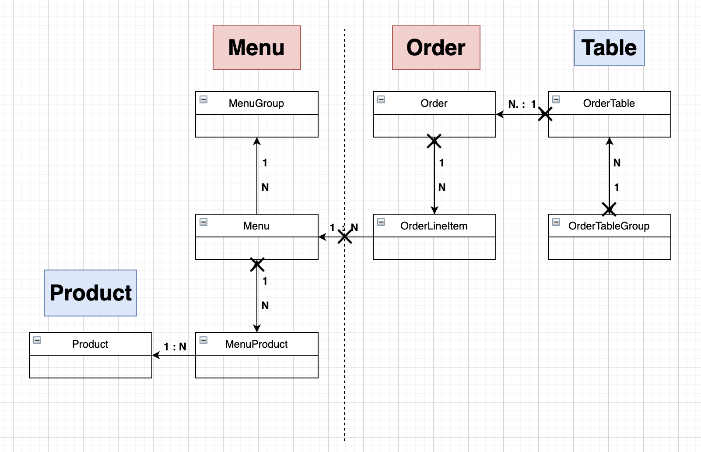

# 🚀 3단계 - 의존성 리팩터링

## 용어 사전

[바로가기](../README.md)

## 비즈니스 요구 사항

[바로가기](step1.md)

## DDD Start!

[바로가기](step2.md)

## 연관관계 끊어내기

- [X] 객체 그래프 그려보기  
  - 목표 
  - [X] 양방향 연관관계 찾기
- [X] 양방향 연관관계 끊어내기
  - [X] OrderTable -> OrderTableGroup 제거
  - [X] Order -> OrderTable 제거
  - [X] OrderLineItem -> Order 제거
  - [X] MenuProduct -> Menu 제거
- [ ] 어그리게잇 Order, Menu 설정
  - [X] OrderLineItem -> Menu 제거
  - [ ] 어그리게잇 간 이벤트 호출 방식으로 변경
