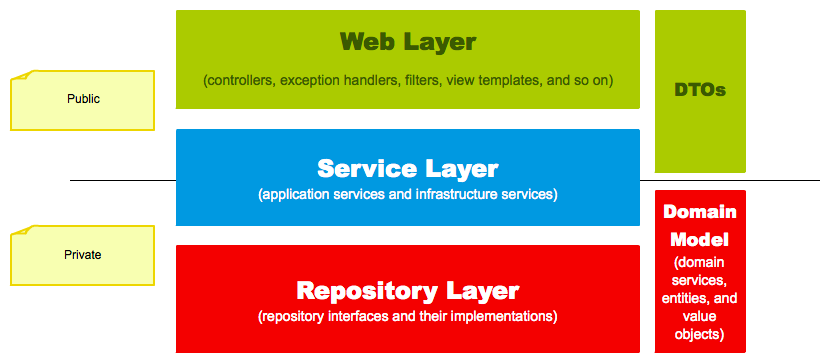

# 🚀 2단계 - 서비스 리팩터링
## 요구 사항
단위 테스트하기 어려운 코드와 단위 테스트 가능한 코드를 분리해 단위 테스트 가능한 코드에 대해 단위 테스트를 구현한다.
- Spring Data JPA 사용 시 spring.jpa.hibernate.ddl-auto=validate 옵션을 필수로 준다.
- 데이터베이스 스키마 변경 및 마이그레이션이 필요하다면 아래 문서를 적극 활용한다.
  - [DB도 형상관리를 해보자!](https://meetup.toast.com/posts/173)

## 프로그래밍 요구 사항
Lombok은 그 강력한 기능만큼 사용상 주의를 요한다.
- 무분별한 setter 메서드 사용
- 객체 간에 상호 참조하는 경우 무한 루프에 빠질 가능성
- [Lombok 사용상 주의점(Pitfall)](https://kwonnam.pe.kr/wiki/java/lombok/pitfall)

이번 과정에서는 Lombok 없이 미션을 진행해 본다.
- 자바 코드 컨벤션을 지키면서 프로그래밍한다. 
  - 기본적으로 [Google Java Style Guide](https://google.github.io/styleguide/javaguide.html)을 원칙으로 한다.
  - 단, 들여쓰기는 '2 spaces'가 아닌 '4 spaces'로 한다.
- indent(인덴트, 들여쓰기) depth를 2를 넘지 않도록 구현한다. 1까지만 허용한다.
  - 예를 들어 while문 안에 if문이 있으면 들여쓰기는 2이다.
  - 힌트: indent(인덴트, 들여쓰기) depth를 줄이는 좋은 방법은 함수(또는 메서드)를 분리하면 된다.
- 3항 연산자를 쓰지 않는다.
- else 예약어를 쓰지 않는다.
  - else 예약어를 쓰지 말라고 하니 switch/case로 구현하는 경우가 있는데 switch/case도 허용하지 않는다.
  - 힌트: if문에서 값을 반환하는 방식으로 구현하면 else 예약어를 사용하지 않아도 된다.
- 모든 기능을 TDD로 구현해 단위 테스트가 존재해야 한다. 단, UI(System.out, System.in) 로직은 제외
  - 핵심 로직을 구현하는 코드와 UI를 담당하는 로직을 구분한다.
  - UI 로직을 InputView, ResultView와 같은 클래스를 추가해 분리한다.
- 함수(또는 메서드)의 길이가 10라인을 넘어가지 않도록 구현한다.
  - 함수(또는 메소드)가 한 가지 일만 하도록 최대한 작게 만들어라.
- 배열 대신 컬렉션을 사용한다.
- 모든 원시 값과 문자열을 포장한다
- 줄여 쓰지 않는다(축약 금지).
- 일급 컬렉션을 쓴다.
- 모든 엔티티를 작게 유지한다.
- 3개 이상의 인스턴스 변수를 가진 클래스를 쓰지 않는다.

## 비즈니스 로직은 어느 곳에 구현하는 것이 좋을까?
다음과 같은 계층형 아키텍처 기반 하에서 핵심 비즈니스 로직은 어디에 구현하는 것이 맞을까?

응용 애플리케이션을 개발할 때 TDD, OOP를 적용하려면 핵심 비즈니스 로직을 도메인 객체가 담당하도록 구현하는 것이다.
즉, 테스트하기 쉬운 부분과 테스트하기 어려운 부분을 분리해 테스트하기 쉬운 부분에 대한 단위 테스트를 구현하고 지속적인 리팩터링을 한다.

## 힌트
### 테스트하기 쉬운 부분과 어려운 부분을 분리
모델에 비즈니스 로직을 최대한 모으면 순수히 해당 언어의 클래스 문법으로만 작성되고, 그 어떤 프레임워크나 외부 종속 없이도 테스트 가능한 객체가 된다. 
이런 객체는 테스트하기 매우 용이해서 더 많은 테스트 코드를 작성하게 하는 순기능이 있다.

### 한 번에 완벽한 설계를 하겠다는 욕심을 버려라.
초기에는 도메인에 대한 이해도가 낮아 설계 품질이 낮다. 반복적인 설계와 구현을 통해 도메인에 대한 이해도를 높인다.
도메인에 대한 이해도가 높아야 추상화 수준도 높아진다.

### 모델에 setter 메서드 넣지 않기
모델에 getter, setter 메서드를 무조건 추가하는 것은 좋지 않은 버릇이다. 특히 setter 메서드는 도메인의 핵심 개념이나 의도를 코드에서 사라지게 한다. 
setter 메서드의 또 다른 문제는 도메인 객체를 생성할 때 완전한 상태가 아닐 수도 있다는 것이다. 
도메인 객체가 불완전한 상태로 사용되는 것을 막으려면 생성 시점에 필요한 것을 전달해 주어야 한다.
```java
changeShippingInfo() vs setShippingInfo()
completePayment() vs setOrderState()
```

## 📚 Todo List 📚
- [x] 리뷰사항 반영하기
- [x] DTO (request/response) 추가
- [x] JdbcTemplate에서 JPA 사용하도록 Entity & Repository 변경
  - [x] Entity Builder Pattern으로 사용하도록 개선
- [x] 비즈니스 로직 Service Layer에서 Domain으로 이동
~~- [ ] Table id가 `seq` 변경~~
- [x] Table BigDecimal인 DECIMAL(19, 2) -> BIGINT로 변경
- [x] order에 넣을 때 menuId만 받고 있는데, OrderLineItem에 넣을 수량이 없어도 되나? -> 수량 넣도록 개선
