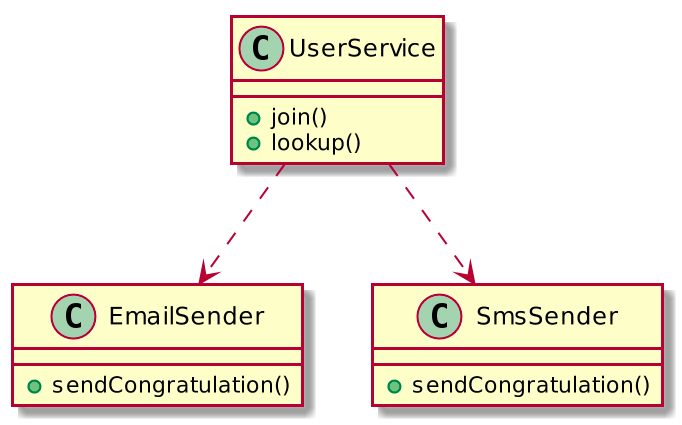
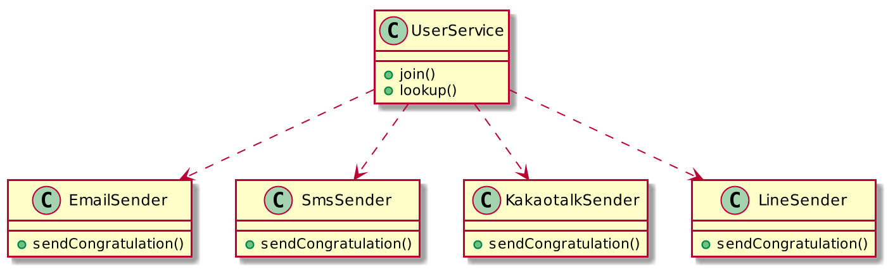
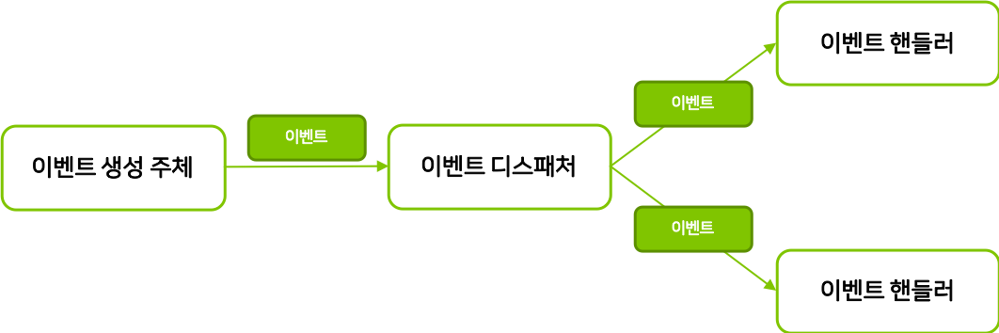
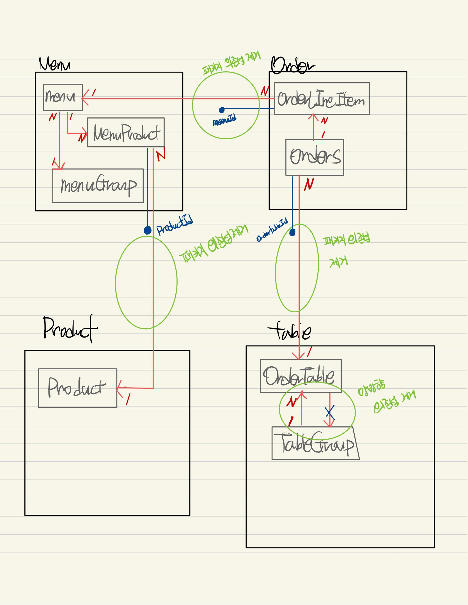
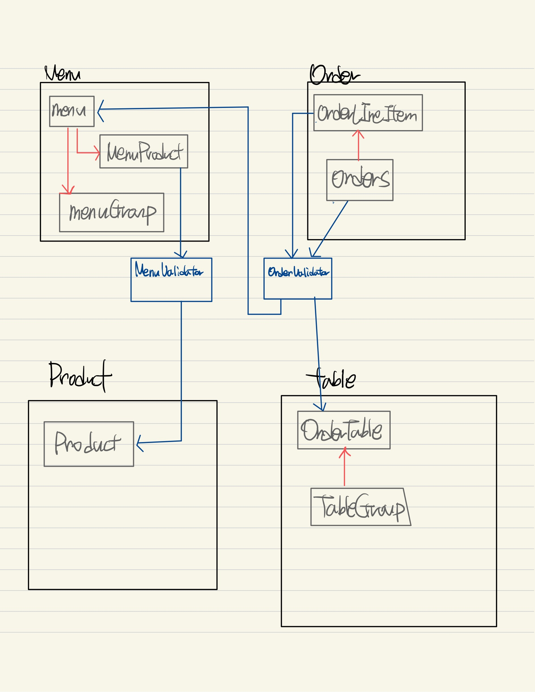

#🚀 3단계 - 의존성 리팩터링
## 요구 사항
이전 단계에서 객체 지향 설계를 의식하였다면 아래의 문제가 존재한다. 의존성 관점에서 설계를 검토해 본다.
- 메뉴의 이름과 가격이 변경되면 주문 항목도 함께 변경된다. 메뉴 정보가 변경되더라도 주문 항목이 변경되지 않게 구현한다.
- 클래스 간의 방향도 중요하고 패키지 간의 방향도 중요하다. 클래스 사이, 패키지 사이의 의존 관계는 단방향이 되도록 해야 한다.
- 데이터베이스 스키마 변경 및 마이그레이션이 필요하다면 아래 문서를 적극 활용한다.
  - [DB도 형상관리를 해보자!](https://meetup.toast.com/posts/173)

## 프로그래밍 요구 사항
Lombok은 그 강력한 기능만큼 사용상 주의를 요한다.
- 무분별한 setter 메서드 사용
- 객체 간에 상호 참조하는 경우 무한 루프에 빠질 가능성
- [Lombok 사용상 주의점(Pitfall)](https://kwonnam.pe.kr/wiki/java/lombok/pitfall)
이번 과정에서는 Lombok 없이 미션을 진행해 본다.

## 힌트
- 함께 생성되고 함께 삭제되는 객체들을 함께 묶어라
- 불변식을 지켜야 하는 객체들을 함께 묶어라
- 가능하면 분리하라
연관 관계는 다양하게 구현할 수 있다.
- 직접 참조 (객체 참조를 이용한 연관 관계)
- 간접 참조 (리포지토리를 통한 탐색)

### 도메인 이벤트
**강한 결합**

`UserService`에 `KakaotalkSender`와 `LineSender`가 더 추가되면 어떻게 될까?

**느슨한 결합과 강한 결합**
- 외부 서비스가 정상이 아닐 경우 트랜잭션 처리를 어떻게 해야 할지 애매
- 외부 서비스 성능에 직접적인 영향을 받는 문제가 있다.
- 도메인 객체에 서비스를 전달하면 추가로 설계상 문제가 나타날 수 있다.
- 도메인 객체에 서비스를 전달할 떄 또 다른 문제는 기능을 추가할 때 발생한다.
- 비동기 이벤트를 사용하면 두 시스템 간의 결합을 크게 낮출 수 있다.

**이벤트 관련 구성요소**

도메인 모델에서 이벤트 주체는 엔티티, 밸류, 도메인 서비스와 같은 도메인 객체이다.
도메인 객체는 도메인 로직을 실행해서 상태가 바뀌면 관련 이벤트를 발생한다.
이벤트 핸들러(handler)는 이벤트 생성 주체가 발생한 이벤트에 반응한다.
이벤트 핸들러는 생성 주체가 발생한 이벤트를 전달받아 이벤트에 담긴 데이터를 이용해서 원하는 기능을 실행한다.
이벤트 생성 주체와 이벤트 핸들러를 연결해 주는 것이 이벤트 디스패처(dispatcher)이다.
이벤트를 전달받은 디스패처는 해당 이벤트를 처리할 수 있는 핸들러에 이벤트를 전파한다.

**이벤트의 구성**
- 이벤트는 현재 기준으로 (바로 직전이라도) 과거에 벌어진 것을 표현하기 때문에 이벤트 이름에는 과거 시제를 사용한다.
- 이벤트는 이벤트 핸들러가 작업을 수행하는 데 필요한 최소한의 데이터를 담아야 한다.

**이벤트 장점**
- 서로 다른 도메인 로직이 섞이는 것을 방지할 수 있다.
- 이벤트 핸들러를 사용하면 기능 확장도 용이하다.

**비동기 이벤트 처리**
- 로컬 핸들러를 비동기로 실행하기
- 메시지 큐를 사용하기
- 이벤트 저장소와 이벤트 포워더 사용하기
- 이벤트 저장소와 이벤트 제공 API 사용하기

### 스프링 ApplicaitonEvent 소개
**Spring Events**

**ApplicationEventPublisher**
- 이벤트 프로그래밍에 필요한 인터페이스 제공
- ApplicationEvent 상속 (4.2 이전)
- ApplicationEventPublisher.publishEvent();
- ApplicationEventPublisherAware

**이벤트 핸들러**
- ApplicationListener 상속 (4.2 이전)
- @EventListener
- @Order
- @Async (@EnableAsync)

## 📚 Todo List 📚
- [x] 모델링 분석
  - **Before**
    
  - **After**
    
- [x] OrderTable - TableGroup 양방향 도메인 의존성 제거
- [x] Menu - Product 패키지 의존성 제거
- [x] Order - Table 패키지 의존성 제거
- [x] Menu - Order 패키지 의존성 제거
- [x] 기존 리뷰 반영 (Message 개선 - static 클래스 -> Enum)
